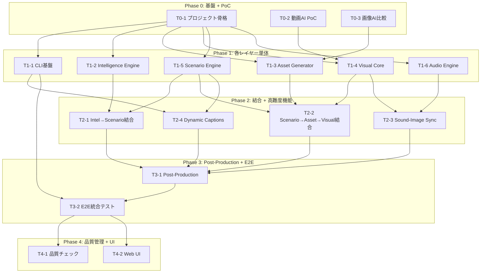

# サブタスク分解計画

## Context

仕様書（`/docs/specs/initial.md`）に基づき、AI動画生成パイプラインの実装をサブタスクに分解する。
17+の外部AI/APIサービス候補があり検証コストが高いため、リスク駆動でフェーズを設計し、並列実行可能な部分を最大化する。

## 設計方針

1. **リスク最大のものを最初に検証**: キャラクター同一性維持（Asset Driven Consistency）がプロジェクト成否を左右するため、Phase 0 でPoC
2. **外部サービス評価を早期に**: 最小限のAPI呼び出しで比較可能な検証プロトコルを設計
3. **横断基盤を先に**: データスキーマ・CLI基盤が無いとレイヤー統合不可

---

## Phase 0: プロジェクト基盤 + 最高リスク技術検証

**目的**: コード骨格を作り、プロジェクトの技術的成立性を確認する

| ID   | サブタスク                                         | 仕様書セクション  | 焦点                                                                                       | 成果物                                                   |
| ---- | -------------------------------------------------- | ----------------- | ------------------------------------------------------------------------------------------ | -------------------------------------------------------- |
| T0-1 | プロジェクト骨格・共通データスキーマ設計           | 2章, 6章          | Pythonパッケージ構成、レイヤー間JSONスキーマ(Pydantic)、ディレクトリ構造、設定管理         | 設計書 `designs/project_skeleton_design.md` + 初期コード |
| T0-2 | 動画生成AI比較検証（Asset Driven Consistency PoC） | 3.4章, 3.5章, 7章 | 1キャラ x 3ポーズのリファレンス画像をVeo/Kling/Luma/Runwayに入力し、同一性維持度を定量評価 | ADR `adrs/001_video_generation_ai.md`                    |
| T0-3 | 画像生成AI比較検証                                 | 3.4章             | Stability AI API/DALL-E 3/Geminiでキャラクター画像を生成、一貫性・品質・API利便性を比較    | ADR `adrs/002_image_generation_ai.md`                    |

**並列構造**: T0-1, T0-2, T0-3 は全て並列実行可能

**コスト最小化**: T0-2は動画AI 4種 x 1クリップ = 4回、T0-3は画像AI 3種 x 3枚 = 9回で比較

---

## Phase 1: 各レイヤー単体実装

**目的**: 各レイヤーを独立モジュールとして実装（T0-1のスキーマに準拠）

| ID   | サブタスク                                | 仕様書セクション | 焦点                                                                             | 依存           |
| ---- | ----------------------------------------- | ---------------- | -------------------------------------------------------------------------------- | -------------- |
| T1-1 | CLI基盤・パイプラインオーケストレーション | 5.1章, 3.1章     | CLIフレームワーク、チェックポイント機構（承認待ち/再開）、ステップ単位の実行制御 | T0-1           |
| T1-2 | Intelligence Engine                       | 3.2章, 7章       | ユーザー目視分析（シーン画像・テキスト）+ YouTube Data API メタデータ・字幕自動取得のハイブリッド分析、Gemini 2.5 Flash によるトレンドJSON集約 | T0-1           |
| T1-3 | Asset Generator                           | 3.4章            | 選定AI(T0-3)でキャラ/小物/背景のリファレンス画像生成、プロンプトテンプレート管理 | T0-1, **T0-3** |
| T1-4 | Visual Core                               | 3.5章            | 選定AI(T0-2)でImage-to-Video生成、複数候補から最良選択する機構                   | T0-1, **T0-2** |
| T1-5 | Scenario Engine                           | 3.3章            | OpenAI GPT-5系でシナリオ・テロップ・プロンプト生成、Structured Output制御、ユーザーディレクション対応 | T0-1           |
| T1-6 | Audio Engine                              | 3.6章            | BGM生成AI(Suno/Udio)評価・選定、フリー素材連携、SE自動割り当て基礎               | T0-1           |

**並列構造**: T1-1〜T1-6 は全て並列実行可能（ただしT1-3はT0-3完了、T1-4はT0-2完了が前提）

---

## Phase 2: レイヤー間結合 + 高難度機能

**目的**: レイヤー間の実データフローを検証し、高難度機能を本格実装

| ID   | サブタスク                     | 仕様書セクション  | 焦点                                                                       | 依存             |
| ---- | ------------------------------ | ----------------- | -------------------------------------------------------------------------- | ---------------- |
| T2-1 | Intelligence → Scenario 結合   | 3.2章→3.3章       | 実トレンドデータでシナリオ生成、プロンプト品質のチューニング               | T1-2, T1-5       |
| T2-2 | Scenario → Asset → Visual 結合 | 3.3章→3.4章→3.5章 | 3シーンミニシナリオで一連フロー検証、**キャラクター同一性の実運用評価**    | T1-3, T1-4, T1-5 |
| T2-3 | Sound-Image Sync 実装          | 3.6章, 3.7章, 7章 | 動画内動作検出→SEマッピング→ミリ秒同期アルゴリズム                         | T1-4, T1-6       |
| T2-4 | Dynamic Captions 実装          | 3.7章, 7章        | テロップアニメーション実装、映像内容ベースの自動配置、トレンドスタイル適用 | T1-1, T1-5       |

**並列構造**: T2-1, T2-2, T2-3, T2-4 は全て並列実行可能（各タスクのPhase 1依存が満たされた後）

---

## Phase 3: Post-Production + End-to-End統合

**目的**: 全レイヤーを結合し、完成動画を出力するパイプラインを完成

| ID   | サブタスク                              | 仕様書セクション | 焦点                                                                            | 依存                   |
| ---- | --------------------------------------- | ---------------- | ------------------------------------------------------------------------------- | ---------------------- |
| T3-1 | Post-Production（カット編集・最終結合） | 3.7章            | MoviePy/FFmpegでシーン結合、BGM合成、SE挿入、テロップ合成、最終出力             | T2-1, T2-2, T2-3, T2-4 |
| T3-2 | End-to-End パイプライン統合テスト       | 3.1章            | キーワード→完成動画の一気通貫実行、チェックポイント動作確認、エラーハンドリング | T3-1, T1-1             |

**順序**: T3-1 → T3-2（順次実行）

---

## Phase 4: 品質管理 + Web UI

**目的**: パイプラインの補助機能を実装

| ID   | サブタスク                         | 仕様書セクション | 焦点                                                                   | 依存 |
| ---- | ---------------------------------- | ---------------- | ---------------------------------------------------------------------- | ---- |
| T4-1 | 自動品質チェックシステム           | 4.1章            | 各レイヤー出力のAI品質評価、閾値未達時の自動再生成トリガー             | T3-2 |
| T4-2 | Web UI（チェックポイント確認画面） | 4.2章, 5.2章     | Streamlit/Gradio でプレビュー・承認/差し戻しUI、進行状況ダッシュボード | T3-2 |

**並列構造**: T4-1, T4-2 は並列実行可能

---

## クリティカルパス

```
T0-2 → T1-4 → T2-2 → T3-1 → T3-2 → T4-1/T4-2
```

Asset Driven Consistency PoC（T0-2） → Visual Core（T1-4） → Scenario→Asset→Visual結合（T2-2）が最長パス。
これがPhase 0で最優先検証する理由。

## 依存関係図



## 実施方法

各サブタスクは `/create-design` スキルで設計書を作成し、その後実装する。
仕様書はフィードバックに基づき継続的に更新する（`/docs/guidelines/development_process.md` 準拠）。

## 対象ファイル

- `/docs/specs/initial.md` - 仕様書（全タスクが参照、随時更新）
- `/docs/guidelines/development_process.md` - 開発プロセスガイドライン
- `/docs/designs/` - 各タスクの設計書を配置
- `/docs/adrs/` - 技術選定ADRを配置
