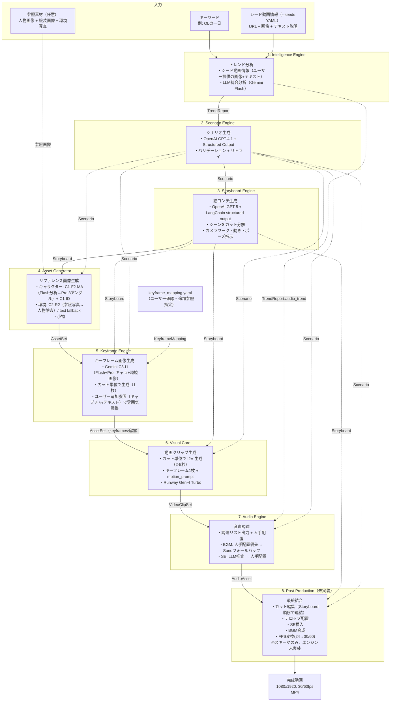

# C1-C3 PoC 知見の全体フロー設計書への統合計画

## Context

C1（キャラクター生成）、C2（環境生成）、C3（シーン融合）の PoC 検証で確立された画像生成パイプラインの知見を、本番設計書 `t1_overall_flow.md` に反映する。あわせて、全レイヤーの実装状況を確認し、設計書と実装の乖離を修正する。

---

## 0. 全レイヤー実装状況と設計書との乖離

| レイヤー | 実装状態 | 設計書の記述 | 実装の実態 | 改修方針 |
|---------|---------|------------|-----------|---------|
| 1. Intelligence | **部分実装** | Phase A/B/C（シード収集→拡張検索→LLM分析） | Phase B「拡張検索」未実装。シード情報→Gemini Flash LLM分析のみ | **設計書を実装に合わせて簡素化** |
| 2. Scenario | 完全実装 | OpenAI GPT-5 系 | OpenAI GPT-4.1 + Structured Output + リトライ | **モデル名を実装に合わせる** |
| 3. Storyboard | 完全実装 | OpenAI GPT-5 系 | OpenAI GPT-5 + LangChain structured output | 乖離なし |
| 4. Asset Generator | 完全実装 | Gemini キャラ/小物/背景 | Gemini 3 Pro Image（実装通り） | **C1-C3 知見で拡張** |
| 5. Keyframe Engine | 完全実装 | Runway Gen-4 Image Turbo | Runway Gen-4 Image Turbo（実装通り） | **Gemini C3-I1 に変更（Runway削除）** |
| 6. Visual Core | 完全実装 | Runway Gen-4 Turbo | Runway Gen-4 Turbo（実装通り） | 乖離なし |
| 7. Audio Engine | 完全実装 | BGM人手→Suno, SE LLM推定 | BGM人手→Suno, SE Gemini推定（実装通り） | 乖離なし |
| 8. Post-Production | **未実装** | カット編集/テロップ/SE/BGM/FPS変換 | スキーマのみ。エンジンクラスなし、CLI未登録 | **設計書に未実装と明記** |

---

## 1. t1 の改修箇所と改修内容の一覧

### 改修箇所マップ

| セクション | 行番号 | 現状 | 改修内容 | 改修理由 |
|-----------|--------|------|----------|----------|
| **§1 パイプライン概要** | L9-29 | Step4=`AssetSet`、Step5=`AssetSet(keyframes追加)` | Step4 の出力記述を更新（Identity Block・環境画像を明記） | C1-ID/C2-R2 の出力増 |
| **§2 Mermaid図** | L33-93 | IE=「Phase A/B/C」、SE=「GPT-5系」、AG=「正面→横→背面→表情」、KE=「Gen-4 Image Turbo」 | IE を実装に合わせて簡素化、SE のモデル名修正、AG を C1-F2-MA + C2-R2 に、KE を Gemini C3-I1 に変更（Runway削除）、PP に未実装注記。参照素材の入力ノード追加 | 全レイヤーの実装との整合性 |
| **§3.1 IE→SE データフロー** | L100-114 | Phase A/B/C の記述 | 実装に合わせて Phase B 記述を削除 | Phase B 未実装 |
| **§3.3 SB→AG データフロー** | L135-151 | AG は Scenario のテキストフィールドのみ消費 | 参照素材（人物・服装・環境写真）の入力を追加 | C1-F2-MA / C2-R2 は画像入力が必須 |
| **§3.4 AG→KE→VC データフロー** | L152-172 | `front_view` + `@char` + `keyframe_prompt` + `StyleMapping` | Gemini C3-I1 に統一。`StyleMapping` → `KeyframeMapping`（確認+追加参照）に変更 | KE 生成方式変更 + ユーザー追加参照機能 |
| **§5 スキーマ一覧** | L312-329 | `CharacterAsset`, `BackgroundAsset`, `KeyframeAsset`, `AssetSet` | 新フィールド追加（identity_block, pose_instruction 等）、`EnvironmentAsset` 新規追加 | C1-C3 の入出力データを格納するため |
| **§6 ディレクトリ構成** | L333-381 | `assets/` 配下にキャラ・小物・背景・キーフレーム | `reference/`, `environments/`, `identity_block.txt` を追加 | C1入力・C2出力の保存先 |
| **§7 技術スタック** | L383-401 | SE=GPT-5系、KE=Runway Gen-4 Image Turbo | SE のモデル名修正、Gemini Flash 行追加、KE を Gemini C3-I1 に変更（Runway削除） | 実装との整合性 + C1-C3 知見 |
| **§8 コスト見積もり** | L403-419 | KE=$0.02/枚 | C3-I1ルートのコスト列を追加 | コスト構造が変わる |
| **§9 新設: C1-C3 まとめ** | (末尾) | なし | C1-C3 の入出力・処理ロジック・フローの要約セクションを新設 | PoC 知見を設計書に記録 |
| **§10(旧§9) 設計書一覧** | L421-435 | PoC 参照なし | C1/C2/C3 結果・ベストプラクティスへの参照を追加 | トレーサビリティ |

---

## 2. 最終的な t1 のフロー

### 2.1 パイプライン概要（改修後）

```
キーワード + シード動画情報（--seeds seeds.yaml で提供）
+ 参照素材（人物画像 + 服装画像 + 環境写真、任意）
    ↓
[1. Intelligence Engine]  → TrendReport
    ↓ チェックポイント
[2. Scenario Engine]      → Scenario
    ↓ チェックポイント
[3. Storyboard Engine]    → Storyboard
    ↓ チェックポイント（カット割りのユーザー確認）
[4. Asset Generator]      → AssetSet（キャラ画像 + Identity Block + 環境画像 + 小物）
    ↓ チェックポイント
[5. Keyframe Engine]      → AssetSet（keyframes 追加）
    ↓ チェックポイント（キーフレーム画像のユーザー確認）
[6. Visual Core]          → VideoClipSet
    ↓ チェックポイント
[7. Audio Engine]         → AudioAsset
    ↓ チェックポイント
[8. Post-Production]      → FinalOutput (完成動画)
    ↓ チェックポイント
完了
```

**変更点**: 入力に「参照素材」追加、Step 4 の出力に「Identity Block」「環境画像」を明記。

### 2.2 データフロー全体図（改修後の Mermaid）



**変更点**:
- 入力に `REF`（参照素材）ノード追加 + AG への破線矢印
- IE: 「Phase A/B/C」→「シード動画情報 + Gemini Flash LLM分析」に簡素化（実装に合わせる）
- SE: 「LLM一括生成」→「OpenAI GPT-4.1」（実装に合わせる）
- SB: 「GPT-5 + LangChain」明記、「ポーズ指示」を追加
- AG: C1-F2-MA / C2-R2 に更新
- KE: Gemini C3-I1 に統一（Runway削除）、ユーザー追加参照機能を追加
- `style_mapping.yaml` → `keyframe_mapping.yaml` に変更（確認項目 + 追加参照）
- PP: 未実装注記を追加

### 2.3 §3.3 Asset Generator の入出力（改修後）

#### 入力

| 入力 | ソース | 用途 |
|------|--------|------|
| `characters[].reference_prompt` | Scenario | テキストベースキャラ生成（参照画像なし時の fallback） |
| `characters[].appearance/outfit` | Scenario | 一貫性維持用コンテキスト |
| `props[].image_prompt` | Scenario | 小物画像の生成プロンプト |
| `scenes[].image_prompt` | Scenario | 背景画像の生成プロンプト（環境写真なし時の fallback） |
| 人物参照画像 | `assets/reference/person/` | **C1-F2-MA**: Flash 分析の入力 |
| 服装参照画像 | `assets/reference/clothing/` | **C1-F2-MA**: Flash 分析の入力 |
| 環境参照写真 | `assets/reference/environments/` | **C2-R2**: 人物除去の入力 |

#### 処理ロジック

```
【キャラクター生成】
IF 参照画像（人物+服装）あり:
    C1-F2-MA: Flash(person+clothing) → テキスト記述 → Pro(front/side/back)
    C1-ID:   Flash(生成済みfront) → Identity Block テキスト
ELSE:
    既存方式: reference_prompt → Pro(front) → front参照で side/back 生成

【環境生成】
IF 環境参照写真あり:
    C2-R2: Pro(参照写真 + 人物除去指示) → 環境画像
ELSE:
    既存方式: image_prompt → Pro → 背景画像

【小物】
変更なし
```

#### 出力

| 出力 | 内容 | 新規/既存 |
|------|------|-----------|
| `CharacterAsset.front_view/side_view/back_view` | キャラクター3アングル画像 | 既存 |
| `CharacterAsset.identity_block` | C1-ID テキスト記述 | **新規** |
| `EnvironmentAsset.image_path` | 人物不在の環境画像 | **新規** |
| `PropAsset` | 小物画像 | 既存 |
| `BackgroundAsset` | 背景画像（fallback） | 既存 |

### 2.4 §3.4 Keyframe Engine の入出力（改修後）

#### 処理方式: Gemini C3-I1（Flash + Pro 2パス）

```
Step 1: Flash 最小指示分析
  入力: キャラ画像 + 環境画像 + Identity Block + pose_instruction
        + ユーザー追加参照（キャプチャ画像/テキスト、任意）
  出力: シーンプロンプト（~53 words）

Step 2: Pro シーン生成
  入力: キャラ画像 + 環境画像 + Flashプロンプト
        + ユーザー追加参照キャプチャ（任意）
  出力: キーフレーム画像（9:16）
```

| データ | 使用レイヤー | 用途 |
|--------|------------|------|
| `CharacterAsset.front_view` | Keyframe Engine | Flash+Pro のキャラクター参照画像 |
| `EnvironmentAsset.image_path` | Keyframe Engine | Flash+Pro の環境参照画像 |
| `CharacterAsset.identity_block` | Keyframe Engine | Flash 最小指示分析のテキスト入力 |
| `CutSpec.pose_instruction` | Keyframe Engine | Flash 分析のポーズ指示 |
| `KeyframeMapping.reference_image` | Keyframe Engine | ユーザー追加のキャプチャ画像（任意） |
| `KeyframeMapping.reference_text` | Keyframe Engine | ユーザー追加のテキスト指示（任意） |
| `KeyframeAsset.image_path` | Visual Core | 動画生成の入力画像 |
| `CutSpec.motion_prompt` | Visual Core | 動画生成プロンプト（変更なし） |

#### keyframe_mapping.yaml — ユーザー確認・追加参照

ASSET ステップ完了後のチェックポイントで、Storyboard + AssetSet の内容から `keyframe_mapping.yaml` を自動生成する。ユーザーはこのファイルで以下を確認・編集する:

1. **確認**: 各シーンの キャラ × 環境 × ポーズ の対応関係（Storyboard から自動導出）
2. **追加**: 参照キャプチャ画像やテキスト指示で雰囲気を調整

```yaml
# keyframe_mapping.yaml（自動生成 → ユーザー編集）
scenes:
  - scene_number: 1
    character: "haruka"          # Storyboard から自動導出
    environment: "env_1"         # Storyboard から自動導出
    pose: "standing_confident"   # Storyboard から自動導出
    # --- ユーザーが任意で追加 ---
    reference_image: "reference/sunset_beach.jpg"   # 雰囲気参照キャプチャ
    reference_text: "夕日を背景に、逆光シルエット気味に"  # 雰囲気指示テキスト

  - scene_number: 2
    character: "haruka"
    environment: "env_2"
    pose: "walking"
    # reference_image:  # 追加なし
    # reference_text:   # 追加なし
```

**Flash への追加情報の渡し方**:
- `reference_image`: Flash に追加画像として渡す（「この画像の雰囲気に寄せて」）
- `reference_text`: Flash プロンプトに追記（ただし最小指示原則を維持し、短く保つ）
- C3-I1 の最小指示知見に基づき、追加情報は簡潔に保つことを推奨する

### 2.5 §5 スキーマ変更（改修後）

| 変更種別 | モデル | フィールド | 型 | デフォルト |
|----------|--------|-----------|-----|-----------|
| **フィールド追加** | `CharacterAsset` | `identity_block` | `str` | `""` |
| **モデル新規** | `EnvironmentAsset` | `scene_number`, `description`, `image_path`, `source_type` | — | — |
| **フィールド追加** | `AssetSet` | `environments` | `list[EnvironmentAsset]` | `[]` |
| **フィールド追加** | `CutSpec` | `pose_instruction` | `str` | `""` |
| **フィールド追加** | `KeyframeAsset` | `cut_id`, `generation_method` | `str`, `str` | `""`, `"runway"` |

| **モデル新規** | `SceneKeyframeSpec` | `scene_number`, `character`, `environment`, `pose`, `reference_image`, `reference_text` | — |
| **モデル新規** | `KeyframeMapping` | `scenes: list[SceneKeyframeSpec]` | — |

全て後方互換（デフォルト値あり）。既存の `BackgroundAsset`, `keyframe_prompt` は維持。`StyleMapping` は `KeyframeMapping` に置き換え。

### 2.6 §7 技術スタック（改修後）

**修正行:**

| 用途 | 現状 | 改修後 |
|------|------|--------|
| シナリオ生成 LLM | OpenAI GPT-5 系 | **OpenAI GPT-4.1**（実装に合わせる） |
| 絵コンテ生成 LLM | OpenAI GPT-5 系 | OpenAI GPT-5 系（変更なし） |

**追加行:**

| 用途 | 採用技術 | 使用レイヤー |
|------|----------|------------|
| キャラ Flash 分析（C1-F2-MA） | Gemini Flash (`gemini-3-flash-preview`) | Asset Generator |
| Identity Block 抽出（C1-ID） | Gemini Flash | Asset Generator |
| 環境生成（C2-R2） | Gemini Pro (`gemini-3-pro-image-preview`) | Asset Generator |
| キーフレーム生成（C3-I1） | Gemini Flash + Pro | Keyframe Engine |

既存の Gemini Pro（画像生成）の行は維持。Runway Gen-4 Image Turbo はキーフレーム生成から削除（Gemini C3-I1 に統一）。

### 2.7 §8 コスト見積もり（改修後）

| レイヤー | 単価 | 数量 | コスト |
|----------|------|------|--------|
| Intelligence Engine | Gemini Flash | 1 | 約 $0.05 |
| Scenario Engine | OpenAI GPT-4.1 | 1 | 約 $0.05〜0.15 |
| Storyboard Engine | OpenAI GPT-5 | 1 | 約 $0.03〜0.10 |
| Asset Generator（キャラ C1-F2-MA + C1-ID） | $0.14/キャラ | 1 | **$0.14** |
| Asset Generator（環境 C2-R2） | $0.04/環境 | 5 | **$0.20** |
| Asset Generator（小物） | API料金依存 | — | — |
| Keyframe Engine（C3-I1） | $0.05/シーン | 25 | **$1.25** |
| Visual Core（Runway Gen-4 Turbo） | $0.05/秒 | 75秒 | **$3.75** |
| Audio Engine（フリー素材のみ） | Gemini Flash | 1 | 約 $0.01 |
| **合計** | | | **〜$5.5〜$5.7** |

### 2.8 §9 新設: C1-C3 PoC 検証結果のまとめ

新セクションとして以下を記載:

1. **C1 キャラクター生成**: C1-F2-MA + C1-ID の入出力・処理フロー・コスト
2. **C2 環境生成**: C2-R2 + C2-R2-MOD の入出力・処理フロー・コスト
3. **C3 シーン融合**: C3-I1 の入出力・処理フロー・コスト
4. **C1→C2→C3 完全フロー図**: 全体の処理フロー
5. **横断的知見**: 1パスvs2パス判断基準、Flash最小指示原則、selfieのベストプラクティス
6. **検証エビデンス**: PoC レポート・ベストプラクティスへの参照リンク

---

## 3. 改修ステップ（実施順序）

| Step | 対象セクション | 作業内容 |
|------|--------------|----------|
| 1 | §9 新設 | C1-C3 PoC まとめセクションを末尾に挿入（旧§9 設計書一覧を§10に繰り下げ） |
| 2 | §1 パイプライン概要 | ASCII図の入力・Step4 の記述を更新 |
| 3 | §2 Mermaid図 | IE簡素化、SE モデル名修正、SB 詳細追加、AG・KE を C1-C3 に更新、PP 未実装注記、REF入力ノード追加 |
| 4 | §3.1 | IE→SE データフローの Phase B 記述を削除、実装に合わせて簡素化 |
| 5 | §3.3 | AG の入力テーブルに参照素材を追加、処理ロジック説明を追加 |
| 6 | §3.4 | Gemini C3-I1 に統一。keyframe_mapping.yaml（ユーザー確認+追加参照）を記載 |
| 7 | §5 | スキーマテーブルに新フィールド・新モデルを追加（EnvironmentAsset, KeyframeMapping 等） |
| 8 | §6 | ディレクトリ構成に `reference/`, `environments/`, `identity_block.txt` を追加 |
| 9 | §7 | SE モデル名修正、Gemini Flash 行追加、KE を Gemini C3-I1 に変更（Runway削除） |
| 10 | §8 | C3-I1ルートのコスト列を追加 |
| 11 | §10(旧§9) | 設計書一覧に PoC・ベストプラクティスの参照を追加 |

## 検証方法

1. 更新後の `t1_overall_flow.md` を通読し、Mermaid 図とテキストの整合性を確認
2. スキーマ変更が既存コードの `asset.py`, `storyboard.py`, `pipeline_io.py` と後方互換であることを確認
3. C1→C2→C3 のデータフローが §3.4 モードA と §9 のフロー図で一致することを確認
