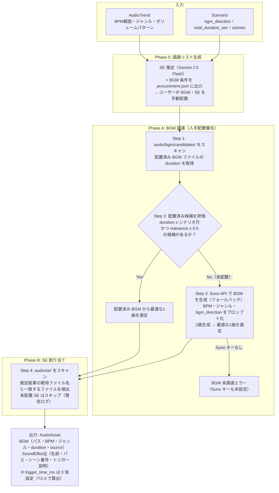

# Audio Engine 設計書

## 1. 概要

- **対応する仕様書セクション:** 3.6章（Audio Engine）、7章（重点技術課題: Sound-Image Sync）
- **サブタスクID:** T1-6
- **依存:** T0-1（プロジェクト骨格・共通データスキーマ）
- **このサブタスクで実現すること:**
  - BGM・SE の調達条件（ジャンル、BPM、SE名等）を自動生成し、調達リスト（`procurement.json`）として出力する
  - 人手で配置されたBGM・SEファイルをスキャンし、最適なBGMを選定する
  - BGM が未配置の場合、Suno API（オプション）でフォールバック生成する
  - シナリオの各シーン情報からSEを LLM で推定し、ファイル名を割り当てる
  - `AudioAsset`（BGM + SE リスト）を生成し、後段の Post-Production に引き渡す

## 2. スコープ

### 対象範囲

- Audio Engine レイヤー（`src/daily_routine/audio/`）の実装
- 調達リスト（BGM条件 + SE名）の自動生成・出力
- 人手配置されたBGM・SEファイルのスキャンと選定ロジック
- BGM生成AI（Suno API）のフォールバック統合（オプション）
- トレンド分析の BPM・ジャンル指定に基づく BGM の自動選定ロジック
- シナリオのシーン情報（状況説明・小物）から SE を LLM で推定する機構
- レイヤー境界の抽象インターフェース定義
- ユニットテスト

### 対象外

- 映像内動作検出による SE のミリ秒同期（T2-3 Sound-Image Sync で実装）
- Udio API の統合（Suno 評価後に必要であれば ADR で再検討）
- Post-Production との結合検証（T3-1 で実施）
- チェックポイント機構の詳細（T1-1 CLI基盤で実装。本設計では保存・読み込み I/F のみ定義）
- Web UI でのプレビュー（T4-2 で実装）

## 3. 技術設計

### 3.1 設計思想

**「調達リスト出力 + 人手配置 + ローカルスキャン」方式**

Pixabay Audio API は公開された音声検索 API が存在しないことが実装時に判明したため、BGM・SE の調達は以下の方式で行う:

1. **調達リスト出力**: トレンド分析とシナリオから、必要な BGM の条件（ジャンル、BPM、最低尺）と SE の名称・ファイル名を `procurement.json` に出力する
2. **人手配置**: ユーザーが調達リストを参照し、BGM と SE のファイルを指定ディレクトリに配置する
3. **ローカルスキャン**: 配置されたファイルをスキャンし、BGM を選定、SE を割り当てる
4. **Suno フォールバック**（オプション）: BGM が未配置の場合、Suno API キーが設定されていれば AI 生成にフォールバックする

SE はシナリオの `SceneSpec.situation`（状況説明）と小物情報から必要な効果音を LLM（Gemini 2.5 Flash）で推定する。映像との精密な同期は T2-3 で実装するため、本フェーズではシーン番号と SE 名の割り当てまでを行い、挿入タイミング（`trigger_time_ms`）は算出しない。

| 音声要素 | 調達方法 | 優先度 | 理由 |
|----------|----------|--------|------|
| BGM | 人手配置（フリー素材サイトから手動ダウンロード） | **1st** | 品質を目視確認可能・ライセンス管理が確実 |
| BGM | Suno API（AI生成フォールバック） | 2nd | BGM 未配置時のオプションフォールバック |
| SE | 人手配置（LLM 推定の SE 名を参照し手動ダウンロード） | **1st** | 品質を目視確認可能 |

### 3.2 技術スタック

| 要素 | 採用技術 | 選定理由 |
|------|----------|----------|
| BGM 調達（第一選択） | 人手配置 + ローカルスキャン | 品質を目視確認可能・ライセンス管理が確実 |
| BGM 生成（フォールバック） | Suno API v4 | BGM 未配置時のオプションフォールバック |
| SE 調達 | 人手配置 + ローカルスキャン | LLM 推定の SE 名を参照し手動ダウンロード |
| SE 推定 | Gemini 2.5 Flash | シーン情報から必要な SE を推定する LLM |
| HTTP 通信 | httpx（async） | コーディング規約に準拠 |
| 音声メタデータ解析 | mutagen | ファイル形式・duration 取得に使用 |

> **実装時の発見:** Pixabay Audio API は公開された音声検索エンドポイントが存在しないことが判明した（Pixabay API は画像・動画のみ対応）。そのため、API 経由の自動検索・取得は行わず、調達リスト出力 + 人手配置方式に変更した。

**BGM 生成 AI 選定について:**

Suno をオプションのフォールバックとして実装する。Suno の品質が不十分な場合は Udio を追加評価し、ADR（`docs/adrs/003_bgm_generation_ai.md`）を作成する。

### 3.3 全体フロー



### 3.4 ディレクトリ構成

```
src/daily_routine/audio/
├── __init__.py
├── engine.py           # AudioEngine（ABCの具象実装）— 調達リスト出力 + ローカルスキャン
├── base.py             # AudioEngineBase（ABC定義）
├── suno.py             # Suno API クライアント（BGM生成フォールバック）
├── bgm_selector.py     # BGM 候補選定ロジック
└── se_estimator.py     # LLM による SE 推定
```

### 3.5 抽象インターフェース定義

```python
# audio/base.py
from abc import ABC, abstractmethod
from pathlib import Path

from daily_routine.schemas.audio import AudioAsset
from daily_routine.schemas.intelligence import AudioTrend
from daily_routine.schemas.scenario import Scenario


class AudioEngineBase(ABC):
    """Audio Engine のレイヤー境界インターフェース."""

    @abstractmethod
    async def generate(
        self,
        audio_trend: AudioTrend,
        scenario: Scenario,
        output_dir: Path,
    ) -> AudioAsset:
        """トレンド分析とシナリオに基づき、BGM と SE を調達する.

        Args:
            audio_trend: Intelligence Engine が生成した音響トレンド
            scenario: Scenario Engine が生成したシナリオ
            output_dir: 音声ファイルの出力先ディレクトリ

        Returns:
            BGM + SE のアセット情報
        """
        ...
```

### 3.6 内部コンポーネント設計

#### 3.6.1 Suno API クライアント (`suno.py`)

Suno API v4 を使い、トレンドに合致した BGM を生成する。

```python
from pydantic import BaseModel, Field


class SunoTrack(BaseModel):
    """Suno で生成されたトラック."""

    track_id: str
    title: str
    audio_url: str = Field(description="ダウンロード可能な音声 URL")
    duration_sec: float
    tags: list[str] = Field(default_factory=list)
    status: str = Field(description="生成ステータス: 'complete' | 'generating' | 'error'")


class SunoClient:
    """Suno API v4 クライアント."""

    def __init__(self, api_key: str) -> None: ...

    async def generate(
        self,
        prompt: str,
        duration_sec: int = 60,
        instrumental: bool = True,
    ) -> list[SunoTrack]:
        """BGM を生成する.

        Suno はプロンプトから2曲を同時生成する。
        instrumental=True でボーカルなしの楽曲を生成。

        Args:
            prompt: 楽曲の説明（ジャンル、BPM、雰囲気等）
            duration_sec: 目標楽曲長（秒）
            instrumental: インストゥルメンタルのみ

        Returns:
            生成されたトラックのリスト（通常2曲）
        """
        ...

    async def wait_for_completion(
        self,
        track_ids: list[str],
        timeout_sec: int = 300,
        poll_interval_sec: int = 10,
    ) -> list[SunoTrack]:
        """トラック生成の完了を待機する.

        Suno の生成は非同期。ポーリングで完了を待つ。

        Args:
            track_ids: 待機対象のトラックID
            timeout_sec: タイムアウト（秒）
            poll_interval_sec: ポーリング間隔（秒）

        Returns:
            完了したトラックのリスト
        """
        ...

    async def download(self, audio_url: str, output_path: Path) -> Path:
        """生成された音声ファイルをダウンロードする.

        Returns:
            ダウンロードしたファイルのパス
        """
        ...
```

**Suno API 仕様:**

| API | エンドポイント | 説明 |
|-----|---------------|------|
| Generate | `POST /v4/generate` | プロンプトから楽曲を生成（2曲同時） |
| Get | `GET /v4/clips/{id}` | 生成ステータスと結果を取得 |

**BGM 生成プロンプト構築:**

`AudioTrend` と `Scenario.bgm_direction` から自動構築する。

```
例: AudioTrend(bpm_range=(110, 130), genres=["lo-fi", "chill hop"])
    Scenario.bgm_direction = "朝の準備シーンに合う爽やかで軽快な曲"

→ プロンプト: "lo-fi chill hop, 110-130 BPM, instrumental,
   fresh and upbeat morning routine vibe, light and cheerful"
```

#### 3.6.2 BGM 候補選定ロジック (`bgm_selector.py`)

フリー素材の候補を評価し、条件を満たすか判定する。満たさない場合は AI 生成へのフォールバックを指示する。

```python
class BGMCandidate(BaseModel):
    """BGM 候補."""

    file_path: Path
    source: str = Field(description="'manual' | 'suno'")
    duration_sec: float
    genre: str
    estimated_bpm: int | None = Field(default=None, description="推定 BPM（取得可能な場合）")
    relevance_score: float = Field(default=0.0, description="検索関連度スコア（0〜1）")


class BGMSelector:
    """BGM 候補プールから最適な1曲を選定する."""

    RELEVANCE_THRESHOLD: float = 0.5

    def select(
        self,
        candidates: list[BGMCandidate],
        target_bpm_range: tuple[int, int],
        min_duration_sec: float,
    ) -> BGMCandidate | None:
        """候補プールから最適な BGM を選定する.

        選定基準（優先度順）:
        1. duration がシナリオ尺（min_duration_sec）以上であること（必須）
        2. relevance_score が閾値（RELEVANCE_THRESHOLD）以上であること
        3. スコアが最も高い候補を返す

        候補がない場合は None を返し、呼び出し元が Suno フォールバックを判断する。

        Args:
            candidates: BGM 候補リスト
            target_bpm_range: トレンドの BPM 範囲
            min_duration_sec: シナリオの合計尺

        Returns:
            選定された BGM 候補。条件を満たす候補がなければ None
        """
        ...
```

**選定ロジック:**

```
1. duration フィルタ: candidate.duration >= min_duration_sec でないものを除外
2. relevance フィルタ: relevance_score < RELEVANCE_THRESHOLD (0.5) のものを除外
3. 残った候補をスコアリングし、最高スコアを選定:

score = relevance_score * 0.7 + bpm_score * 0.3

bpm_score:
  estimated_bpm が target_bpm_range 内 → 1.0
  estimated_bpm が ±10 以内 → 0.5
  estimated_bpm なし or 範囲外 → 0.0

4. 候補が0件 → None を返す（Suno フォールバックのトリガー）
```

**人手配置優先フローでの使われ方:**

```python
# engine.py での呼び出しイメージ
# Step 1: 配置済み BGM ファイルをスキャン
candidates = self._scan_bgm_candidates(output_dir)  # mutagen で duration 取得
selected = selector.select(candidates, bpm_range, scenario.total_duration_sec)

if selected is None and self._suno_api_key:
    # 配置済み BGM で条件を満たす候補がない → Suno フォールバック
    logger.warning("配置済み BGM で条件を満たす候補がありません。Suno API で生成します。")
    suno_tracks = await suno_client.generate(prompt)
    suno_candidates = [...]  # SunoTrack → BGMCandidate に変換
    selected = selector.select(suno_candidates, bpm_range, scenario.total_duration_sec)

if selected is None:
    raise RuntimeError("BGM が配置されていません。procurement.json を参照してください。")
```

#### 3.6.3 LLM による SE 推定 (`se_estimator.py`)

シナリオの各シーン情報から、必要な SE を LLM で推定する。挿入タイミングの算出は本フェーズのスコープ外（T2-3 で映像解析後に決定）。

```python
class SEEstimation(BaseModel):
    """1つの SE の推定結果."""

    se_name: str = Field(description="SE の名前（英語、検索キーワードとして使用）")
    scene_number: int = Field(description="挿入するシーン番号")
    trigger_description: str = Field(description="トリガーとなる動作/物体の説明")


class SEEstimator:
    """LLM でシーン情報から必要な SE を推定する."""

    def __init__(self, api_key: str) -> None: ...

    async def estimate(
        self,
        scenes: list[SceneSpec],
        se_usage_points: list[str],
    ) -> list[SEEstimation]:
        """シナリオの各シーンから必要な SE を推定する.

        Gemini 2.5 Flash に以下を入力し、SE リストを Structured Output で生成させる:
        - 各シーンの situation（状況説明）
        - 各シーンの caption_text（テロップ）
        - AudioTrend.se_usage_points（トレンドでの SE 使用パターン）

        SE 推定のガイドライン:
        - 1シーンあたり最大2つの SE を割り当て（過剰な SE は視聴体験を損なう）
        - 日常動作に対応する SE を優先（足音、ドア、キーボード等）
        - 環境音（雑踏、鳥の声等）も考慮

        Args:
            scenes: シナリオの全シーン仕様
            se_usage_points: トレンドでの SE 使用パターン

        Returns:
            各シーンに割り当てる SE の推定リスト
        """
        ...
```

**SE 推定のプロンプト例:**

```
あなたは動画の効果音（SE）設計の専門家です。
以下のシーン情報から、各シーンに最適な効果音を割り当ててください。

## トレンドでの SE 使用パターン:
{se_usage_points}

## シーン一覧:
シーン1: {situation} / テロップ: {caption_text}
シーン2: ...

## ルール:
- 1シーンあたり最大2つの SE
- SE 名は英語の検索キーワードとして使えるもの（例: "footsteps", "door open"）
- trigger_description にはどの動作/物体が SE のトリガーかを記載
```

**trigger_time_ms について:**

`SoundEffect.trigger_time_ms` は本フェーズでは `0` を仮設定する。T2-3（Sound-Image Sync）で映像内の動作検出を行い、実際の挿入タイミングを算出して上書きする。

```python
# T1-6 での SoundEffect 生成（trigger_time_ms は仮値）
SoundEffect(
    name="footsteps",
    file_path=Path("audio/se/scene_01_footsteps.mp3"),
    trigger_time_ms=0,  # T2-3 で映像ベースに算出
    scene_number=1,
    trigger_description="キャラクターが玄関を出て歩き始める",
)
```

### 3.7 スキーマ拡張

既存の `AudioAsset` スキーマ（`schemas/audio.py`）はそのまま使用する。変更不要。

内部の中間データ型（`SunoTrack`, `BGMCandidate`, `SEEstimation`）は `audio/` パッケージ内の各モジュールに定義し、`schemas/` には追加しない。

### 3.8 設定

#### グローバル設定への追加

`configs/global.yaml` の `api_keys` に以下を追加する:

```yaml
api_keys:
  youtube_data_api: ""
  openai: ""
  google_ai: ""
  suno: ""        # 追加: Suno API キー（オプション、BGM フォールバック用）
```

環境変数でのオーバーライド: `DAILY_ROUTINE_API_KEY_SUNO`

#### Audio Engine 固有の設定

engine のコンストラクタ引数で制御する。

| パラメータ | デフォルト値 | 説明 |
|-----------|-------------|------|
| `suno_api_key` | `""` | Suno API キー（空の場合フォールバック無効） |
| `google_ai_api_key` | `""` | Google AI API キー（SE 推定用） |
| `max_se_per_scene` | 2 | 1シーンあたりの最大 SE 数 |

### 3.9 エラーハンドリング

| エラー種別 | 対処 |
|-----------|------|
| BGM 未配置 + Suno キー未設定 | RuntimeError で停止。procurement.json を参照して手動配置を促すメッセージを出力 |
| BGM 未配置 + Suno キーあり | Suno フォールバックで BGM を生成（警告ログ） |
| 配置済み BGM で条件未達 | Suno フォールバックへ移行（警告ログ） |
| Suno 生成タイムアウト | エラーで停止（警告ログ） |
| Suno 生成失敗 | エラーで停止（同上） |
| SE ファイル未配置（特定 SE） | 当該 SE をスキップし、他の SE で続行（警告ログ） |
| Google AI API キー未設定（SE 推定） | SE 推定をスキップし、空の推定結果で続行（警告ログ） |
| Gemini API レート制限（SE 推定） | 指数バックオフで最大3回リトライ |

### 3.10 中間データの保存

```
{project_dir}/audio/
├── audio_asset.json               # 最終出力（AudioAsset）
├── procurement.json               # 調達リスト（BGM条件 + SE名）
├── bgm/
│   ├── selected.mp3               # 選定された BGM（コピー）
│   └── candidates/                # BGM 候補プール（人手配置 or Suno 生成）
│       ├── lofi_morning.mp3       # ← ユーザーが手動配置
│       ├── chill_track.mp3        # ← ユーザーが手動配置
│       ├── suno_001.mp3           # ← Suno フォールバック時に生成
│       └── suno_002.mp3
├── se/                            # SE ファイル（ユーザーが手動配置）
│   ├── scene_01_alarm_clock.mp3
│   ├── scene_02_door_open_close.mp3
│   ├── scene_02_footsteps.mp3
│   └── ...
└── tmp/
    └── se_estimations.json        # LLM による SE 推定結果（キャッシュ）
```

## 4. 入出力例

「OLの一日」（全5シーン、45秒）を題材にした具体例。

### 4.1 入力

#### AudioTrend（Intelligence Engine から）

```json
{
  "bpm_range": [110, 130],
  "genres": ["lo-fi", "chill hop"],
  "volume_patterns": ["イントロで小さく→メインで通常→ラストで余韻"],
  "se_usage_points": [
    "朝の目覚めシーンでアラーム音",
    "ドアの開閉で場面転換を強調",
    "キーボード打鍵音で仕事シーンの臨場感",
    "カフェシーンでカップを置く音"
  ]
}
```

#### Scenario（Scenario Engine から）

```json
{
  "title": "OLの一日",
  "total_duration_sec": 45.0,
  "characters": [
    {
      "name": "Aoi",
      "appearance": "20代後半の日本人女性、ミディアムヘア、ナチュラルメイク",
      "outfit": "白ブラウス、ネイビーのタイトスカート、ベージュのパンプス",
      "reference_prompt": "..."
    }
  ],
  "props": [
    { "name": "コーヒーカップ", "description": "白い陶器のマグカップ", "image_prompt": "..." },
    { "name": "ノートPC", "description": "シルバーのノートPC", "image_prompt": "..." }
  ],
  "scenes": [
    {
      "scene_number": 1,
      "duration_sec": 8.0,
      "situation": "朝、アラームが鳴りベッドから起き上がる",
      "camera_work": { "type": "close-up", "description": "アラームを止める手元のアップ" },
      "caption_text": "朝6時…今日も始まる",
      "image_prompt": "...",
      "video_prompt": "..."
    },
    {
      "scene_number": 2,
      "duration_sec": 7.0,
      "situation": "身支度を整え、玄関のドアを開けて出発する",
      "camera_work": { "type": "wide", "description": "玄関からの出発を引きで撮影" },
      "caption_text": "いってきます！",
      "image_prompt": "...",
      "video_prompt": "..."
    },
    {
      "scene_number": 3,
      "duration_sec": 12.0,
      "situation": "オフィスでPCに向かい、キーボードを打つ",
      "camera_work": { "type": "POV", "description": "デスクワークのPOV視点" },
      "caption_text": "今日のタスクは山積み…",
      "image_prompt": "...",
      "video_prompt": "..."
    },
    {
      "scene_number": 4,
      "duration_sec": 10.0,
      "situation": "昼休み、カフェでコーヒーを飲みながらひと息つく",
      "camera_work": { "type": "close-up", "description": "コーヒーカップを置く手元" },
      "caption_text": "ランチタイムが唯一の癒し",
      "image_prompt": "...",
      "video_prompt": "..."
    },
    {
      "scene_number": 5,
      "duration_sec": 8.0,
      "situation": "夕方、オフィスを出て夕焼けの中を歩く",
      "camera_work": { "type": "wide", "description": "夕焼けの街を歩く後ろ姿" },
      "caption_text": "お疲れさま、私",
      "image_prompt": "...",
      "video_prompt": "..."
    }
  ],
  "bgm_direction": "朝の準備シーンに合う爽やかで軽快な曲、lo-fi系で統一"
}
```

### 4.2 中間データ

#### SE 推定結果（`tmp/se_estimations.json`）

LLM が Scenario の各シーン情報と AudioTrend.se_usage_points から推定した結果。

```json
[
  {
    "se_name": "alarm clock",
    "scene_number": 1,
    "trigger_description": "目覚まし時計のアラームが鳴る"
  },
  {
    "se_name": "door open close",
    "scene_number": 2,
    "trigger_description": "玄関のドアを開けて出発する"
  },
  {
    "se_name": "footsteps",
    "scene_number": 2,
    "trigger_description": "玄関を出て歩き始める"
  },
  {
    "se_name": "keyboard typing",
    "scene_number": 3,
    "trigger_description": "PCのキーボードをタイピングする"
  },
  {
    "se_name": "cup place on table",
    "scene_number": 4,
    "trigger_description": "コーヒーカップをテーブルに置く"
  }
]
```

#### 調達リスト（`procurement.json`）

SE 推定結果と BGM 条件を JSON で出力する。ユーザーはこれを参照して BGM・SE を手動で調達・配置する。

```json
{
  "bgm": {
    "genres": ["lo-fi", "chill hop"],
    "bpm_range": [110, 130],
    "min_duration_sec": 45.0,
    "direction": "朝の準備シーンに合う爽やかで軽快な曲、lo-fi系で統一",
    "placement_dir": "audio/bgm/candidates/"
  },
  "sound_effects": [
    {
      "se_name": "alarm clock",
      "scene_number": 1,
      "trigger_description": "目覚まし時計のアラームが鳴る",
      "expected_filename": "scene_01_alarm_clock.*"
    },
    {
      "se_name": "door open close",
      "scene_number": 2,
      "trigger_description": "玄関のドアを開けて出発する",
      "expected_filename": "scene_02_door_open_close.*"
    },
    {
      "se_name": "footsteps",
      "scene_number": 2,
      "trigger_description": "玄関を出て歩き始める",
      "expected_filename": "scene_02_footsteps.*"
    },
    {
      "se_name": "keyboard typing",
      "scene_number": 3,
      "trigger_description": "PCのキーボードをタイピングする",
      "expected_filename": "scene_03_keyboard_typing.*"
    },
    {
      "se_name": "cup place on table",
      "scene_number": 4,
      "trigger_description": "コーヒーカップをテーブルに置く",
      "expected_filename": "scene_04_cup_place_on_table.*"
    }
  ]
}
```

#### BGM 選定 — ケースA: 人手配置で解決

ユーザーが `audio/bgm/candidates/` に BGM ファイルを配置した場合、ローカルスキャンで候補を検出する。
人手配置ファイルの `relevance_score` はデフォルト `0.9` とする。

→ 配置済みファイルの duration ≥ シナリオ尺であれば選定される。Suno フォールバック不要（コスト: $0）

---

**ケースB: BGM 未配置 → Suno フォールバック**

BGM が未配置で Suno API キーが設定されている場合:

```json
[
  {
    "file_path": "audio/bgm/candidates/suno_001.mp3",
    "source": "suno",
    "duration_sec": 62.0,
    "genre": "lo-fi chill hop",
    "estimated_bpm": null,
    "relevance_score": 0.8
  },
  {
    "file_path": "audio/bgm/candidates/suno_002.mp3",
    "source": "suno",
    "duration_sec": 58.0,
    "genre": "lo-fi chill hop",
    "estimated_bpm": null,
    "relevance_score": 0.8
  }
]
```

→ **suno_001 を選定**（score: 0.8 × 0.7 + 0.0 × 0.3 = 0.56）

### 4.3 出力

#### AudioAsset（`audio/audio_asset.json`）— ケースA の場合

```json
{
  "bgm": {
    "file_path": "audio/bgm/selected.mp3",
    "bpm": 0,
    "genre": "",
    "duration_sec": 120.0,
    "source": "manual"
  },
  "sound_effects": [
    {
      "name": "alarm clock",
      "file_path": "audio/se/scene_01_alarm_clock.mp3",
      "trigger_time_ms": 0,
      "scene_number": 1,
      "trigger_description": "目覚まし時計のアラームが鳴る"
    },
    {
      "name": "door open close",
      "file_path": "audio/se/scene_02_door_open_close.mp3",
      "trigger_time_ms": 0,
      "scene_number": 2,
      "trigger_description": "玄関のドアを開けて出発する"
    },
    {
      "name": "footsteps",
      "file_path": "audio/se/scene_02_footsteps.mp3",
      "trigger_time_ms": 0,
      "scene_number": 2,
      "trigger_description": "玄関を出て歩き始める"
    },
    {
      "name": "keyboard typing",
      "file_path": "audio/se/scene_03_keyboard_typing.mp3",
      "trigger_time_ms": 0,
      "scene_number": 3,
      "trigger_description": "PCのキーボードをタイピングする"
    },
    {
      "name": "cup place on table",
      "file_path": "audio/se/scene_04_cup_place_on_table.mp3",
      "trigger_time_ms": 0,
      "scene_number": 4,
      "trigger_description": "コーヒーカップをテーブルに置く"
    }
  ]
}
```

> **注:** `trigger_time_ms` は全て `0`（仮値）。T2-3（Sound-Image Sync）で映像内動作検出を行い、実際の挿入タイミングに更新される。

## 5. 実装計画

### ステップ1: 依存関係の追加と基盤ファイル作成

- `pyproject.toml` に依存関係を追加: `mutagen`
- `configs/global.yaml` に `suno` の API キーエントリを追加
- `audio/base.py` に抽象インターフェース `AudioEngineBase` を定義
- `audio/` 以下のモジュールファイルを作成
- **完了条件:** `uv sync` が成功し、`AudioEngineBase` がインポート可能

### ステップ2: Suno API クライアントの実装

- `suno.py` に `SunoClient` を実装
- BGM 生成、ポーリングによる完了待ち、ダウンロード
- ユニットテスト: API レスポンスをモック化して検証
- **完了条件:** モックテストが通り、`SunoTrack` が正しく返される

### ステップ3: BGM 選定ロジックと SE 推定の実装

- `bgm_selector.py` に `BGMSelector` を実装
- `se_estimator.py` に `SEEstimator` を実装
- ユニットテスト: BGM 選定のスコアリングロジック検証、SE 推定の Gemini API モック検証
- **完了条件:** スコアリングが正しく動作し、SE 推定が `SEEstimation` リストを返す

### ステップ4: AudioEngine の統合実装

- `engine.py` に `AudioEngine` を実装（調達リスト出力 + ローカルスキャン方式）
- Phase 0（調達リスト生成） → Phase A（BGM 調達） → Phase B（SE 割り当て）のフロー
- `procurement.json` の出力、SE 推定結果のキャッシュ
- エラーハンドリング（人手配置優先 → 未配置時のみ Suno フォールバック）
- 統合テスト: 全コンポーネントのモックを組み合わせた E2E フロー検証
- **完了条件:** 統合テストが通り、`AudioTrend` + `Scenario` → `AudioAsset` の一連のフローが動作する

## 6. テスト方針

### ユニットテスト

| テスト対象 | テスト内容 |
|-----------|-----------|
| `SunoClient` | 生成リクエストの構築、ポーリングロジック、タイムアウト処理、ダウンロード |
| `BGMSelector` | スコアリング計算、duration フィルタリング、BPM 範囲判定、候補0件時の None 返却 |
| `SEEstimator` | LLM プロンプト構築、Structured Output のパース、SE 名・シーン番号の妥当性 |

### 統合テスト

| テスト対象 | テスト内容 |
|-----------|-----------|
| `AudioEngine.generate()` | 全コンポーネントをモック化した一気通貫テスト（Phase 0 → Phase A → Phase B） |
| 配置済み BGM で解決 | BGM 配置あり → Suno 呼び出しなしで完了 |
| Suno フォールバック | BGM 未配置 + Suno キーあり → Suno 生成にフォールバック → BGM 選定 |
| BGM 未調達エラー | BGM 未配置 + Suno キーなし → RuntimeError |
| 調達リスト保存 | procurement.json がファイルシステムに正しく保存される |
| SE 一部未配置時のスキップ | 一部 SE 未配置でも配置済み SE は正常に処理される |
| SE 推定キャッシュ | キャッシュ存在時は Gemini を呼ばずにキャッシュから読み込み |

### テスト方針

- 全ての外部呼び出し（Suno API, Gemini API）はモック化する
- テスト命名: `test_{テスト対象}_{条件}_{期待結果}`
- テストファイル: `tests/test_audio/` 以下にモジュール単位で配置

## 7. コスト見積もり（1回の実行あたり）

| 項目 | 見積もり |
|------|----------|
| BGM・SE ファイル（人手配置） | フリー素材使用時は無料 |
| Gemini 2.5 Flash（SE 推定） | 約 $0.01（テキスト入力のみ） |
| Suno API（BGM 2曲生成、フォールバック時のみ） | 約 $0.10（クレジット制、10クレジット） |
| **合計（人手配置で解決時）** | **約 $0.01** |
| **合計（Suno フォールバック時）** | **約 $0.11** |

## 8. リスク・検討事項

| リスク | 影響 | 対策 |
|--------|------|------|
| Suno 生成楽曲の商用利用ライセンス | YouTube Shorts 公開時に著作権問題が発生する可能性 | Suno の有料プラン（Pro/Premier）は商用利用可。無料プランは不可。**実装時に有料プランを前提とする旨を設定・ログで明示する。** PoC 段階でライセンス条件を確認し、ADR に記録する |
| 人手配置の手間 | BGM・SE の調達にユーザーの手動作業が必要 | 調達リスト（procurement.json）に SE 名・BGM 条件を明示し、検索キーワードとしてそのまま使える形式で出力する。将来的に API 対応のフリー素材サービスが見つかれば自動化可能 |
| Suno API のプレビュー/ベータ版リスク | API 仕様変更でクライアント実装の修正が必要 | クライアントを抽象化し差し替え可能に。Udio を代替候補として確保 |
| BGM の BPM 自動検出未実装 | 人手配置素材の BPM が不明なため、トレンド BPM 範囲との一致度を評価できない | 人手配置ファイルの relevance_score をデフォルト 0.9 に設定し、duration のみで選定。BPM 検出ライブラリ（librosa 等）の追加は未決事項として管理 |

## 9. 未決事項


| 項目 | 内容 | 判断タイミング |
|------|------|--------------|
| Suno の品質評価 | 実際に生成した BGM の品質がトレンドに合致するか | ステップ2実行後、生成結果を評価 |
| Udio の追加検討 | Suno の品質が不十分な場合に Udio を評価 | Suno PoC 後、必要に応じて ADR 作成 |
| BPM 自動検出 | 人手配置された BGM の BPM を自動検出する方法 | ステップ3実行後、選定精度を評価 |
| フリー素材の自動調達 | API 対応のフリー素材サービスの調査（Freesound API 等） | 人手配置の手間が問題になった場合 |
| SE 挿入タイミングの精度 | trigger_time_ms は T2-3 で映像ベースに算出 | T2-3（Sound-Image Sync）で本格対応 |

## 10. 参考資料

- 仕様書: `/docs/specs/initial.md` 3.6章
- 既存スキーマ: `src/daily_routine/schemas/audio.py`
- 入力スキーマ: `src/daily_routine/schemas/intelligence.py`（`AudioTrend`）、`src/daily_routine/schemas/scenario.py`（`Scenario`）
- サブタスク計画: `/docs/claude-plans/curried-frolicking-horizon.md`
- 関連タスク: T2-3（Sound-Image Sync）— SE のミリ秒同期はこちらで実装
