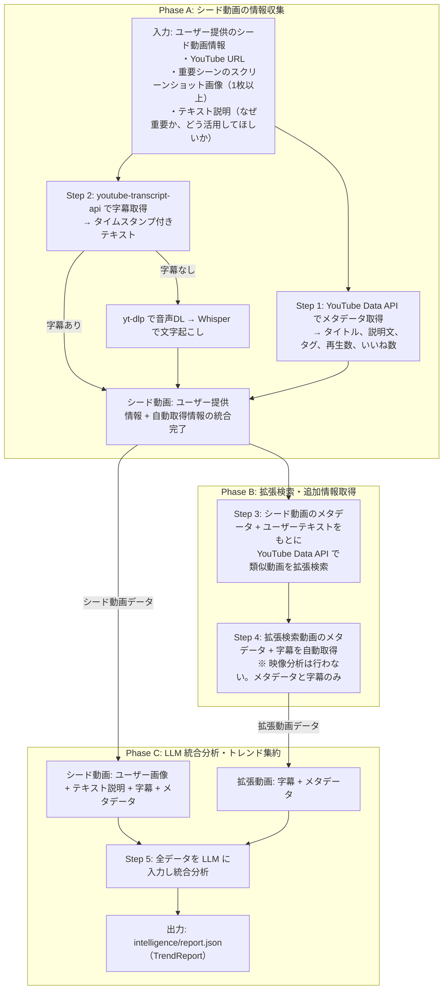

# Intelligence Engine 設計書

## 1. 概要

- **対応する仕様書セクション:** 3.2章（Intelligence Engine）、7章（重点技術課題: Trend Decomposition）
- **サブタスクID:** T1-2
- **依存:** T0-1（プロジェクト骨格・共通データスキーマ）
- **このサブタスクで実現すること:**
  - ユーザーが提供する競合動画情報（URL + 重要シーンの画像 + テキスト説明）を構造化する
  - 競合動画の字幕・メタデータを自動取得し、ユーザー提供情報と統合する
  - 統合データに基づき類似コンテンツを拡張検索し、追加情報を取得する
  - 全データを LLM で分析・集約し、`TrendReport` を生成する

## 2. スコープ

### 対象範囲

- ユーザー提供データの受け入れ（URL、重要シーン画像、テキスト説明）
- 字幕の自動取得（youtube-transcript-api + Whisper フォールバック）
- メタデータの自動取得（YouTube Data API v3）
- 分析結果に基づく類似コンテンツの拡張検索（YouTube Data API v3）
- 拡張検索動画の字幕・メタデータ自動取得
- 全データの LLM 統合分析とトレンド集約
- `TrendReport` の生成・保存
- レイヤー境界の抽象インターフェース定義

### 対象外

- 動画ファイルのダウンロード・AI映像分析（コストが高いため、ユーザーの目視分析で代替）
- Intelligence → Scenario の結合検証（T2-1で実施）
- チェックポイント機構の詳細（T1-1 CLI基盤で実装。本設計では保存・読み込みI/Fのみ定義）
- Web UI でのプレビュー（T4-2で実装）
- 音声からのBPM自動検出（LLM による推定で代替）

## 3. 技術設計

### 3.1 設計思想

**「ユーザーの目視分析 + 自動メタデータ取得」のハイブリッド方式**

動画の映像内容は AI で自動分析するよりも、ユーザーが実際に動画を視聴して重要シーンをキャプチャし、注目ポイントをテキストで説明する方が、精度・コスト両面で優れている。一方、字幕・メタデータは API で機械的に取得できるため自動化する。

| 情報                       | 取得方法                           | 理由                                         |
| -------------------------- | ---------------------------------- | -------------------------------------------- |
| 重要シーンの映像           | ユーザーがスクリーンショットを提供 | AI映像分析は高コスト、ユーザーの審美眼が重要 |
| なぜ重要か・どう活用するか | ユーザーがテキストで説明           | 制作意図はユーザーしか持たない情報           |
| 字幕（トランスクリプト）   | youtube-transcript-api で自動取得  | 無料・高速、テロップ内容の把握に有用         |
| メタデータ                 | YouTube Data API で自動取得        | タイトル、タグ、再生数等の構造化データ       |

### 3.2 技術スタック

| 要素                         | 採用技術                   | 選定理由                                 |
| ---------------------------- | -------------------------- | ---------------------------------------- |
| 字幕取得                     | youtube-transcript-api     | APIキー不要、タイムスタンプ付き、無料    |
| 字幕取得（フォールバック）   | OpenAI Whisper API         | 字幕が存在しない動画への対応             |
| メタデータ取得               | YouTube Data API v3        | タイトル・タグ・再生数等のメタデータ     |
| 拡張検索                     | YouTube Data API v3        | 類似動画の検索                           |
| 画像分析（ユーザー提供画像） | Gemini 2.5 Flash（Vision） | ユーザーのテキスト説明を補強する画像理解 |
| トレンド集約                 | Gemini 2.5 Flash           | 全データの統合分析                       |
| Gemini SDK                   | `google-genai`（公式SDK）  | Asset Generator の `langchain-google-genai` と SDK が異なるが、Intelligence Engine は Vision 入力 + Structured Output が主用途であり、公式 SDK の方が直接的。各レイヤーのSDK選択はレイヤー内で完結するため混在は許容する |
| 音声DL（フォールバック用）   | yt-dlp                     | Whisper フォールバック時のみ使用         |
| HTTP通信                     | httpx（async）             | コーディング規約に準拠                   |

### 3.3 全体フロー



### 3.4 ディレクトリ構成

```
src/daily_routine/intelligence/
├── __init__.py
├── engine.py           # IntelligenceEngine（ABCの具象実装）
├── base.py             # IntelligenceEngineBase（ABC定義）+ 入力データ型
├── youtube.py          # YouTube Data API クライアント（メタデータ + 拡張検索）
├── transcript.py       # 字幕取得（youtube-transcript-api + Whisper フォールバック）
├── trend_aggregator.py # LLM 統合分析・トレンド集約
└── downloader.py       # 音声ダウンロード（Whisper フォールバック用のみ）
```

### 3.5 抽象インターフェース定義

```python
# intelligence/base.py
from abc import ABC, abstractmethod
from pathlib import Path
from pydantic import BaseModel, Field
from daily_routine.schemas.intelligence import TrendReport


class SceneCapture(BaseModel):
    """ユーザーが提供する重要シーンのキャプチャ."""

    image_path: Path = Field(description="スクリーンショット画像のパス")
    description: str = Field(description="このシーンがなぜ重要か、どう活用してほしいか")
    timestamp_sec: float | None = Field(
        default=None,
        description="動画内の大まかな時刻（秒）。不明なら省略可",
    )


class SeedVideo(BaseModel):
    """ユーザーが提供するシード動画情報."""

    url: str = Field(description="YouTube動画のURL")
    note: str = Field(default="", description="動画全体に対するテキスト補足")
    scene_captures: list[SceneCapture] = Field(
        default_factory=list,
        description="重要シーンのキャプチャ（1枚以上推奨）",
    )


class IntelligenceEngineBase(ABC):
    """Intelligence Engine のレイヤー境界インターフェース."""

    @abstractmethod
    async def analyze(
        self,
        keyword: str,
        seed_videos: list[SeedVideo],
        max_expand_videos: int = 10,
    ) -> TrendReport:
        """ユーザー提供の競合動画情報を分析し、拡張検索を経てトレンドレポートを生成する.

        Args:
            keyword: 検索キーワード（例：「OLの一日」）
            seed_videos: ユーザーが提供した競合動画情報のリスト
            max_expand_videos: 拡張検索で追加取得する動画の最大数

        Returns:
            トレンド分析レポート
        """
        ...
```

### 3.6 内部コンポーネント設計

#### 3.6.1 YouTube クライアント (`youtube.py`)

YouTube Data API v3 を使い、動画のメタデータ取得と拡張検索を行う。

```python
from pydantic import BaseModel, Field


class VideoMetadata(BaseModel):
    """YouTube動画のメタデータ."""

    video_id: str
    title: str
    description: str
    channel_title: str
    published_at: str
    view_count: int
    like_count: int
    duration_sec: int = Field(description="動画の長さ（秒）")
    thumbnail_url: str
    tags: list[str] = Field(default_factory=list, description="動画タグ")
    category_id: str = Field(default="", description="YouTubeカテゴリID")


class YouTubeClient:
    """YouTube Data API v3 クライアント."""

    def __init__(self, api_key: str) -> None: ...

    async def get_video_metadata(self, video_id: str) -> VideoMetadata:
        """動画IDからメタデータを取得する.

        videos.list API の snippet, statistics, contentDetails を使用。
        """
        ...

    async def search_related(
        self,
        seed_metadata: list[VideoMetadata],
        keyword: str,
        max_results: int = 20,
    ) -> list[VideoMetadata]:
        """シード動画の情報をもとに類似動画を拡張検索する.

        シード動画のタイトル・タグ・説明文から検索クエリを構築し、
        類似するショート動画を検索する。シード動画自体は除外する。
        """
        ...

    @staticmethod
    def extract_video_id(url: str) -> str:
        """YouTube URLから動画IDを抽出する.

        対応形式:
        - https://www.youtube.com/watch?v=VIDEO_ID
        - https://youtu.be/VIDEO_ID
        - https://www.youtube.com/shorts/VIDEO_ID
        """
        ...
```

**API仕様:**

| API         | エンドポイント              | クォータコスト | 取得情報                            |
| ----------- | --------------------------- | -------------- | ----------------------------------- |
| videos.list | `GET .../youtube/v3/videos` | 1単位          | snippet, statistics, contentDetails |
| search.list | `GET .../youtube/v3/search` | 100単位        | 拡張検索結果                        |

**拡張検索戦略:**

| 項目                     | 値                                                          |
| ------------------------ | ----------------------------------------------------------- |
| 検索クエリの構築         | keyword + シード動画タイトルの共通キーワード + 頻出タグ     |
| フィルタ                 | `type=video`, `videoDuration=short`, `videoDefinition=high` |
| 追加フィルタ（コード内） | duration ≤ 60秒、シード動画IDを除外                         |
| 並び順                   | `viewCount`（再生回数順）                                   |

#### 3.6.2 字幕取得 (`transcript.py`)

`youtube-transcript-api` で字幕を取得する。字幕がない動画には Whisper API でフォールバックする。

```python
class TranscriptSegment(BaseModel):
    """字幕のセグメント."""

    start_sec: float = Field(description="開始時刻（秒）")
    duration_sec: float = Field(description="継続時間（秒）")
    text: str = Field(description="テキスト")


class TranscriptResult(BaseModel):
    """字幕取得結果."""

    video_id: str
    source: str = Field(description="取得元: 'youtube_caption' | 'whisper'")
    language: str
    segments: list[TranscriptSegment]
    full_text: str = Field(description="全文テキスト")


class TranscriptFetcher:
    """字幕取得（youtube-transcript-api + Whisper フォールバック）."""

    def __init__(self, openai_api_key: str | None = None) -> None:
        """初期化.

        Args:
            openai_api_key: Whisper API用キー（フォールバック用、省略時はフォールバック無効）
        """
        ...

    async def fetch(self, video_id: str, audio_path: Path | None = None) -> TranscriptResult:
        """動画の字幕を取得する.

        1. youtube-transcript-api で字幕を試行（日本語 → 英語 → 自動生成の優先順）
        2. 字幕が存在しない場合、audio_path が指定されていれば Whisper API でフォールバック
        3. どちらも失敗した場合は空の TranscriptResult を返す

        Args:
            video_id: YouTube動画ID
            audio_path: 音声ファイルパス（Whisperフォールバック用、省略可）

        Returns:
            字幕結果
        """
        ...
```

**字幕取得の優先順位:**

| 優先度 | 方法                   | 条件                         | コスト            |
| ------ | ---------------------- | ---------------------------- | ----------------- |
| 1      | youtube-transcript-api | 字幕あり（手動 or 自動生成） | 無料、APIキー不要 |
| 2      | Whisper API            | 字幕なし + 音声ファイルあり  | $0.006/分         |
| 3      | なし（空結果）         | 字幕なし + 音声なし          | -                 |

#### 3.6.3 音声ダウンロード (`downloader.py`)

Whisper フォールバック時にのみ使用する。

```python
class AudioDownloader:
    """YouTube動画の音声をダウンロードする（Whisperフォールバック用）."""

    def __init__(self, output_dir: Path) -> None: ...

    async def download(self, video_id: str) -> Path:
        """動画の音声をMP3で取得する.

        yt-dlp をサブプロセスとして呼び出す。
        出力先: {output_dir}/{video_id}/audio.mp3

        Returns:
            ダウンロードした音声ファイルのパス
        """
        ...
```

#### 3.6.4 LLM 統合分析・トレンド集約 (`trend_aggregator.py`)

全データを LLM に入力し、統合分析と `TrendReport` 生成を行う。

```python
class SeedVideoData(BaseModel):
    """シード動画の統合データ（ユーザー提供 + 自動取得）."""

    video_id: str
    metadata: VideoMetadata
    transcript: TranscriptResult | None
    scene_captures: list[SceneCapture]  # ユーザー提供の画像+説明
    user_note: str  # ユーザーの全体テキスト補足


class ExpandedVideoData(BaseModel):
    """拡張検索動画のデータ（自動取得のみ）."""

    video_id: str
    metadata: VideoMetadata
    transcript: TranscriptResult | None


class TrendAggregator:
    """全データの LLM 統合分析とトレンド集約."""

    def __init__(self, api_key: str) -> None: ...

    async def aggregate(
        self,
        keyword: str,
        seed_videos: list[SeedVideoData],
        expanded_videos: list[ExpandedVideoData],
    ) -> TrendReport:
        """全動画データを統合分析し、トレンドレポートを生成する.

        シード動画はユーザーの画像+テキスト説明を含む深い分析を行い、
        拡張検索動画は字幕+メタデータからトレンドの補強材料として活用する。
        """
        ...
```

**LLM 統合分析のロジック:**

Gemini 2.5 Flash に以下を入力し、`TrendReport` を Structured Output で生成させる:

**入力データ:**

1. **シード動画（深い分析）:**
   - ユーザー提供のスクリーンショット画像（Vision 入力）
   - ユーザーのテキスト説明（なぜ重要か、どう活用するか）
   - 字幕テキスト（タイムスタンプ付き）
   - メタデータ（タイトル、説明文、タグ、再生数）
2. **拡張検索動画（補強材料）:**
   - 字幕テキスト
   - メタデータ

**分析指示:**

1. シード動画のユーザー提供画像を Vision で解析し、テキスト説明と照合してシーン構成・映像特徴を把握する
2. 字幕テキストからテロップの内容傾向、ナレーション有無、BGM言及等を分析する
3. 拡張検索動画の字幕・メタデータからトレンドを補強する
4. `TrendReport` の各フィールドを生成する:
   - `SceneStructure`: シーン数・尺、フック手法、遷移パターン
   - `CaptionTrend`: テロップスタイル（ユーザー画像から読み取り）
   - `VisualTrend`: シチュエーション・小物・カメラワーク・色調（ユーザー画像+説明から）
   - `AudioTrend`: BGMテンポ・ジャンル、SE使用箇所（字幕・ユーザー説明から推定）
   - `AssetRequirement`: 必要素材リスト

### 3.7 スキーマ拡張

既存の `TrendReport` スキーマ（`schemas/intelligence.py`）は概ねそのまま使用する。

**変更点:** `AudioTrend.bpm_range` の型を `tuple[int, int]` → `list[int]`（`min_length=2, max_length=2`）に変更。Gemini API の `response_schema` が Pydantic v2 の `prefixItems`（tuple の JSON Schema 表現）に対応していないため。

`SeedVideo`, `SceneCapture`（ユーザー入力）は `intelligence/base.py` に定義する。内部の中間データ型は `intelligence/` パッケージ内に定義し、`schemas/` には追加しない。

### 3.8 設定

#### グローバル設定への追加

`configs/global.yaml` の `api_keys` に `youtube_data_api`, `openai`, `google_ai` は既に定義済み。追加の設定は不要。

#### Intelligence Engine 固有の設定

engine のコンストラクタ引数で制御する。

| パラメータ          | デフォルト値 | 説明                               |
| ------------------- | ------------ | ---------------------------------- |
| `max_expand_videos` | 10           | 拡張検索で追加取得する動画の最大数 |

### 3.9 エラーハンドリング

| エラー種別                             | 対処                                               |
| -------------------------------------- | -------------------------------------------------- |
| YouTube API クォータ超過               | 例外を上位に伝播。ログに残量を記録                 |
| メタデータ取得失敗（シード動画）       | 即座にエラーを返す（ユーザー指定なので必須）       |
| メタデータ取得失敗（拡張検索動画）     | 当該動画をスキップし、他の動画で続行               |
| 字幕取得失敗（youtube-transcript-api） | Whisper フォールバックを試行                       |
| Whisper フォールバック失敗             | 字幕なしで LLM 分析を実行（degraded mode）         |
| ユーザー画像ファイルが存在しない       | 即座にエラーを返す                                 |
| Gemini API レート制限                  | 指数バックオフで最大3回リトライ                    |
| 拡張検索で類似動画が0件                | シード動画のみでトレンドレポートを生成（警告ログ） |

### 3.10 中間データの保存

```
{project_dir}/intelligence/
├── report.json                    # 最終出力（TrendReport）
├── seed_input.json                # ユーザー提供のシード動画情報（URL, note, scene_captures参照）
├── scene_captures/                # ユーザー提供のスクリーンショット画像
│   ├── {video_id}/
│   │   ├── scene_001.png
│   │   └── ...
│   └── ...
└── tmp/
    ├── expanded_search.json       # 拡張検索結果
    ├── seed/
    │   └── {video_id}/
    │       ├── metadata.json      # メタデータ
    │       ├── transcript.json    # 字幕結果
    │       └── audio.mp3          # 音声（Whisperフォールバック時のみ）
    └── expanded/
        └── {video_id}/
            ├── metadata.json
            └── transcript.json
```

## 4. 入出力例

「OLの一日」をキーワードとした分析の具体例を示す。

### 4.1 入力例

#### CLI からの呼び出し

```bash
# シード動画なし（拡張検索のみ）
uv run daily-routine run "OLの一日"

# シード動画付き（YAML ファイルで指定）
uv run daily-routine run "OLの一日" --seeds seeds.yaml
```

**seeds.yaml の形式:**

```yaml
seed_videos:
  - url: "https://www.youtube.com/shorts/abc123xyz"
    note: "朝の準備から出社までをテンポよく見せている。テロップの入れ方が上手い"
    scene_captures:
      - image_path: "./captures/abc123xyz/scene_001.png"
        description: "冒頭のアラーム画面。大きな白文字で「AM 6:00」と表示。視聴者の目を引くフック"
        timestamp_sec: 0.5
      - image_path: "./captures/abc123xyz/scene_002.png"
        description: "コーヒーを淹れるシーン。暖色系フィルタでおしゃれな雰囲気。小物の配置が参考になる"
        timestamp_sec: 8.0
  - url: "https://www.youtube.com/shorts/def456uvw"
    note: "退勤後の夜ルーティンに特化。BGMがチルで心地よい"
    scene_captures:
      - image_path: "./captures/def456uvw/scene_001.png"
        description: "帰宅してドアを開ける瞬間。「ただいま〜」のテロップがかわいいフォント"
        timestamp_sec: 1.0
```

CLI は YAML を `_load_seeds()` で `list[SeedVideo]` に変換し、`run_pipeline()` → `_build_input()` → `IntelligenceInput.seed_videos` に渡す。

#### `IntelligenceEngine.analyze()` の呼び出し

```python
await engine.analyze(
    keyword="OLの一日",
    seed_videos=[
        SeedVideo(
            url="https://www.youtube.com/shorts/abc123xyz",
            note="朝の準備から出社までをテンポよく見せている。テロップの入れ方が上手い",
            scene_captures=[
                SceneCapture(
                    image_path=Path("scene_captures/abc123xyz/scene_001.png"),
                    description="冒頭のアラーム画面。大きな白文字で「AM 6:00」と表示。視聴者の目を引くフック",
                    timestamp_sec=0.5,
                ),
                SceneCapture(
                    image_path=Path("scene_captures/abc123xyz/scene_002.png"),
                    description="コーヒーを淹れるシーン。暖色系フィルタでおしゃれな雰囲気。小物の配置が参考になる",
                    timestamp_sec=8.0,
                ),
            ],
        ),
        SeedVideo(
            url="https://www.youtube.com/shorts/def456uvw",
            note="退勤後の夜ルーティンに特化。BGMがチルで心地よい",
            scene_captures=[
                SceneCapture(
                    image_path=Path("scene_captures/def456uvw/scene_001.png"),
                    description="帰宅してドアを開ける瞬間。「ただいま〜」のテロップがかわいいフォント",
                    timestamp_sec=1.0,
                ),
            ],
        ),
    ],
    max_expand_videos=10,
)
```

#### ユーザー提供のシード動画情報（`seed_input.json` として保存される形式）

```json
{
  "keyword": "OLの一日",
  "seed_videos": [
    {
      "url": "https://www.youtube.com/shorts/abc123xyz",
      "note": "朝の準備から出社までをテンポよく見せている。テロップの入れ方が上手い",
      "scene_captures": [
        {
          "image_path": "scene_captures/abc123xyz/scene_001.png",
          "description": "冒頭のアラーム画面。大きな白文字で「AM 6:00」と表示。視聴者の目を引くフック",
          "timestamp_sec": 0.5
        },
        {
          "image_path": "scene_captures/abc123xyz/scene_002.png",
          "description": "コーヒーを淹れるシーン。暖色系フィルタでおしゃれな雰囲気。小物の配置が参考になる",
          "timestamp_sec": 8.0
        }
      ]
    },
    {
      "url": "https://www.youtube.com/shorts/def456uvw",
      "note": "退勤後の夜ルーティンに特化。BGMがチルで心地よい",
      "scene_captures": [
        {
          "image_path": "scene_captures/def456uvw/scene_001.png",
          "description": "帰宅してドアを開ける瞬間。「ただいま〜」のテロップがかわいいフォント",
          "timestamp_sec": 1.0
        }
      ]
    }
  ]
}
```

### 4.2 中間データ例

#### メタデータ（`tmp/seed/abc123xyz/metadata.json`）

```json
{
  "video_id": "abc123xyz",
  "title": "【モーニングルーティン】都内OLのリアルな朝 🌅",
  "description": "朝6時起きのOLの一日...",
  "channel_title": "OL Diary",
  "published_at": "2026-01-15T09:00:00Z",
  "view_count": 1250000,
  "like_count": 45000,
  "duration_sec": 58,
  "thumbnail_url": "https://i.ytimg.com/vi/abc123xyz/hqdefault.jpg",
  "tags": ["OL", "モーニングルーティン", "一日", "vlog", "ルーティン動画"],
  "category_id": "22"
}
```

#### 字幕（`tmp/seed/abc123xyz/transcript.json`）

```json
{
  "video_id": "abc123xyz",
  "source": "youtube_caption",
  "language": "ja",
  "segments": [
    {"start_sec": 0.0, "duration_sec": 2.0, "text": "AM 6:00"},
    {"start_sec": 2.0, "duration_sec": 3.0, "text": "今日も一日頑張ろう"},
    {"start_sec": 5.0, "duration_sec": 3.5, "text": "まずは顔を洗って"},
    {"start_sec": 8.5, "duration_sec": 3.0, "text": "コーヒータイム☕"},
    {"start_sec": 11.5, "duration_sec": 4.0, "text": "お気に入りのマグカップで"}
  ],
  "full_text": "AM 6:00 今日も一日頑張ろう まずは顔を洗って コーヒータイム☕ お気に入りのマグカップで"
}
```

### 4.3 出力例

#### `TrendReport`（`intelligence/report.json`）

```json
{
  "keyword": "OLの一日",
  "analyzed_video_count": 12,
  "scene_structure": {
    "total_scenes": 8,
    "avg_scene_duration_sec": 7.0,
    "hook_techniques": [
      "時刻テロップで日常感を演出（AM 6:00）",
      "アラーム音SEで臨場感",
      "1秒以内にメインビジュアルを表示"
    ],
    "transition_patterns": [
      "時間経過に沿った時系列遷移",
      "カット切り替え（0.3秒フェード）",
      "同ポジション別アングル切り替え"
    ]
  },
  "caption_trend": {
    "font_styles": ["丸ゴシック体", "手書き風フォント"],
    "color_schemes": ["白文字+黒縁取り", "パステルカラー（ピンク・水色）"],
    "animation_types": ["ポップイン", "フェードイン", "バウンス"],
    "positions": ["画面中央下", "被写体の横（吹き出し風）"],
    "emphasis_techniques": ["キーワードのみ色変え", "絵文字の併用（☕🌅）"]
  },
  "visual_trend": {
    "situations": [
      "起床・アラーム停止",
      "洗顔・スキンケア",
      "朝食・コーヒー準備",
      "メイク・身支度",
      "通勤・出社",
      "デスクワーク",
      "退勤・帰宅",
      "夜のリラックスタイム"
    ],
    "props": [
      "スマートフォン（アラーム）",
      "マグカップ",
      "コスメポーチ",
      "ノートPC",
      "観葉植物"
    ],
    "camera_works": [
      "俯瞰（デスク上・料理シーン）",
      "正面バストアップ（メイクシーン）",
      "スライド（部屋全体の紹介）"
    ],
    "color_tones": [
      "暖色系フィルタ（朝・カフェシーン）",
      "ナチュラル（オフィスシーン）",
      "ブルー系（夜・リラックスシーン）"
    ]
  },
  "audio_trend": {
    "bpm_range": [90, 120],
    "genres": ["Lo-Fi Hip Hop", "アコースティック", "チル系エレクトロ"],
    "volume_patterns": [
      "冒頭SE後にBGMフェードイン",
      "シーン切り替え時に一瞬無音",
      "ラストに向けてフェードアウト"
    ],
    "se_usage_points": [
      "アラーム音（冒頭フック）",
      "ドアの開閉音（場面転換）",
      "キーボードタイピング音（仕事シーン）",
      "カップを置く音（カフェシーン）"
    ]
  },
  "asset_requirements": {
    "characters": ["20代後半女性OL（主人公）"],
    "props": [
      "スマートフォン",
      "マグカップ",
      "コスメポーチ",
      "ノートPC",
      "通勤バッグ",
      "観葉植物"
    ],
    "backgrounds": [
      "1Kマンション室内（ベッド・キッチン・洗面台）",
      "カフェ風キッチン",
      "都内オフィス（デスク周り）",
      "駅・通勤路",
      "リビング（夜・間接照明）"
    ]
  }
}
```

## 5. 実装計画

### ステップ1: 依存関係の追加と基盤ファイル作成

- `pyproject.toml` に依存関係を追加: `google-api-python-client`, `google-genai`, `youtube-transcript-api`, `yt-dlp`, `httpx`
- `intelligence/base.py` に抽象インターフェースと `SeedVideo`, `SceneCapture` を定義
- `intelligence/` 以下のモジュールファイルを作成
- **完了条件:** `uv sync` が成功し、`IntelligenceEngineBase` がインポート可能

### ステップ2: YouTube クライアントの実装

- `youtube.py` に `YouTubeClient` を実装
- URLからの動画ID抽出、メタデータ取得、拡張検索
- ユニットテスト: APIレスポンスをモック化して検証
- **完了条件:** モックテストが通り、`VideoMetadata` が正しく返される

### ステップ3: 字幕取得の実装

- `transcript.py` に `TranscriptFetcher` を実装
- youtube-transcript-api による字幕取得 + Whisper API フォールバック
- `downloader.py` に `AudioDownloader` を実装（フォールバック用）
- ユニットテスト: youtube-transcript-api と Whisper API をモック化して検証
- **完了条件:** 字幕あり/なし両方のケースでテストが通る

### ステップ4: LLM 統合分析・トレンド集約の実装

- `trend_aggregator.py` に `TrendAggregator` を実装
- ユーザー画像（Vision）+ テキスト説明 + 字幕 + メタデータの統合プロンプト構築
- Structured Output で `TrendReport` スキーマに準拠
- ユニットテスト: Gemini APIをモック化して検証
- **完了条件:** モックテストが通り、`TrendReport` が正しく生成される

### ステップ5: IntelligenceEngine の統合実装

- `engine.py` に `IntelligenceEngine` を実装
- Phase A → B → C のフロー
- 中間データの保存・ロード
- エラーハンドリング（シード動画必須、拡張動画スキップ可、字幕フォールバック）
- 統合テスト: 全コンポーネントのモックを組み合わせた E2E フロー検証
- **完了条件:** 統合テストが通り、`SeedVideo` リスト → `TrendReport` の一連のフローが動作する

## 6. テスト方針

### ユニットテスト

| テスト対象          | テスト内容                                                                                |
| ------------------- | ----------------------------------------------------------------------------------------- |
| `YouTubeClient`     | URL→動画ID抽出（各URL形式）、メタデータ取得のパース、拡張検索クエリ構築、フィルタリング   |
| `TranscriptFetcher` | youtube-transcript-api成功時の取得、字幕なし時のWhisperフォールバック、両方失敗時の空結果 |
| `AudioDownloader`   | yt-dlpコマンドの構築、出力パスの生成                                                      |
| `TrendAggregator`   | 統合プロンプト構築（画像+テキスト+字幕+メタデータ）、`TrendReport` への変換               |

### 統合テスト

| テスト対象                     | テスト内容                                                      |
| ------------------------------ | --------------------------------------------------------------- |
| `IntelligenceEngine.analyze()` | 全コンポーネントをモック化した一気通貫テスト（Phase A → B → C） |
| 中間データ保存                 | 中間結果がファイルシステムに正しく保存される                    |
| 字幕フォールバック             | youtube-transcript-api失敗 → Whisper → degraded mode の遷移     |
| エラーハンドリング             | シード動画失敗で即エラー、拡張動画失敗でスキップ                |
| 拡張検索0件                    | シード動画のみでTrendReportが生成される                         |
| 画像なしシード                 | scene_captures が空でも動作する                                 |

### テスト方針

- 全ての外部呼び出し（YouTube Data API, youtube-transcript-api, Whisper, Gemini, yt-dlp）はモック化する
- テスト命名: `test_{テスト対象}_{条件}_{期待結果}`
- テストファイル: `tests/test_intelligence/` 以下にモジュール単位で配置

## 7. コスト見積もり（1回の分析実行あたり）

| 項目                                            | 見積もり                                    |
| ----------------------------------------------- | ------------------------------------------- |
| YouTube Data API（メタデータ + 拡張検索）       | 約110クォータ単位（日次上限10,000の約1.1%） |
| youtube-transcript-api（字幕取得）              | 無料                                        |
| Whisper API（フォールバック: 字幕なし動画のみ） | $0.006/分 × 対象動画数                      |
| Gemini 2.5 Flash（画像 + テキスト統合分析）     | 約$0.05（画像数枚 + テキスト入力）          |
| **合計（字幕全取得成功時）**                    | **約$0.05**                                 |
| **合計（全動画Whisperフォールバック時）**       | **約$0.13**                                 |

## 8. 未決事項

| 項目                   | 内容                                                     | 判断タイミング                      |
| ---------------------- | -------------------------------------------------------- | ----------------------------------- |
| BGM分析の精度          | ユーザー説明+字幕からのLLM推定で十分か                   | ステップ4実行後、出力を評価         |
| 拡張検索クエリの最適化 | シード動画からどの情報を検索クエリに使うか               | ステップ2実行後、検索結果の質を評価 |
| ユーザー入力のガイド   | スクリーンショットの推奨枚数、テキスト説明のテンプレート | ステップ5実行後、使い勝手を評価     |
