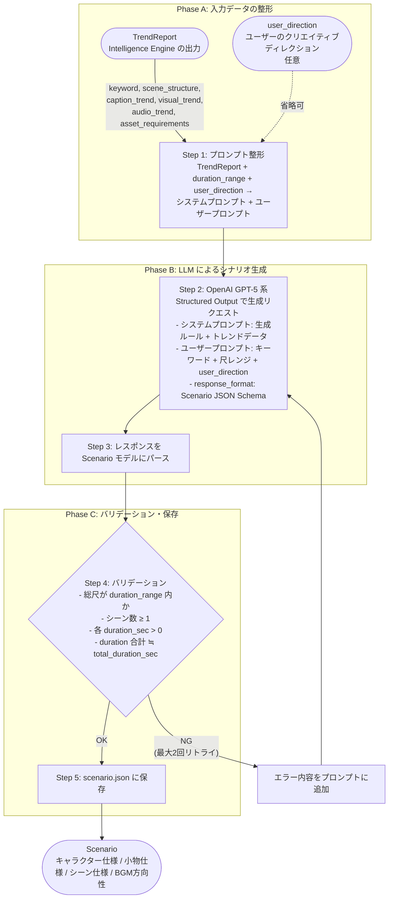

# Scenario Engine 設計書

## 1. 概要

- **対応する仕様書セクション:** 3.3章（Scenario Engine）
- **サブタスクID:** T1-5
- **依存:** T0-1（プロジェクト骨格・共通データスキーマ）
- **このサブタスクで実現すること:**
  - Intelligence Engine が出力した `TrendReport` を入力として、動画全体のシナリオを自動生成する
  - シーンごとの状況説明・時間配分・カメラワーク・テロップ文言を構造化する
  - Asset Generator 向けの画像生成プロンプト、Keyframe Engine 向けのキーフレーム画像生成プロンプト、Visual Core 向けの動画生成プロンプトを自動構築する
  - キャラクター仕様（外見・服装・リファレンスプロンプト）を導出する
  - BGM の方向性指示を生成する

## 2. スコープ

### 対象範囲

- Scenario Engine レイヤー（`src/daily_routine/scenario/`）の実装
- レイヤー境界の抽象インターフェース定義（ABC）
- LLM（OpenAI GPT-5 系）による `TrendReport` → `Scenario` 変換
- Structured Output による型安全なシナリオ生成
- プロンプトテンプレートの設計・管理（LLM へのシステムプロンプト）
- 生成結果の保存（`scenario/scenario.json`）
- ユニットテスト

### 対象外

- Intelligence → Scenario の結合検証（T2-1 で実施）
- Scenario → Asset → Visual の結合検証（T2-2 で実施）
- Dynamic Captions の詳細なアニメーション制御（T2-4 で実施。本タスクではテロップ文言の生成のみ）
- Web UI でのシナリオ確認・編集画面（T4-2 で実施）
- 自動品質チェック（T4-1 で実施）
- パイプラインオーケストレーションへの統合（T1-1 で実施、本タスクではインターフェースのみ定義）

## 3. 技術設計

### 3.1 設計思想

**「LLM による一括生成 + Structured Output で型保証」方式**

TrendReport の全フィールド（シーン構成・テロップトレンド・映像トレンド・音響トレンド・素材要件）を LLM に一括入力し、`Scenario` スキーマに準拠した構造化出力を得る。ルールベースの分岐ロジックを最小限にし、LLM の文脈理解力を最大限に活用する。

| 設計判断         | 選択                             | 理由                                                                                                                       |
| ---------------- | -------------------------------- | -------------------------------------------------------------------------------------------------------------------------- |
| シナリオ生成方式 | LLM 一括生成                     | シーン間の整合性（時間配分、ストーリーの流れ、カメラワークの変化）を LLM が全体を見て最適化できる                          |
| 出力制御         | Structured Output（JSON Schema） | `Scenario` スキーマへの準拠を API レベルで保証し、パース失敗を排除                                                         |
| プロンプト生成   | LLM にシーン文脈ごと生成させる   | Asset Generator / Keyframe Engine / Visual Core 向けプロンプトは、シーンの状況・カメラワーク・キャラクター情報を統合した文脈依存が必要なため |

### 3.2 技術スタック

| 要素              | 採用技術                                         | 選定理由                                                                                                                          |
| ----------------- | ------------------------------------------------ | --------------------------------------------------------------------------------------------------------------------------------- |
| シナリオ生成 LLM  | OpenAI GPT-5 系                                  | Gemini 2.5 Flash と比較してシナリオ生成（創作・構成力）の性能が優位。Structured Output 対応。日英混在出力の精度が高い              |
| Structured Output | OpenAI SDK の `response_format`（JSON Schema）   | Pydantic モデルから JSON Schema を自動生成し、LLM 出力を型安全に取得。`openai` SDK がネイティブ対応                               |
| HTTP 通信         | openai SDK（内部で httpx 使用、`AsyncOpenAI`）   | 非同期対応の公式 SDK。コーディング規約の async/await + httpx に準拠                                                                |

### 3.3 全体フロー



### 3.4 ディレクトリ構成

```
src/daily_routine/scenario/
├── __init__.py
├── base.py             # ScenarioEngineBase（ABC定義）
├── engine.py           # OpenAIScenarioEngine（ABCの具象実装）
├── prompt.py           # LLM 向けプロンプトテンプレート管理
└── validator.py        # 生成結果のバリデーション
```

### 3.5 抽象インターフェース定義

```python
# scenario/base.py
from abc import ABC, abstractmethod
from pathlib import Path

from daily_routine.schemas.intelligence import TrendReport
from daily_routine.schemas.scenario import Scenario


class ScenarioEngineBase(ABC):
    """Scenario Engine のレイヤー境界インターフェース."""

    @abstractmethod
    async def generate(
        self,
        trend_report: TrendReport,
        output_dir: Path,
        duration_range: tuple[int, int] = (30, 60),
        user_direction: str | None = None,
    ) -> Scenario:
        """トレンド分析レポートからシナリオを生成する.

        Args:
            trend_report: Intelligence Engine が生成したトレンド分析レポート
            output_dir: 出力ディレクトリ（scenario.json の保存先）
            duration_range: 動画尺の範囲（秒）。デフォルトは 30〜60秒
            user_direction: ユーザーのクリエイティブディレクション（自由テキスト）。
                例: 「コメディ寄りにしたい」「朝のシーンを長めに」等。
                省略時はトレンド分析のみに基づいて生成する。

        Returns:
            シナリオ（キャラクター仕様、小物仕様、シーン仕様、BGM方向性を含む）
        """
        ...
```

**設計ポイント:**

- 入力は `TrendReport`（レイヤー間依存は `schemas/` 経由）
- `output_dir` は呼び出し側（パイプラインランナー）から渡される（Asset Generator と同じパターン）
- `duration_range` は `ProjectConfig.output_duration_range` から渡される
- `user_direction` はユーザーの創作意図を自由テキストで受け取る。LLM プロンプトに追加され、トレンド分析と合わせてシナリオ生成を誘導する。省略可能
- 出力は `Scenario`（`schemas/scenario.py` で定義済み）

### 3.6 内部コンポーネント設計

#### 3.6.1 プロンプトテンプレート管理 (`prompt.py`)

LLM に渡すシステムプロンプトとユーザープロンプトを構築する。

```python
class ScenarioPromptBuilder:
    """Scenario Engine 用のプロンプト構築."""

    def build_system_prompt(self, trend_report: TrendReport) -> str:
        """TrendReport の情報を含むシステムプロンプトを構築する.

        以下の情報を構造化してプロンプトに埋め込む:
        - シーン構成トレンド（シーン数、フック手法、遷移パターン）
        - テロップトレンド（スタイル傾向）
        - 映像トレンド（シチュエーション、小物、カメラワーク、色調）
        - 音響トレンド（BPM、ジャンル、SE使用箇所）
        - 素材要件（キャラクター、小物、背景リスト）
        - シナリオ生成ルール（後述）
        """
        ...

    def build_user_prompt(
        self,
        keyword: str,
        duration_range: tuple[int, int],
        user_direction: str | None = None,
    ) -> str:
        """キーワードと動画尺レンジを含むユーザープロンプトを構築する.

        user_direction が指定されている場合、ユーザーの創作意図として
        プロンプトに追加する。LLM はトレンド分析と user_direction の
        両方を考慮してシナリオを生成する。
        """
        ...
```

**シナリオ生成ルール（システムプロンプトに含める）:**

1. **全体構成:**
   - `title` はキーワードを含む魅力的なタイトル
   - `total_duration_sec` は `duration_range` 内
   - 冒頭シーンはトレンド分析の `hook_techniques` を活用してフックを効かせる

2. **キャラクター仕様（`CharacterSpec`）:**
   - `asset_requirements.characters` から名前を導出
   - `appearance`: 年齢、髪型、髪色、体型などの具体的な外見描写（英語）
   - `outfit`: 服装の具体的な描写（英語）
   - `reference_prompt`: Asset Generator が正面リファレンス画像を生成するための詳細プロンプト（英語）。白背景、スタジオライティング、全身立ちポーズを含む。**注意:** このプロンプトは Asset Generator のモード A の起点（正面画像）用であり、横・背面・表情バリエーションは Asset Generator が正面画像を参照画像として自律的に派生させる（Asset Generator 設計書参照）

3. **小物仕様（`PropSpec`）:**
   - `asset_requirements.props` からリストを導出し、各小物の詳細説明と画像生成プロンプトを付与
   - `name`: 小物名（日本語）
   - `description`: 小物の詳細説明（日本語）。シナリオ内での用途・特徴を含む
   - `image_prompt`: Asset Generator 向け小物画像生成プロンプト（英語）。白背景、スタジオライティング、商品撮影風

4. **シーン仕様（`SceneSpec`）:**
   - `scene_number`: 1始まりの連番
   - `duration_sec`: トレンド分析の `avg_scene_duration_sec` を参考に配分
   - `situation`: シーンの状況を具体的に説明（日本語）
   - `camera_work`: トレンド分析の `camera_works` を参考に、シーンに適したカメラワークを指定
   - `caption_text`: 視聴者の興味を引くテロップ文言（日本語）。トレンド分析の `emphasis_techniques` を参考
   - `image_prompt`: Asset Generator 向け背景画像生成プロンプト（英語）。キャラクター不在、背景のみ。色調はトレンドの `color_tones` を反映
   - `keyframe_prompt`: Gen-4 Image 向けキーフレーム画像生成プロンプト（英語）。シーンの場所・状況にキャラクターを配置した構図を記述する。`@char` タグでキャラクターを参照し、照明・雰囲気を含める。背景画像（`image_prompt`）とは異なり、キャラクターを含む完成構図を記述する
   - `motion_prompt`: Visual Core 向け動画生成プロンプト（英語）。`/docs/guidelines/visual_prompt.md` に準拠する。Subject Motion + Scene Motion + Camera Motion の3要素で構成し、入力画像に既にある情報（外見・服装・場所）は記述しない。能動態の精密な動詞を使用する

5. **BGM方向性（`bgm_direction`）:**
   - トレンド分析の `audio_trend`（BPM帯、ジャンル）を反映した自然言語の指示

6. **プロンプト言語:**
   - `image_prompt`, `keyframe_prompt`, `motion_prompt`, `reference_prompt`, `appearance`, `outfit`: 英語（画像/動画生成 AI は英語プロンプトで最高性能を発揮）
   - `title`, `situation`, `caption_text`, `bgm_direction`, `PropSpec.name`, `PropSpec.description`: 日本語（日本語コンテンツ向け）

### 3.7 OpenAI Scenario Engine 実装 (`engine.py`)

```python
class OpenAIScenarioEngine(ScenarioEngineBase):
    """OpenAI GPT-5 系を使った Scenario Engine 実装."""

    def __init__(self, api_key: str, model_name: str = "gpt-5") -> None:
        ...

    async def generate(
        self,
        trend_report: TrendReport,
        output_dir: Path,
        duration_range: tuple[int, int] = (30, 60),
        user_direction: str | None = None,
    ) -> Scenario:
        """TrendReport からシナリオを生成する.

        1. プロンプト構築（Phase A）— user_direction があればプロンプトに追加
        2. OpenAI API に Structured Output で生成リクエスト（Phase B）
        3. バリデーション（Phase C）
        4. バリデーション失敗時は最大2回リトライ（エラー内容をプロンプトに追加）
        5. output_dir/scenario.json に保存
        """
        ...
```

**Structured Output の実装方針:**

OpenAI SDK の `response_format` パラメータで JSON Schema を指定する。`openai` SDK は Pydantic モデルからの Structured Output をネイティブサポートしており、`client.beta.chat.completions.parse()` で直接 Pydantic モデルを渡せる。

```python
# 実装イメージ
from openai import AsyncOpenAI

client = AsyncOpenAI(api_key=api_key)

response = await client.beta.chat.completions.parse(
    model=model_name,
    messages=[
        {"role": "system", "content": system_prompt},
        {"role": "user", "content": user_prompt},
    ],
    response_format=Scenario,
)

# SDK が自動的に Pydantic モデルにパース
scenario = response.choices[0].message.parsed
```

**Pydantic モデル連携:**

OpenAI SDK は Pydantic v2 の `BaseModel` を `response_format` に直接受け付けるため、`Scenario` モデルをそのまま渡せる。Gemini と異なり JSON Schema への手動変換ヘルパーは不要。ただし OpenAI の Structured Output にも一部制約があるため（再帰型の制限等）、`Scenario` スキーマの互換性は実装時に検証する。

### 3.8 バリデーション (`validator.py`)

LLM 生成結果の論理的な整合性を検証する。Structured Output でスキーマ準拠は保証されるが、値の妥当性は追加チェックが必要。

```python
class ScenarioValidationError(Exception):
    """シナリオバリデーションエラー."""

    def __init__(self, errors: list[str]) -> None:
        self.errors = errors
        super().__init__(f"シナリオバリデーションエラー: {errors}")


class ScenarioValidator:
    """生成されたシナリオのバリデーション."""

    def validate(
        self,
        scenario: Scenario,
        duration_range: tuple[int, int],
    ) -> None:
        """シナリオの論理的整合性を検証する.

        検証項目:
        1. total_duration_sec が duration_range 内
        2. scenes が 1 件以上存在
        3. 各シーンの duration_sec > 0
        4. 各シーンの duration_sec 合計と total_duration_sec の差が ±2秒以内
        5. scene_number が 1 始まりの連番
        6. characters が 1 件以上存在

        Raises:
            ScenarioValidationError: バリデーションエラーがある場合
        """
        ...
```

**リトライ時のエラーフィードバック:**

バリデーションエラーが発生した場合、エラー内容をユーザープロンプトに追加して LLM にリトライさせる。これにより LLM が自身の出力を修正できる。

```
# リトライ時に追加するプロンプト例
前回の生成結果に以下のエラーがありました。修正してください:
- total_duration_sec が 75.0 秒ですが、30〜60秒の範囲内にしてください
- scene_number が [1, 2, 4] ですが、連番にしてください
```

### 3.9 設定

#### グローバル設定からの取得

`configs/global.yaml` の `api_keys.openai` を使用する（`GlobalConfig.api_keys.openai`）。既に定義済みのため追加設定は不要。

**API キーの環境変数オーバーライド:** `DAILY_ROUTINE_API_KEY_OPENAI` 環境変数が設定されている場合、`configs/global.yaml` の値より優先される（`config/manager.py` の `_apply_env_overrides()` による共通機構）。`.env` ファイルによる設定もサポートされる。

#### Scenario Engine 固有のパラメータ

コンストラクタ引数で制御する。初期値はハードコードとし、将来的に `configs/global.yaml` への外出しが必要になった場合に対応する。

| パラメータ    | デフォルト値 | 供給元                                 | 説明                                   |
| ------------- | ------------ | -------------------------------------- | -------------------------------------- |
| `api_key`     | （必須）     | `GlobalConfig.api_keys.openai`         | OpenAI API キー                        |
| `model_name`  | `"gpt-5"`   | コンストラクタ引数（ハードコード）     | 使用する OpenAI モデル                 |
| `max_retries` | `2`          | コンストラクタ引数（ハードコード）     | バリデーション失敗時の最大リトライ回数 |

`duration_range` は `ProjectConfig.output_duration_range` から `generate()` 呼び出し時に渡される。

### 3.10 エラーハンドリング

| エラー種別                             | 対処                                                     |
| -------------------------------------- | -------------------------------------------------------- |
| OpenAI API レート制限（429）           | 指数バックオフで最大3回リトライ                          |
| API キー未設定                         | 起動時に `ValueError` で即時停止                         |
| Structured Output パース失敗（refusal 等） | リトライ（最大2回）。3回失敗で例外を上位に伝播       |
| バリデーションエラー                   | エラー内容を LLM にフィードバックしてリトライ（最大2回） |
| TrendReport が不完全（フィールド欠損） | Pydantic バリデーションで即時エラー（入力は上流の責務）  |

**リトライのスコープ:**

2種類のリトライは独立カウントで運用する。

- **API レート制限リトライ（内側）:** 各 API 呼び出しに対して最大3回。`tenacity` の指数バックオフで制御
- **バリデーションリトライ（外側）:** 生成→バリデーションのサイクルを最大2回やり直し（初回含め最大3回生成）

```
生成試行1 ──[API リトライ最大3回]──→ バリデーション → 失敗
    ↓ エラーフィードバック
生成試行2 ──[API リトライ最大3回]──→ バリデーション → 失敗
    ↓ エラーフィードバック
生成試行3 ──[API リトライ最大3回]──→ バリデーション → 失敗 → 例外伝播
```

最悪ケースで API 呼び出し 3（バリデーション試行）× 3（API リトライ）= 9回。

### 3.11 中間データの保存

```
{project_dir}/scenario/
└── scenario.json     # 最終出力（Scenario を JSON シリアライズ）
```

`scenario.json` には `Scenario` モデルの全フィールドを保存する。パイプライン再開時に `scenario.json` が存在すれば、LLM 呼び出しをスキップして既存データを使用する（チェックポイント機構は T1-1 の責務）。

## 4. 入出力仕様

### 入力

| ソース              | データ                       | スキーマ                              | 必須 |
| ------------------- | ---------------------------- | ------------------------------------- | ---- |
| Intelligence Engine | トレンド分析レポート         | `schemas.intelligence.TrendReport`    | Yes  |
| ユーザー            | クリエイティブディレクション | `str | None`                          | No   |
| 設定                | 動画尺レンジ                 | `ProjectConfig.output_duration_range` | Yes  |
| 設定                | API キー                     | `GlobalConfig.api_keys.openai`        | Yes  |

### 出力

| データ   | スキーマ                    | 保存先                                 |
| -------- | --------------------------- | -------------------------------------- |
| シナリオ | `schemas.scenario.Scenario` | `projects/{id}/scenario/scenario.json` |

### 後続レイヤーへの提供データ

| 後続レイヤー    | 提供データ                       | 用途                                         |
| --------------- | -------------------------------- | -------------------------------------------- |
| Asset Generator | `CharacterSpec.reference_prompt` | キャラクターリファレンス画像の生成プロンプト |
| Asset Generator | `PropSpec.image_prompt`          | 小物画像の生成プロンプト                     |
| Asset Generator | `SceneSpec.image_prompt`         | 背景画像の生成プロンプト                     |
| Keyframe Engine | `SceneSpec.keyframe_prompt`      | キーフレーム画像の生成プロンプト             |
| Visual Core     | `SceneSpec.motion_prompt`        | 動画クリップの生成プロンプト                 |
| Audio Engine    | `Scenario.bgm_direction`         | BGM の方向性指示                             |
| Audio Engine    | `SceneSpec`（SE 配置の参考）     | 各シーンの状況に基づく SE 割り当て           |
| Post-Production | `SceneSpec.caption_text`         | テロップ文言                                 |
| Post-Production | `SceneSpec.duration_sec`         | シーンごとの尺                               |

### 入出力例

キーワード「OLの一日」、`user_direction = "コメディ要素を入れて明るい雰囲気にしてほしい"` の場合の具体例。

#### 入力例: TrendReport

```json
{
  "keyword": "OLの一日",
  "analyzed_video_count": 15,
  "scene_structure": {
    "total_scenes": 8,
    "avg_scene_duration_sec": 5.0,
    "hook_techniques": ["目覚ましアラームの音から始まる", "時計のクローズアップ"],
    "transition_patterns": ["カット切り替え", "ホワイトフェード"]
  },
  "caption_trend": {
    "font_styles": ["太ゴシック", "丸ゴシック"],
    "color_schemes": ["白文字+黒縁", "ピンク+白縁"],
    "animation_types": ["ポップイン", "スライドイン"],
    "positions": ["center-bottom", "center"],
    "emphasis_techniques": ["キーワード拡大", "絵文字併用", "擬音語"]
  },
  "visual_trend": {
    "situations": ["朝の目覚め", "メイク", "通勤電車", "オフィスデスク", "ランチ", "会議", "退勤", "帰宅リラックス"],
    "props": ["スマートフォン", "コーヒーカップ", "ノートPC", "通勤バッグ", "コスメポーチ"],
    "camera_works": ["POV", "close-up", "wide", "follow"],
    "color_tones": ["warm filter", "soft pastel", "bright and airy"]
  },
  "audio_trend": {
    "bpm_range": [110, 130],
    "genres": ["lo-fi pop", "acoustic"],
    "volume_patterns": ["冒頭やや大きめ→安定"],
    "se_usage_points": ["目覚まし音", "ドアの開閉", "キーボード打鍵", "電車到着音"]
  },
  "asset_requirements": {
    "characters": ["OL（主人公）"],
    "props": ["スマートフォン", "コーヒーカップ", "ノートPC", "通勤バッグ", "コスメポーチ"],
    "backgrounds": ["ベッドルーム", "洗面台", "駅のホーム", "オフィス", "カフェ", "リビング"]
  }
}
```

#### 出力例: Scenario

```json
{
  "title": "OLの一日 〜ドタバタ出社編〜",
  "total_duration_sec": 45.0,
  "characters": [
    {
      "name": "Aoi",
      "appearance": "25-year-old Japanese woman, shoulder-length black hair with slight wave, slim build, bright expressive eyes",
      "outfit": "white blouse with ribbon tie, navy pencil skirt, beige cardigan draped over shoulders",
      "reference_prompt": "A 25-year-old Japanese woman with shoulder-length wavy black hair, slim build, bright expressive eyes, wearing a white blouse with ribbon tie, navy pencil skirt, beige cardigan. Full body, front view, standing pose, plain white background, studio lighting, semi-realistic style, high quality"
    }
  ],
  "props": [
    {
      "name": "スマートフォン",
      "description": "主人公が毎朝アラームで起きる際に使用。ピンクのケース付き",
      "image_prompt": "A modern smartphone with a pink protective case, screen showing alarm clock display, plain white background, studio lighting, product photography style, high quality"
    },
    {
      "name": "コーヒーカップ",
      "description": "朝の準備中とオフィスで使用するマグカップ。白地に小さな花柄",
      "image_prompt": "A white ceramic mug with small floral pattern, filled with coffee, plain white background, studio lighting, product photography style, high quality"
    },
    {
      "name": "ノートPC",
      "description": "オフィスのデスクで使用。シルバーの薄型ノートPC",
      "image_prompt": "A slim silver laptop computer, open at 120 degrees showing desktop screen, plain white background, studio lighting, product photography style, high quality"
    },
    {
      "name": "通勤バッグ",
      "description": "通勤時に持つベージュのトートバッグ",
      "image_prompt": "A beige leather tote bag, structured shape, simple elegant design, plain white background, studio lighting, product photography style, high quality"
    },
    {
      "name": "コスメポーチ",
      "description": "朝のメイクシーンで登場するピンクのポーチ",
      "image_prompt": "A small pink cosmetic pouch with zipper, slightly open showing makeup items inside, plain white background, studio lighting, product photography style, high quality"
    }
  ],
  "scenes": [
    {
      "scene_number": 1,
      "duration_sec": 4.0,
      "situation": "朝7時、スマホのアラームが鳴り響く。布団の中から手だけ出してアラームを止めようとするが、スマホを落としてしまい慌てて起き上がる",
      "camera_work": {
        "type": "close-up",
        "description": "スマートフォン画面のクローズアップから、慌てて起き上がる主人公へパンアップ"
      },
      "caption_text": "朝7時…まだ眠い…💤",
      "image_prompt": "A cozy Japanese bedroom at morning, warm sunlight streaming through white curtains, messy bed with pastel pink bedding, nightstand with alarm clock, warm filter, soft pastel tones, no people, background only, high quality",
      "keyframe_prompt": "@char lies in a cozy bed with pastel pink bedding, reaching one hand toward a smartphone on the nightstand, warm morning sunlight streaming through white curtains, close-up shot from above, sleepy atmosphere",
      "motion_prompt": "She reaches out from under the blanket to grab the smartphone, accidentally knocks it off the nightstand, then quickly sits up in a panic. The curtains sway gently in the morning breeze. Camera pans up from the smartphone to her startled face."
    },
    {
      "scene_number": 2,
      "duration_sec": 5.0,
      "situation": "洗面台で急いで顔を洗い、鏡の前でメイクを始める。急いでいるのでアイラインがうまく引けず、やり直す",
      "camera_work": {
        "type": "POV",
        "description": "鏡越しのPOVショット。メイクの手元にフォーカス"
      },
      "caption_text": "時短メイク…のはずが⏰",
      "image_prompt": "A modern Japanese bathroom vanity with round mirror, bright LED lighting, makeup items and cosmetic pouch scattered on counter, clean white tiles, bright and airy, no people, background only, high quality",
      "keyframe_prompt": "@char stands at a bathroom vanity looking into a round mirror, holding an eyeliner pen, cosmetic pouch open on the counter, bright LED lighting, POV-style composition through the mirror, fresh morning atmosphere",
      "motion_prompt": "She carefully applies eyeliner while looking in the mirror, makes a mistake and flinches, wipes it off with a tissue with a frustrated but comedic expression. Camera holds steady in a POV mirror shot, fast-paced morning energy."
    },
    {
      "scene_number": 3,
      "duration_sec": 4.0,
      "situation": "キッチンでコーヒーを淹れようとするが、時間がないのでカップを持ったまま玄関へダッシュ",
      "camera_work": {
        "type": "follow",
        "description": "キッチンから玄関までカメラが追従"
      },
      "caption_text": "コーヒーは持ち歩きスタイル☕",
      "image_prompt": "A small modern Japanese kitchen, white countertop with coffee maker, morning sunlight from window, warm filter, clean and minimal, no people, background only, high quality",
      "keyframe_prompt": "@char stands in a small modern kitchen holding a coffee mug in one hand and a smartphone in the other, looking at the phone screen with a shocked expression, morning sunlight from window, warm tones, medium shot",
      "motion_prompt": "She grabs the coffee mug from the counter, takes one quick sip, checks the time on her phone with a shocked expression, then rushes toward the entrance with the mug still in hand. Follow camera tracks her movement, comedic fast pace."
    },
    {
      "scene_number": 4,
      "duration_sec": 5.0,
      "situation": "駅のホームで電車を待つ。満員電車に乗り込み、つり革につかまりながらスマホをチェック",
      "camera_work": {
        "type": "wide",
        "description": "ホーム全体のワイドショットから、電車内のクローズアップへ切り替え"
      },
      "caption_text": "通勤ラッシュ…毎日の戦い 🚃",
      "image_prompt": "A Japanese train station platform in the morning, clean modern design, electronic departure board, bright daylight, commuters waiting in line, soft pastel tones, no main character, background only, high quality",
      "keyframe_prompt": "@char stands on a Japanese train station platform in the morning, holding a tote bag, commuters in the background, clean modern platform design, bright daylight, wide shot composition, soft pastel tones",
      "motion_prompt": "She walks briskly along the platform and boards a crowded train, grabs a strap handle, checks her smartphone with one hand while swaying slightly with the train. Wide shot transitions to interior medium shot, natural morning commute atmosphere."
    },
    {
      "scene_number": 5,
      "duration_sec": 6.0,
      "situation": "オフィスに到着。デスクに座ってノートPCを開き、大量のメールに驚く。コーヒーを飲みながらキーボードを打つ",
      "camera_work": {
        "type": "close-up",
        "description": "PC画面のメール一覧クローズアップから、コーヒーを飲む手元へ"
      },
      "caption_text": "未読メール52件…😱",
      "image_prompt": "A modern Japanese office desk with a silver laptop, coffee mug with floral pattern, stationery items, large windows with city view in background, bright and airy office lighting, no people, background only, high quality",
      "keyframe_prompt": "@char sits at a modern office desk with a silver laptop open, holding a coffee mug with floral pattern, eyes wide looking at the laptop screen, large windows with city view in background, close-up shot, bright office lighting",
      "motion_prompt": "She opens the laptop, her eyes widen with a comedic shocked reaction at the screen, takes a big sip of coffee, sighs, then starts typing rapidly. Close-up on hands and screen, bright office environment."
    },
    {
      "scene_number": 6,
      "duration_sec": 5.0,
      "situation": "ランチタイム。同僚とカフェに行き、パスタを食べながら笑い合う。束の間の癒し",
      "camera_work": {
        "type": "wide",
        "description": "カフェのテーブル全体をワイドショットで撮影"
      },
      "caption_text": "ランチが一番の楽しみ 🍝✨",
      "image_prompt": "A trendy Japanese cafe interior, wooden tables, warm pendant lighting, green plants, large windows with soft natural light, pasta dishes on table, cozy relaxing atmosphere, no people, background only, high quality",
      "keyframe_prompt": "@char sits at a wooden cafe table with a colleague, pasta dishes on the table, warm pendant lighting, green plants nearby, large windows with soft natural light, wide shot, cozy relaxing atmosphere",
      "motion_prompt": "She twirls pasta on a fork, takes a bite, and laughs with her colleague across the table. Warm cozy lighting, relaxed pace contrasting with the hectic morning. Camera holds in a wide shot, soft natural atmosphere."
    },
    {
      "scene_number": 7,
      "duration_sec": 4.0,
      "situation": "定時退勤。オフィスを出て夕焼けの街を歩く。ほっとした表情で通勤バッグを揺らしながら歩く",
      "camera_work": {
        "type": "follow",
        "description": "オフィスビルの出口から夕焼けの街へ。後ろから追従"
      },
      "caption_text": "今日もおつかれさま 🌇",
      "image_prompt": "A Japanese city street at sunset, warm orange and pink sky, modern office buildings, street lights starting to turn on, golden hour lighting, warm filter, no people, background only, high quality",
      "keyframe_prompt": "@char walks on a Japanese city street at sunset, carrying a tote bag, warm orange and pink sky, modern office buildings in the background, golden hour lighting, follow shot from behind, peaceful atmosphere",
      "motion_prompt": "She walks out of an office building entrance into the sunset-lit street, stretches her arms with a relieved smile, strolls with a slight spring in her step while swinging the tote bag. Follow camera from behind, warm golden hour lighting."
    },
    {
      "scene_number": 8,
      "duration_sec": 5.0,
      "situation": "帰宅後、パジャマに着替えてソファでスマホを見ながらリラックス。猫のクッションを抱えて微笑む",
      "camera_work": {
        "type": "close-up",
        "description": "ソファに座る主人公のクローズアップ。穏やかな表情にフォーカス"
      },
      "caption_text": "明日もがんばろ〜 😊",
      "image_prompt": "A cozy Japanese living room at night, warm lamp lighting, comfortable sofa with cute cushions, TV in background, houseplants, relaxing home atmosphere, soft warm tones, no people, background only, high quality",
      "keyframe_prompt": "@char sits on a comfortable sofa in pajamas, hugging a cat-shaped cushion, smartphone in hand, warm lamp lighting, cozy living room with houseplants, close-up shot, peaceful relaxing atmosphere",
      "motion_prompt": "She sinks deeper into the sofa, scrolls on her smartphone, then looks up and smiles warmly at the camera. Close-up shot, cozy warm lamp lighting, peaceful ending mood."
    }
  ],
  "bgm_direction": "明るく軽快なlo-fi popまたはacoustic。BPM 110〜130。朝のドタバタシーンではテンポ感を強調し、ランチ〜帰宅シーンでは穏やかなトーンに変化させる"
}
```

#### user_direction の反映箇所

上記の出力例では `user_direction = "コメディ要素を入れて明るい雰囲気にしてほしい"` が以下に反映されている:

| 反映箇所 | 具体例 |
|---------|--------|
| `title` | 「〜ドタバタ出社編〜」のコメディ調サブタイトル |
| `situation` | スマホを落とす、アイラインに失敗する等のコミカルな描写 |
| `caption_text` | 絵文字の活用、軽い語調（「まだ眠い…」「のはずが」） |
| `motion_prompt` | `"comedic shocked reaction"`, `"comedic fast pace"` 等の雰囲気指定 |
| `bgm_direction` | 「明るく軽快な」トーン指定 |

## 5. 実装計画

### ステップ1: 基盤ファイル作成と ABC 定義

- `scenario/base.py` に `ScenarioEngineBase` ABC を定義
- `scenario/validator.py` に `ScenarioValidator` と `ScenarioValidationError` を実装
- `scenario/__init__.py` に公開 API をエクスポート
- **完了条件:** `ScenarioEngineBase` がインポート可能。`ScenarioValidator` のユニットテストが通る

### ステップ2: プロンプトテンプレートの実装

- `scenario/prompt.py` に `ScenarioPromptBuilder` を実装
- `TrendReport` → システムプロンプトの変換ロジック
- キーワード + 動画尺レンジ → ユーザープロンプトの構築ロジック
- Structured Output 用の JSON Schema 生成ヘルパー
- **完了条件:** `TrendReport` のサンプルデータを入力として、システムプロンプトとユーザープロンプトが生成される。JSON Schema が `Scenario` モデルと整合する

### ステップ3: OpenAIScenarioEngine の実装

- `scenario/engine.py` に `OpenAIScenarioEngine` を実装
- Phase A（プロンプト構築）→ Phase B（LLM 生成）→ Phase C（バリデーション）のフロー
- バリデーションエラー時のリトライ（エラーフィードバック付き）
- `scenario.json` への保存
- **完了条件:** モックテストが通り、`TrendReport` → `Scenario` の一連のフローが動作する

### ステップ4: ユニットテスト

- `ScenarioValidator` のテスト（各バリデーション条件）
- `ScenarioPromptBuilder` のテスト（プロンプト内容の検証）
- `OpenAIScenarioEngine` のモックテスト（生成フロー、リトライ動作）
- **完了条件:** `uv run pytest tests/test_scenario/` が全テストパス

## 6. テスト方針

### ユニットテスト

```
tests/test_scenario/
├── __init__.py
├── test_validator.py      # ScenarioValidator のテスト
├── test_prompt.py         # ScenarioPromptBuilder のテスト
└── test_engine.py         # OpenAIScenarioEngine のモックテスト
```

| テスト対象              | テスト内容                                                                                                                                                              |
| ----------------------- | ----------------------------------------------------------------------------------------------------------------------------------------------------------------------- |
| `ScenarioValidator`     | 正常なシナリオでバリデーション通過、尺超過でエラー、シーン0件でエラー、duration_sec合計不一致でエラー、scene_number非連番でエラー、キャラクター0件でエラー              |
| `ScenarioPromptBuilder` | TrendReport の各フィールドがシステムプロンプトに含まれること、duration_range がユーザープロンプトに含まれること、JSON Schema が Scenario モデルと整合すること           |
| `OpenAIScenarioEngine`  | 正常系: TrendReport → Scenario の生成フロー、バリデーションエラー時のリトライ動作（エラーフィードバック付き）、API エラー時のリトライ動作、最大リトライ超過時の例外伝播 |

### 統合テスト（手動、CI 対象外）

- 実際の OpenAI API を呼び出してシナリオを生成し、出力の品質を目視確認
- 様々なキーワード（「OLの一日」「大学生の一日」等）でシナリオのバリエーションを確認

### テスト方針

- OpenAI API 呼び出しはモック化する
- テスト命名: `test_{テスト対象}_{条件}_{期待結果}`
- テストファイル: `tests/test_scenario/` 以下にモジュール単位で配置

## 7. コスト見積もり（1回のシナリオ生成あたり）

| 項目 | 見積もり |
|------|----------|
| 入力トークン（TrendReport + システムプロンプト） | 約 2,000〜4,000 トークン |
| 出力トークン（Scenario JSON） | 約 1,500〜3,000 トークン |
| 1回の生成コスト（GPT-5 系） | 実装時に公式料金を確認 |
| 最悪ケース（バリデーションリトライ3回） | 上記の約3倍 |

**注記:** GPT-5 系の料金体系は実装時点の OpenAI 公式ドキュメントで確認する。

## 8. リスク・検討事項

| リスク                         | 影響                                                  | 対策                                                                             |
| ------------------------------ | ----------------------------------------------------- | -------------------------------------------------------------------------------- |
| LLM 生成シナリオの品質ばらつき | シーン間の整合性が低い、不自然なストーリー展開        | プロンプトテンプレートを反復改善。T2-1 の結合テストで品質評価し調整              |
| Structured Output の制約       | OpenAI の Structured Output にも一部制約がある可能性（再帰型等） | `Scenario` スキーマの互換性を実装時に検証。必要に応じてスキーマを微調整          |
| 画像/動画生成プロンプトの品質  | Asset Generator / Visual Core の出力品質に直結        | T2-2 の結合テストでプロンプト品質を評価し、テンプレートを調整                    |
| テロップ文言の魅力不足         | 視聴維持率の低下                                      | トレンド分析の `emphasis_techniques` を活用。T2-4 で Dynamic Captions と統合評価 |
| OpenAI モデルのバージョン変更  | 出力品質の変動                                        | `model_name` を設定値として外出し。モデル差し替え可能な ABC 設計                 |

## 9. 参考資料

- 仕様書: `/docs/specs/initial.md` 3.3章
- Intelligence Engine 設計書: `/docs/designs/intelligence_engine_design.md`（入力スキーマの詳細）
- Asset Generator 設計書: `/docs/designs/asset_generator_design.md`（出力プロンプトの消費先、`reference_prompt` の利用方法）
- CLI パイプライン設計書: `/docs/designs/cli_pipeline_design.md`（パイプラインオーケストレーション、チェックポイント機構）
- 既存スキーマ: `src/daily_routine/schemas/scenario.py`、`src/daily_routine/schemas/intelligence.py`
- 設定管理: `src/daily_routine/config/manager.py`（`GlobalConfig`、API キーの環境変数オーバーライド機構）
