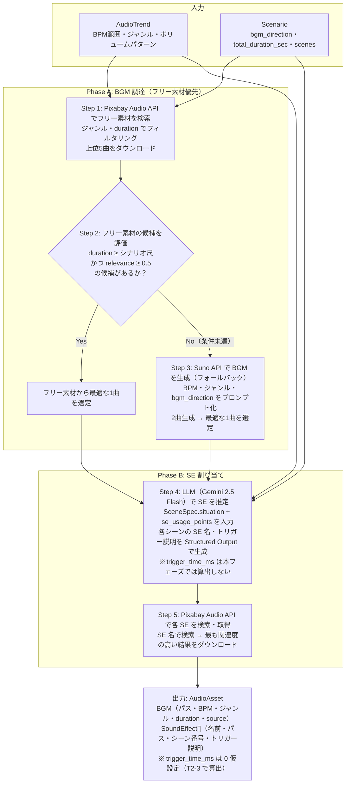

# Audio Engine 設計書

## 1. 概要

- **対応する仕様書セクション:** 3.6章（Audio Engine）、7章（重点技術課題: Sound-Image Sync）
- **サブタスクID:** T1-6
- **依存:** T0-1（プロジェクト骨格・共通データスキーマ）
- **このサブタスクで実現すること:**
  - BGM生成AI（Suno / Udio）の評価・選定と、フリー素材ライブラリからの自動選定を実装する
  - トレンド分析（`AudioTrend`）とシナリオ（`Scenario`）に基づき、最適なBGMを自動調達する
  - シナリオの各シーン情報からSEを自動割り当てる基礎機構を実装する
  - `AudioAsset`（BGM + SE リスト）を生成し、後段の Post-Production に引き渡す

## 2. スコープ

### 対象範囲

- Audio Engine レイヤー（`src/daily_routine/audio/`）の実装
- BGM生成AI（Suno API）の統合
- フリー素材ライブラリ（Pixabay Audio API）からのBGM自動検索・取得
- トレンド分析の BPM・ジャンル指定に基づく BGM の自動選定ロジック
- シナリオのシーン情報（状況説明・小物）から SE を推定し、フリー素材から取得する機構
- レイヤー境界の抽象インターフェース定義
- ユニットテスト

### 対象外

- 映像内動作検出による SE のミリ秒同期（T2-3 Sound-Image Sync で実装）
- Udio API の統合（Suno 評価後に必要であれば ADR で再検討）
- Post-Production との結合検証（T3-1 で実施）
- チェックポイント機構の詳細（T1-1 CLI基盤で実装。本設計では保存・読み込み I/F のみ定義）
- Web UI でのプレビュー（T4-2 で実装）

## 3. 技術設計

### 3.1 設計思想

**「フリー素材優先 + AI 生成フォールバック」方式**

BGM・SE ともにまずフリー素材（Pixabay Audio）から調達する。フリー素材は無料・安定品質・ライセンスが明確であり、コスト面で最も優れている。フリー素材でトレンド条件（duration・ジャンル）を満たす候補が見つからない場合に限り、AI 生成（Suno）にフォールバックする。

SE はシナリオの `SceneSpec.situation`（状況説明）と小物情報から必要な効果音を LLM で推定し、フリー素材ライブラリから取得する。映像との精密な同期は T2-3 で実装するため、本フェーズではシーン番号と SE 名の割り当てまでを行い、挿入タイミング（`trigger_time_ms`）は算出しない。

| 音声要素 | 調達方法 | 優先度 | 理由 |
|----------|----------|--------|------|
| BGM | Pixabay Audio API（フリー素材） | **1st** | 無料・安定品質・ライセンス明確 |
| BGM | Suno API（AI生成フォールバック） | 2nd | フリー素材で条件を満たす候補がない場合のみ使用 |
| SE | Pixabay Audio API（フリー素材） | **1st** | SE は既存素材で十分な品質。生成 AI は不要 |

### 3.2 技術スタック

| 要素 | 採用技術 | 選定理由 |
|------|----------|----------|
| BGM フリー素材 | Pixabay Audio API | 無料・商用利用可・API提供あり・楽曲数豊富。**第一選択** |
| BGM 生成（フォールバック） | Suno API v4 | フリー素材で条件を満たせない場合のみ使用 |
| SE フリー素材 | Pixabay Audio API | BGM と同一プラットフォームで統一管理 |
| SE 推定 | Gemini 2.5 Flash | シーン情報から必要な SE を推定する LLM |
| HTTP 通信 | httpx（async） | コーディング規約に準拠 |
| 音声メタデータ解析 | mutagen | BPM 検出には未対応だが、ファイル形式・duration 取得に使用 |

**BGM 生成 AI 選定について:**

Suno をデフォルトとして実装を開始する。Suno の品質が不十分な場合は Udio を追加評価し、ADR（`docs/adrs/003_bgm_generation_ai.md`）を作成する。現時点では以下の理由で Suno を優先する:

| 観点 | Suno | Udio |
|------|------|------|
| API 成熟度 | 公式 API あり（v4） | 公式 API あり |
| 楽曲品質 | 高品質、ジャンル多様 | 高品質、特にボーカル品質に強み |
| BPM / ジャンル制御 | プロンプトで指定可能 | プロンプトで指定可能 |
| 生成速度 | 約30秒〜2分 | 約1分〜3分 |
| コスト | 有料（クレジット制） | 有料（クレジット制） |
| 選定理由 | **先行してPoCを実施し品質を評価する** | Suno が不十分な場合の代替候補 |

### 3.3 全体フロー



### 3.4 ディレクトリ構成

```
src/daily_routine/audio/
├── __init__.py
├── engine.py           # AudioEngine（ABCの具象実装）
├── base.py             # AudioEngineBase（ABC定義）
├── suno.py             # Suno API クライアント（BGM生成）
├── pixabay.py          # Pixabay Audio API クライアント（BGM + SE フリー素材）
├── bgm_selector.py     # BGM 候補選定ロジック
└── se_estimator.py     # LLM による SE 推定
```

### 3.5 抽象インターフェース定義

```python
# audio/base.py
from abc import ABC, abstractmethod
from pathlib import Path

from daily_routine.schemas.audio import AudioAsset
from daily_routine.schemas.intelligence import AudioTrend
from daily_routine.schemas.scenario import Scenario


class AudioEngineBase(ABC):
    """Audio Engine のレイヤー境界インターフェース."""

    @abstractmethod
    async def generate(
        self,
        audio_trend: AudioTrend,
        scenario: Scenario,
        output_dir: Path,
    ) -> AudioAsset:
        """トレンド分析とシナリオに基づき、BGM と SE を調達する.

        Args:
            audio_trend: Intelligence Engine が生成した音響トレンド
            scenario: Scenario Engine が生成したシナリオ
            output_dir: 音声ファイルの出力先ディレクトリ

        Returns:
            BGM + SE のアセット情報
        """
        ...
```

### 3.6 内部コンポーネント設計

#### 3.6.1 Suno API クライアント (`suno.py`)

Suno API v4 を使い、トレンドに合致した BGM を生成する。

```python
from pydantic import BaseModel, Field


class SunoTrack(BaseModel):
    """Suno で生成されたトラック."""

    track_id: str
    title: str
    audio_url: str = Field(description="ダウンロード可能な音声 URL")
    duration_sec: float
    tags: list[str] = Field(default_factory=list)
    status: str = Field(description="生成ステータス: 'complete' | 'generating' | 'error'")


class SunoClient:
    """Suno API v4 クライアント."""

    def __init__(self, api_key: str) -> None: ...

    async def generate(
        self,
        prompt: str,
        duration_sec: int = 60,
        instrumental: bool = True,
    ) -> list[SunoTrack]:
        """BGM を生成する.

        Suno はプロンプトから2曲を同時生成する。
        instrumental=True でボーカルなしの楽曲を生成。

        Args:
            prompt: 楽曲の説明（ジャンル、BPM、雰囲気等）
            duration_sec: 目標楽曲長（秒）
            instrumental: インストゥルメンタルのみ

        Returns:
            生成されたトラックのリスト（通常2曲）
        """
        ...

    async def wait_for_completion(
        self,
        track_ids: list[str],
        timeout_sec: int = 300,
        poll_interval_sec: int = 10,
    ) -> list[SunoTrack]:
        """トラック生成の完了を待機する.

        Suno の生成は非同期。ポーリングで完了を待つ。

        Args:
            track_ids: 待機対象のトラックID
            timeout_sec: タイムアウト（秒）
            poll_interval_sec: ポーリング間隔（秒）

        Returns:
            完了したトラックのリスト
        """
        ...

    async def download(self, audio_url: str, output_path: Path) -> Path:
        """生成された音声ファイルをダウンロードする.

        Returns:
            ダウンロードしたファイルのパス
        """
        ...
```

**Suno API 仕様:**

| API | エンドポイント | 説明 |
|-----|---------------|------|
| Generate | `POST /v4/generate` | プロンプトから楽曲を生成（2曲同時） |
| Get | `GET /v4/clips/{id}` | 生成ステータスと結果を取得 |

**BGM 生成プロンプト構築:**

`AudioTrend` と `Scenario.bgm_direction` から自動構築する。

```
例: AudioTrend(bpm_range=(110, 130), genres=["lo-fi", "chill hop"])
    Scenario.bgm_direction = "朝の準備シーンに合う爽やかで軽快な曲"

→ プロンプト: "lo-fi chill hop, 110-130 BPM, instrumental,
   fresh and upbeat morning routine vibe, light and cheerful"
```

#### 3.6.2 Pixabay Audio API クライアント (`pixabay.py`)

Pixabay Audio API で BGM・SE のフリー素材を検索・取得する。

```python
class PixabayTrack(BaseModel):
    """Pixabay Audio の検索結果."""

    track_id: int
    title: str
    audio_url: str = Field(description="ダウンロード URL")
    duration_sec: float
    tags: str = Field(description="タグ（カンマ区切り文字列）")
    category: str = Field(description="'music' | 'sound_effect'")


class PixabayAudioClient:
    """Pixabay Audio API クライアント."""

    def __init__(self, api_key: str) -> None: ...

    async def search_music(
        self,
        query: str,
        min_duration_sec: int | None = None,
        max_duration_sec: int | None = None,
        max_results: int = 5,
    ) -> list[PixabayTrack]:
        """BGM を検索する.

        Args:
            query: 検索キーワード（ジャンル、雰囲気等）
            min_duration_sec: 最小楽曲長
            max_duration_sec: 最大楽曲長
            max_results: 最大取得件数

        Returns:
            検索結果のトラックリスト
        """
        ...

    async def search_sound_effects(
        self,
        query: str,
        max_results: int = 3,
    ) -> list[PixabayTrack]:
        """SE を検索する.

        Args:
            query: 検索キーワード（例: "footsteps", "keyboard typing"）
            max_results: 最大取得件数

        Returns:
            検索結果のトラックリスト
        """
        ...

    async def download(self, audio_url: str, output_path: Path) -> Path:
        """音声ファイルをダウンロードする.

        Returns:
            ダウンロードしたファイルのパス
        """
        ...
```

**Pixabay Audio API 仕様:**

| API | エンドポイント | クォータ | 取得情報 |
|-----|---------------|---------|---------|
| Search Music | `GET /api/music/` | 100リクエスト/分 | BGM 楽曲 |
| Search SFX | `GET /api/sound-effects/` | 100リクエスト/分 | 効果音 |

**検索クエリの構築:**

| 用途 | クエリ構築方法 |
|------|---------------|
| BGM | `AudioTrend.genres` を結合（例: `"lo-fi chill hop"`） |
| SE | `SEEstimation.se_name` をそのまま使用（例: `"footsteps"`） |

#### 3.6.3 BGM 候補選定ロジック (`bgm_selector.py`)

フリー素材の候補を評価し、条件を満たすか判定する。満たさない場合は AI 生成へのフォールバックを指示する。

```python
class BGMCandidate(BaseModel):
    """BGM 候補."""

    file_path: Path
    source: str = Field(description="'suno' | 'pixabay'")
    duration_sec: float
    genre: str
    estimated_bpm: int | None = Field(default=None, description="推定 BPM（取得可能な場合）")
    relevance_score: float = Field(default=0.0, description="検索関連度スコア（0〜1）")


class BGMSelector:
    """BGM 候補プールから最適な1曲を選定する."""

    RELEVANCE_THRESHOLD: float = 0.5

    def select(
        self,
        candidates: list[BGMCandidate],
        target_bpm_range: tuple[int, int],
        min_duration_sec: float,
    ) -> BGMCandidate | None:
        """候補プールから最適な BGM を選定する.

        選定基準（優先度順）:
        1. duration がシナリオ尺（min_duration_sec）以上であること（必須）
        2. relevance_score が閾値（RELEVANCE_THRESHOLD）以上であること
        3. スコアが最も高い候補を返す

        候補がない場合は None を返し、呼び出し元が Suno フォールバックを判断する。

        Args:
            candidates: BGM 候補リスト
            target_bpm_range: トレンドの BPM 範囲
            min_duration_sec: シナリオの合計尺

        Returns:
            選定された BGM 候補。条件を満たす候補がなければ None
        """
        ...
```

**選定ロジック:**

```
1. duration フィルタ: candidate.duration >= min_duration_sec でないものを除外
2. relevance フィルタ: relevance_score < RELEVANCE_THRESHOLD (0.5) のものを除外
3. 残った候補をスコアリングし、最高スコアを選定:

score = relevance_score * 0.7 + bpm_score * 0.3

bpm_score:
  estimated_bpm が target_bpm_range 内 → 1.0
  estimated_bpm が ±10 以内 → 0.5
  estimated_bpm なし or 範囲外 → 0.0

4. 候補が0件 → None を返す（Suno フォールバックのトリガー）
```

**フリー素材優先フローでの使われ方:**

```python
# engine.py での呼び出しイメージ
candidates = await pixabay_client.search_music(query, min_duration_sec=scenario.total_duration_sec)
selected = bgm_selector.select(candidates, audio_trend.bpm_range, scenario.total_duration_sec)

if selected is None:
    # フリー素材で条件を満たす候補がない → Suno フォールバック
    logger.warning("フリー素材で条件を満たすBGMが見つかりません。Suno APIで生成します。")
    suno_tracks = await suno_client.generate(prompt, duration_sec=...)
    suno_candidates = [...]  # SunoTrack → BGMCandidate に変換
    selected = bgm_selector.select(suno_candidates, audio_trend.bpm_range, scenario.total_duration_sec)
```

#### 3.6.4 LLM による SE 推定 (`se_estimator.py`)

シナリオの各シーン情報から、必要な SE を LLM で推定する。挿入タイミングの算出は本フェーズのスコープ外（T2-3 で映像解析後に決定）。

```python
class SEEstimation(BaseModel):
    """1つの SE の推定結果."""

    se_name: str = Field(description="SE の名前（英語、検索キーワードとして使用）")
    scene_number: int = Field(description="挿入するシーン番号")
    trigger_description: str = Field(description="トリガーとなる動作/物体の説明")


class SEEstimator:
    """LLM でシーン情報から必要な SE を推定する."""

    def __init__(self, api_key: str) -> None: ...

    async def estimate(
        self,
        scenes: list[SceneSpec],
        se_usage_points: list[str],
    ) -> list[SEEstimation]:
        """シナリオの各シーンから必要な SE を推定する.

        Gemini 2.5 Flash に以下を入力し、SE リストを Structured Output で生成させる:
        - 各シーンの situation（状況説明）
        - 各シーンの caption_text（テロップ）
        - AudioTrend.se_usage_points（トレンドでの SE 使用パターン）

        SE 推定のガイドライン:
        - 1シーンあたり最大2つの SE を割り当て（過剰な SE は視聴体験を損なう）
        - 日常動作に対応する SE を優先（足音、ドア、キーボード等）
        - 環境音（雑踏、鳥の声等）も考慮

        Args:
            scenes: シナリオの全シーン仕様
            se_usage_points: トレンドでの SE 使用パターン

        Returns:
            各シーンに割り当てる SE の推定リスト
        """
        ...
```

**SE 推定のプロンプト例:**

```
あなたは動画の効果音（SE）設計の専門家です。
以下のシーン情報から、各シーンに最適な効果音を割り当ててください。

## トレンドでの SE 使用パターン:
{se_usage_points}

## シーン一覧:
シーン1: {situation} / テロップ: {caption_text}
シーン2: ...

## ルール:
- 1シーンあたり最大2つの SE
- SE 名は英語の検索キーワードとして使えるもの（例: "footsteps", "door open"）
- trigger_description にはどの動作/物体が SE のトリガーかを記載
```

**trigger_time_ms について:**

`SoundEffect.trigger_time_ms` は本フェーズでは `0` を仮設定する。T2-3（Sound-Image Sync）で映像内の動作検出を行い、実際の挿入タイミングを算出して上書きする。

```python
# T1-6 での SoundEffect 生成（trigger_time_ms は仮値）
SoundEffect(
    name="footsteps",
    file_path=Path("audio/se/scene_01_footsteps.mp3"),
    trigger_time_ms=0,  # T2-3 で映像ベースに算出
    scene_number=1,
    trigger_description="キャラクターが玄関を出て歩き始める",
)
```

### 3.7 スキーマ拡張

既存の `AudioAsset` スキーマ（`schemas/audio.py`）はそのまま使用する。変更不要。

内部の中間データ型（`SunoTrack`, `PixabayTrack`, `BGMCandidate`, `SEEstimation`）は `audio/` パッケージ内の各モジュールに定義し、`schemas/` には追加しない。

### 3.8 設定

#### グローバル設定への追加

`configs/global.yaml` の `api_keys` に以下を追加する:

```yaml
api_keys:
  youtube_data_api: ""
  openai: ""
  google_ai: ""
  suno: ""        # 追加: Suno API キー
  pixabay: ""     # 追加: Pixabay API キー
```

環境変数でのオーバーライド: `DAILY_ROUTINE_API_KEY_SUNO`, `DAILY_ROUTINE_API_KEY_PIXABAY`

#### Audio Engine 固有の設定

engine のコンストラクタ引数で制御する。

| パラメータ | デフォルト値 | 説明 |
|-----------|-------------|------|
| `suno_track_count` | 2 | Suno で生成する BGM の曲数 |
| `pixabay_bgm_count` | 3 | Pixabay から取得する BGM 候補数 |
| `max_se_per_scene` | 2 | 1シーンあたりの最大 SE 数 |

### 3.9 エラーハンドリング

| エラー種別 | 対処 |
|-----------|------|
| Pixabay API キー未設定 | エラーで停止（フリー素材は必須ソース） |
| Pixabay 検索結果0件 | 検索クエリを簡略化してリトライ（例: ジャンル単体で検索）。それでも0件なら Suno フォールバック |
| Pixabay で条件を満たす BGM がない | Suno フォールバックへ移行（警告ログ） |
| Suno API キー未設定（フォールバック時） | エラーで停止（フリー素材でも Suno でも BGM を調達できない） |
| Suno 生成タイムアウト | エラーで停止（警告ログ。Pixabay で条件未達の上 Suno も失敗） |
| Suno 生成失敗 | エラーで停止（同上） |
| SE 検索結果0件（特定 SE） | 当該 SE をスキップし、他の SE で続行（警告ログ） |
| Gemini API レート制限（SE 推定） | 指数バックオフで最大3回リトライ |
| ダウンロード失敗 | 最大3回リトライ後、当該ファイルをスキップ |

### 3.10 中間データの保存

```
{project_dir}/audio/
├── audio_asset.json               # 最終出力（AudioAsset）
├── bgm/
│   ├── selected.mp3               # 選定された BGM
│   └── candidates/                # BGM 候補プール
│       ├── suno_001.mp3
│       ├── suno_002.mp3
│       ├── pixabay_001.mp3
│       ├── pixabay_002.mp3
│       └── pixabay_003.mp3
├── se/
│   ├── scene_01_footsteps.mp3
│   ├── scene_01_door_open.mp3
│   ├── scene_02_keyboard.mp3
│   └── ...
└── tmp/
    ├── bgm_candidates.json        # BGM 候補メタデータ
    └── se_estimations.json        # LLM による SE 推定結果
```

## 4. 入出力例

「OLの一日」（全5シーン、45秒）を題材にした具体例。

### 4.1 入力

#### AudioTrend（Intelligence Engine から）

```json
{
  "bpm_range": [110, 130],
  "genres": ["lo-fi", "chill hop"],
  "volume_patterns": ["イントロで小さく→メインで通常→ラストで余韻"],
  "se_usage_points": [
    "朝の目覚めシーンでアラーム音",
    "ドアの開閉で場面転換を強調",
    "キーボード打鍵音で仕事シーンの臨場感",
    "カフェシーンでカップを置く音"
  ]
}
```

#### Scenario（Scenario Engine から）

```json
{
  "title": "OLの一日",
  "total_duration_sec": 45.0,
  "characters": [
    {
      "name": "Aoi",
      "appearance": "20代後半の日本人女性、ミディアムヘア、ナチュラルメイク",
      "outfit": "白ブラウス、ネイビーのタイトスカート、ベージュのパンプス",
      "reference_prompt": "..."
    }
  ],
  "props": [
    { "name": "コーヒーカップ", "description": "白い陶器のマグカップ", "image_prompt": "..." },
    { "name": "ノートPC", "description": "シルバーのノートPC", "image_prompt": "..." }
  ],
  "scenes": [
    {
      "scene_number": 1,
      "duration_sec": 8.0,
      "situation": "朝、アラームが鳴りベッドから起き上がる",
      "camera_work": { "type": "close-up", "description": "アラームを止める手元のアップ" },
      "caption_text": "朝6時…今日も始まる",
      "image_prompt": "...",
      "video_prompt": "..."
    },
    {
      "scene_number": 2,
      "duration_sec": 7.0,
      "situation": "身支度を整え、玄関のドアを開けて出発する",
      "camera_work": { "type": "wide", "description": "玄関からの出発を引きで撮影" },
      "caption_text": "いってきます！",
      "image_prompt": "...",
      "video_prompt": "..."
    },
    {
      "scene_number": 3,
      "duration_sec": 12.0,
      "situation": "オフィスでPCに向かい、キーボードを打つ",
      "camera_work": { "type": "POV", "description": "デスクワークのPOV視点" },
      "caption_text": "今日のタスクは山積み…",
      "image_prompt": "...",
      "video_prompt": "..."
    },
    {
      "scene_number": 4,
      "duration_sec": 10.0,
      "situation": "昼休み、カフェでコーヒーを飲みながらひと息つく",
      "camera_work": { "type": "close-up", "description": "コーヒーカップを置く手元" },
      "caption_text": "ランチタイムが唯一の癒し",
      "image_prompt": "...",
      "video_prompt": "..."
    },
    {
      "scene_number": 5,
      "duration_sec": 8.0,
      "situation": "夕方、オフィスを出て夕焼けの中を歩く",
      "camera_work": { "type": "wide", "description": "夕焼けの街を歩く後ろ姿" },
      "caption_text": "お疲れさま、私",
      "image_prompt": "...",
      "video_prompt": "..."
    }
  ],
  "bgm_direction": "朝の準備シーンに合う爽やかで軽快な曲、lo-fi系で統一"
}
```

### 4.2 中間データ

#### SE 推定結果（`tmp/se_estimations.json`）

LLM が Scenario の各シーン情報と AudioTrend.se_usage_points から推定した結果。

```json
[
  {
    "se_name": "alarm clock",
    "scene_number": 1,
    "trigger_description": "目覚まし時計のアラームが鳴る"
  },
  {
    "se_name": "door open close",
    "scene_number": 2,
    "trigger_description": "玄関のドアを開けて出発する"
  },
  {
    "se_name": "footsteps",
    "scene_number": 2,
    "trigger_description": "玄関を出て歩き始める"
  },
  {
    "se_name": "keyboard typing",
    "scene_number": 3,
    "trigger_description": "PCのキーボードをタイピングする"
  },
  {
    "se_name": "cup place on table",
    "scene_number": 4,
    "trigger_description": "コーヒーカップをテーブルに置く"
  }
]
```

#### BGM 候補メタデータ（`tmp/bgm_candidates.json`）— ケースA: フリー素材で解決

```json
[
  {
    "file_path": "audio/bgm/candidates/pixabay_001.mp3",
    "source": "pixabay",
    "duration_sec": 120.0,
    "genre": "lo-fi",
    "estimated_bpm": null,
    "relevance_score": 0.92
  },
  {
    "file_path": "audio/bgm/candidates/pixabay_002.mp3",
    "source": "pixabay",
    "duration_sec": 75.0,
    "genre": "chill",
    "estimated_bpm": null,
    "relevance_score": 0.85
  },
  {
    "file_path": "audio/bgm/candidates/pixabay_003.mp3",
    "source": "pixabay",
    "duration_sec": 90.0,
    "genre": "lo-fi beats",
    "estimated_bpm": null,
    "relevance_score": 0.68
  },
  {
    "file_path": "audio/bgm/candidates/pixabay_004.mp3",
    "source": "pixabay",
    "duration_sec": 30.0,
    "genre": "chill hop",
    "estimated_bpm": null,
    "relevance_score": 0.55
  },
  {
    "file_path": "audio/bgm/candidates/pixabay_005.mp3",
    "source": "pixabay",
    "duration_sec": 45.0,
    "genre": "ambient",
    "estimated_bpm": null,
    "relevance_score": 0.38
  }
]
```

**BGM 選定（Step 2: フリー素材評価）:**

| 候補 | duration フィルタ | relevance フィルタ (≥0.5) | score | 結果 |
|------|------------------|--------------------------|-------|------|
| pixabay_001 | 120s ≥ 45s OK | 0.92 ≥ 0.5 OK | 0.92 × 0.7 + 0.0 × 0.3 = **0.644** | |
| pixabay_002 | 75s ≥ 45s OK | 0.85 ≥ 0.5 OK | 0.85 × 0.7 + 0.0 × 0.3 = 0.595 | |
| pixabay_003 | 90s ≥ 45s OK | 0.68 ≥ 0.5 OK | 0.68 × 0.7 + 0.0 × 0.3 = 0.476 | |
| pixabay_004 | **30s < 45s** | - | **除外** | duration 不足 |
| pixabay_005 | 45s ≥ 45s OK | **0.38 < 0.5** | **除外** | relevance 不足 |

→ **pixabay_001 を選定**。条件を満たす候補あり → Suno フォールバック不要（コスト: $0）

---

**ケースB: フリー素材で条件未達 → Suno フォールバック**

フリー素材で duration ≥ 45s かつ relevance ≥ 0.5 の候補が0件の場合:

```
Step 2: フリー素材候補 → 全て除外（duration不足 or relevance不足）→ None を返す
Step 3: Suno API で BGM を生成
```

```json
[
  {
    "file_path": "audio/bgm/candidates/suno_001.mp3",
    "source": "suno",
    "duration_sec": 62.0,
    "genre": "lo-fi chill hop",
    "estimated_bpm": 118,
    "relevance_score": 0.8
  },
  {
    "file_path": "audio/bgm/candidates/suno_002.mp3",
    "source": "suno",
    "duration_sec": 58.0,
    "genre": "lo-fi chill hop",
    "estimated_bpm": 124,
    "relevance_score": 0.8
  }
]
```

→ **suno_001 を選定**（score: 0.8 × 0.7 + 1.0 × 0.3 = 0.86）

### 4.3 出力

#### AudioAsset（`audio/audio_asset.json`）— ケースA の場合

```json
{
  "bgm": {
    "file_path": "audio/bgm/selected.mp3",
    "bpm": 0,
    "genre": "lo-fi",
    "duration_sec": 120.0,
    "source": "pixabay"
  },
  "sound_effects": [
    {
      "name": "alarm clock",
      "file_path": "audio/se/scene_01_alarm_clock.mp3",
      "trigger_time_ms": 0,
      "scene_number": 1,
      "trigger_description": "目覚まし時計のアラームが鳴る"
    },
    {
      "name": "door open close",
      "file_path": "audio/se/scene_02_door_open_close.mp3",
      "trigger_time_ms": 0,
      "scene_number": 2,
      "trigger_description": "玄関のドアを開けて出発する"
    },
    {
      "name": "footsteps",
      "file_path": "audio/se/scene_02_footsteps.mp3",
      "trigger_time_ms": 0,
      "scene_number": 2,
      "trigger_description": "玄関を出て歩き始める"
    },
    {
      "name": "keyboard typing",
      "file_path": "audio/se/scene_03_keyboard_typing.mp3",
      "trigger_time_ms": 0,
      "scene_number": 3,
      "trigger_description": "PCのキーボードをタイピングする"
    },
    {
      "name": "cup place on table",
      "file_path": "audio/se/scene_04_cup_place_on_table.mp3",
      "trigger_time_ms": 0,
      "scene_number": 4,
      "trigger_description": "コーヒーカップをテーブルに置く"
    }
  ]
}
```

> **注:** `trigger_time_ms` は全て `0`（仮値）。T2-3（Sound-Image Sync）で映像内動作検出を行い、実際の挿入タイミングに更新される。

## 5. 実装計画

### ステップ1: 依存関係の追加と基盤ファイル作成

- `pyproject.toml` に依存関係を追加: `mutagen`
- `configs/global.yaml` に `suno`, `pixabay` の API キーエントリを追加
- `audio/base.py` に抽象インターフェース `AudioEngineBase` を定義
- `audio/` 以下のモジュールファイルを作成
- **完了条件:** `uv sync` が成功し、`AudioEngineBase` がインポート可能

### ステップ2: Pixabay Audio クライアントの実装

- `pixabay.py` に `PixabayAudioClient` を実装
- BGM 検索（`search_music`）と SE 検索（`search_sound_effects`）
- 音声ファイルダウンロード
- ユニットテスト: API レスポンスをモック化して検証
- **完了条件:** モックテストが通り、`PixabayTrack` が正しく返される

### ステップ3: Suno API クライアントの実装

- `suno.py` に `SunoClient` を実装
- BGM 生成、ポーリングによる完了待ち、ダウンロード
- ユニットテスト: API レスポンスをモック化して検証
- **完了条件:** モックテストが通り、`SunoTrack` が正しく返される

### ステップ4: BGM 選定ロジックと SE 推定の実装

- `bgm_selector.py` に `BGMSelector` を実装
- `se_estimator.py` に `SEEstimator` を実装
- ユニットテスト: BGM 選定のスコアリングロジック検証、SE 推定の Gemini API モック検証
- **完了条件:** スコアリングが正しく動作し、SE 推定が `SEEstimation` リストを返す

### ステップ5: AudioEngine の統合実装

- `engine.py` に `AudioEngine` を実装
- Phase A（BGM 調達） → Phase B（SE 割り当て）のフロー
- 中間データの保存・ロード
- エラーハンドリング（フリー素材優先 → 条件未達時のみ Suno フォールバック）
- 統合テスト: 全コンポーネントのモックを組み合わせた E2E フロー検証
- **完了条件:** 統合テストが通り、`AudioTrend` + `Scenario` → `AudioAsset` の一連のフローが動作する

## 6. テスト方針

### ユニットテスト

| テスト対象 | テスト内容 |
|-----------|-----------|
| `SunoClient` | 生成リクエストの構築、ポーリングロジック、タイムアウト処理、ダウンロード |
| `PixabayAudioClient` | BGM/SE 検索クエリの構築、レスポンスパース、ダウンロード |
| `BGMSelector` | スコアリング計算、duration フィルタリング、BPM 範囲判定、候補0件時のエラー |
| `SEEstimator` | LLM プロンプト構築、Structured Output のパース、SE 名・シーン番号の妥当性 |

### 統合テスト

| テスト対象 | テスト内容 |
|-----------|-----------|
| `AudioEngine.generate()` | 全コンポーネントをモック化した一気通貫テスト（Phase A → Phase B） |
| フリー素材で解決 | Pixabay で条件を満たす候補あり → Suno 呼び出しなしで完了 |
| Suno フォールバック | Pixabay で条件未達 → Suno 生成にフォールバック → BGM 選定 |
| Suno フォールバック失敗 | Pixabay 条件未達 + Suno 失敗 → エラーで停止 |
| 中間データ保存 | 中間結果がファイルシステムに正しく保存される |
| SE 検索失敗時のスキップ | 一部 SE 取得失敗でも他の SE は正常に処理される |

### テスト方針

- 全ての外部呼び出し（Suno API, Pixabay API, Gemini API）はモック化する
- テスト命名: `test_{テスト対象}_{条件}_{期待結果}`
- テストファイル: `tests/test_audio/` 以下にモジュール単位で配置

## 7. コスト見積もり（1回の実行あたり）

| 項目 | 見積もり |
|------|----------|
| Pixabay Audio API（BGM + SE 検索） | 無料 |
| Gemini 2.5 Flash（SE 推定） | 約 $0.01（テキスト入力のみ） |
| Suno API（BGM 2曲生成、フォールバック時のみ） | 約 $0.10（クレジット制、10クレジット） |
| **合計（フリー素材で解決時）** | **約 $0.01** |
| **合計（Suno フォールバック時）** | **約 $0.11** |

## 8. リスク・検討事項

| リスク | 影響 | 対策 |
|--------|------|------|
| Suno 生成楽曲の商用利用ライセンス | YouTube Shorts 公開時に著作権問題が発生する可能性 | Suno の有料プラン（Pro/Premier）は商用利用可。無料プランは不可。**実装時に有料プランを前提とする旨を設定・ログで明示する。** PoC 段階でライセンス条件を確認し、ADR に記録する |
| Pixabay Audio のライセンス | Pixabay License は商用利用可・帰属不要だが、条件変更の可能性 | 利用時に Pixabay License の最新条件を確認する。ダウンロードした素材のライセンス情報をメタデータ（`bgm_candidates.json`）に記録する |
| Suno API のプレビュー/ベータ版リスク | API 仕様変更でクライアント実装の修正が必要 | クライアントを抽象化し差し替え可能に。Udio を代替候補として確保 |
| Pixabay SE のカバー率不足 | 特定の日常 SE が見つからない場合がある | SE 検索失敗時はスキップ。ステップ5 実行後にカバー率を評価し、不足なら Freesound 等のソース追加を検討 |
| BGM の BPM 自動検出未実装 | Pixabay 素材の BPM が不明なため、トレンド BPM 範囲との一致度を評価できない | フリー素材優先のため実用上の影響は小さい（relevance_score で選定）。BPM 検出ライブラリ（librosa 等）の追加は未決事項として管理 |

## 9. 未決事項


| 項目 | 内容 | 判断タイミング |
|------|------|--------------|
| Suno の品質評価 | 実際に生成した BGM の品質がトレンドに合致するか | ステップ3実行後、生成結果を評価 |
| Udio の追加検討 | Suno の品質が不十分な場合に Udio を評価 | Suno PoC 後、必要に応じて ADR 作成 |
| BPM 自動検出 | ダウンロードした BGM の BPM を自動検出する方法 | ステップ4実行後、選定精度を評価 |
| SE ライブラリの拡充 | Pixabay で不足する SE の別ソース確保 | ステップ5実行後、SE のカバー率を評価 |
| SE 挿入タイミングの精度 | trigger_time_ms は T2-3 で映像ベースに算出 | T2-3（Sound-Image Sync）で本格対応 |

## 10. 参考資料

- 仕様書: `/docs/specs/initial.md` 3.6章
- 既存スキーマ: `src/daily_routine/schemas/audio.py`
- 入力スキーマ: `src/daily_routine/schemas/intelligence.py`（`AudioTrend`）、`src/daily_routine/schemas/scenario.py`（`Scenario`）
- サブタスク計画: `/docs/claude-plans/curried-frolicking-horizon.md`
- 関連タスク: T2-3（Sound-Image Sync）— SE のミリ秒同期はこちらで実装
