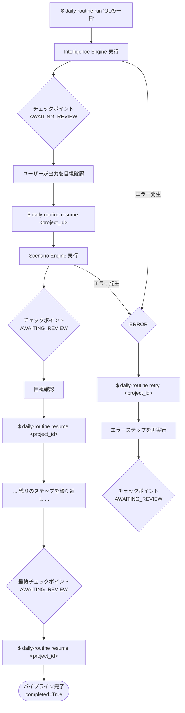

# CLI基盤・パイプラインオーケストレーション設計書

## 1. 概要

- **対応する仕様書セクション:** 3.1章（全体フロー）、5.1章（CLI）
- **このサブタスクで実現すること:**
  - パイプラインの順次実行（6ステップをチェックポイント付きで逐次実行）
  - チェックポイント停止（各ステップ完了後に `AWAITING_REVIEW` で停止）
  - resume/retry制御（承認済みステップから再開、エラーステップの再試行）
  - ABC基底クラス（各レイヤーエンジンの共通インターフェース定義）
  - 状態永続化（`state.yaml` への読み書き）
  - CLIコマンドの拡充（`resume`, `retry` の追加）

### スコープ

| 対象 | 対象外 |
| --- | --- |
| パイプライン順次実行 | 各レイヤーのビジネスロジック（T1-2〜T1-6） |
| チェックポイント停止・再開 | Web UI（T4-2） |
| resume / retry制御 | 自動品質チェック（T4-1） |
| ABC基底クラス定義 | 並列実行の最適化 |
| 状態永続化（YAML） | |
| エラーハンドリング・例外定義 | |
| エンジンレジストリ | |

---

## 2. ユーザー操作フロー



---

## 3. 状態遷移

### 3.1 ステップ単位の状態遷移

```
PENDING ──run/resume──→ RUNNING ──成功──→ AWAITING_REVIEW ──resume──→ APPROVED
                           │                                              │
                           │ 失敗                                         │ (次ステップへ)
                           ▼                                              │
                         ERROR ──retry──→ RUNNING                         │
                                                                          ▼
                                                                   (次ステップの RUNNING へ)
```

| 状態 | 説明 | 遷移条件 |
| --- | --- | --- |
| `PENDING` | 未実行 | 初期状態 |
| `RUNNING` | 実行中 | `run` / `resume` / `retry` で遷移 |
| `AWAITING_REVIEW` | 人間の確認待ち | ステップ正常完了時 |
| `APPROVED` | 承認済み | `resume` 時に現在の `AWAITING_REVIEW` を `APPROVED` に遷移 |
| `ERROR` | エラー発生 | ステップ実行中に例外発生時 |

### 3.2 パイプライン全体の完了判定

- 最終ステップ（`post_production`）が `APPROVED` になった時点で `PipelineState.completed = True`
- `completed` が `True` のプロジェクトに対する `resume` / `retry` はエラー

---

## 4. 技術設計

### 4.1 スキーマ変更 (`schemas/project.py`)

既存の `CheckpointStatus` に `ERROR` を追加し、`StepState` に `retry_count` を追加、`PipelineState` に `completed` を追加する。

```python
class CheckpointStatus(str, Enum):
    """チェックポイントのステータス."""

    PENDING = "pending"
    RUNNING = "running"
    AWAITING_REVIEW = "awaiting_review"
    APPROVED = "approved"
    REJECTED = "rejected"
    ERROR = "error"              # 追加


class StepState(BaseModel):
    """各ステップの実行状態."""

    status: CheckpointStatus = CheckpointStatus.PENDING
    started_at: datetime | None = None
    completed_at: datetime | None = None
    error: str | None = None
    retry_count: int = Field(default=0, description="リトライ回数")  # 追加


class PipelineState(BaseModel):
    """パイプライン全体の実行状態."""

    project_id: str
    current_step: PipelineStep | None = None
    steps: dict[PipelineStep, StepState] = Field(default_factory=dict)
    completed: bool = Field(default=False, description="パイプライン完了フラグ")  # 追加
    created_at: datetime = Field(default_factory=datetime.now)
    updated_at: datetime = Field(default_factory=datetime.now)
```

**変更点まとめ:**

| 対象 | 変更内容 |
| --- | --- |
| `CheckpointStatus` | `ERROR = "error"` を追加 |
| `StepState` | `retry_count: int = 0` を追加 |
| `PipelineState` | `completed: bool = False` を追加 |

### 4.2 ABC基底クラス (`pipeline/base.py`) — 新規作成

各レイヤーエンジンが実装すべきインターフェースを定義する。`Generic[InputT, OutputT]` を使用し、入出力の型安全性を保証する。

```python
from abc import ABC, abstractmethod
from typing import Generic, TypeVar

InputT = TypeVar("InputT")
OutputT = TypeVar("OutputT")


class StepEngine(ABC, Generic[InputT, OutputT]):
    """パイプラインステップの基底クラス.

    各レイヤーエンジン（Intelligence, Scenario, ...）はこのクラスを継承し、
    execute / load_output / save_output を実装する。
    """

    @abstractmethod
    async def execute(self, input_data: InputT, project_dir: Path) -> OutputT:
        """ステップのメイン処理を実行する.

        Args:
            input_data: このステップに必要な全入力データ
            project_dir: プロジェクトデータディレクトリ

        Returns:
            このステップの出力データ
        """

    @abstractmethod
    def load_output(self, project_dir: Path) -> OutputT:
        """永続化済みの出力データを読み込む.

        resume時に前ステップの出力を取得するために使用。

        Args:
            project_dir: プロジェクトデータディレクトリ

        Returns:
            保存済みの出力データ
        """

    @abstractmethod
    def save_output(self, project_dir: Path, output: OutputT) -> None:
        """出力データを永続化する.

        Args:
            project_dir: プロジェクトデータディレクトリ
            output: 保存する出力データ
        """
```

**設計判断:**

- `execute` は `async` とする。外部API呼び出しが主要な処理であり、CLAUDE.mdの規約（`async/await` + `httpx`）に準拠する。
- `execute` に `project_dir` を渡す。各ステップが出力の永続化先を自律的に決定できるようにする。
- `load_output` / `save_output` は同期メソッドとする。ローカルファイルI/Oのみであり、非同期化の恩恵が小さいため。
- `InputT` / `OutputT` はPydantic `BaseModel` のサブクラスを想定するが、型制約は設けない。最初のステップ（Intelligence）は `str`（キーワード）を入力とするため。

### 4.2.1 ステップ入力型とアダプター設計

各レイヤーのエンジンは独自の ABC（`IntelligenceEngineBase`, `ScenarioEngineBase` 等）を持ち、それぞれ異なるシグネチャの `generate()` / `analyze()` メソッドを定義する。一方、パイプラインランナーは統一インターフェース `StepEngine.execute(input_data, project_dir)` でステップを実行する。

この統合のために、各ステップにアダプタークラスを配置する。アダプターは `StepEngine` を継承し、`execute()` 内でステップ固有の入力組み立て + レイヤーエンジンの呼び出しを行う。

**各ステップの入力型と入力組み立て方式:**

| ステップ | InputT | 入力の組み立て方式 | OutputT |
| --- | --- | --- | --- |
| Intelligence | `IntelligenceInput` | CLI から keyword + seed_videos を受け取る | `TrendReport` |
| Scenario | `TrendReport` | 前ステップ出力をそのまま使用 + `ProjectConfig` から `duration_range` を取得 | `Scenario` |
| Asset | `Scenario` | 前ステップ出力をそのまま使用（`characters`, `props`, `scenes` を内包） | `AssetSet` |
| Visual | `VisualInput` | `Scenario`（2ステップ前）+ `AssetSet`（1ステップ前）を `load_output` で取得して複合 | `VideoClipSet` |
| Audio | `AudioInput` | `TrendReport.audio_trend`（3ステップ前）+ `Scenario`（2ステップ前）を `load_output` で取得して複合 | `AudioAsset` |
| Post-Production | `PostProductionInput` | 過去全ステップの出力を `load_output` で取得して複合 | `FinalOutput` |

**複合入力型の定義（`schemas/pipeline_io.py` — 新規作成）:**

```python
from pydantic import BaseModel, Field
from daily_routine.schemas.intelligence import TrendReport
from daily_routine.schemas.scenario import Scenario
from daily_routine.schemas.asset import AssetSet
from daily_routine.schemas.visual import VideoClipSet
from daily_routine.schemas.audio import AudioAsset
from daily_routine.intelligence.base import SeedVideo


class IntelligenceInput(BaseModel):
    """Intelligence Engine のパイプライン入力."""

    keyword: str
    seed_videos: list[SeedVideo] = Field(default_factory=list)
    max_expand_videos: int = 10


class VisualInput(BaseModel):
    """Visual Core のパイプライン入力（複合）."""

    scenario: Scenario
    assets: AssetSet


class AudioInput(BaseModel):
    """Audio Engine のパイプライン入力（複合）."""

    audio_trend: "AudioTrend"
    scenario: Scenario


class PostProductionInput(BaseModel):
    """Post-Production のパイプライン入力（複合）."""

    scenario: Scenario
    video_clips: VideoClipSet
    audio_asset: AudioAsset
```

**アダプターの実装例（`pipeline/adapters.py` — 新規作成）:**

```python
class VisualStepAdapter(StepEngine[VisualInput, VideoClipSet]):
    """Visual Core を StepEngine に適合させるアダプター."""

    def __init__(self, engine: VisualEngine) -> None:
        self._engine = engine

    async def execute(self, input_data: VisualInput, project_dir: Path) -> VideoClipSet:
        output_dir = project_dir / "clips"
        return await self._engine.generate_clips(
            scenario=input_data.scenario,
            assets=input_data.assets,
            output_dir=output_dir,
        )

    def load_output(self, project_dir: Path) -> VideoClipSet:
        # clips/metadata.json から VideoClipSet を復元
        ...

    def save_output(self, project_dir: Path, output: VideoClipSet) -> None:
        # clips/metadata.json に VideoClipSet を保存
        ...
```

**入力の組み立て（ランナー側）:**

ランナーの `_execute_step()` は、現在のステップに応じて過去ステップの出力を `load_output()` で取得し、入力型を組み立てる。

```python
async def _build_input(step: PipelineStep, project_dir: Path) -> object:
    """ステップに必要な入力データを過去の出力から組み立てる."""
    if step == PipelineStep.INTELLIGENCE:
        config = load_project_config(project_dir)
        return IntelligenceInput(keyword=config.keyword, seed_videos=...)
    elif step == PipelineStep.SCENARIO:
        return create_engine(PipelineStep.INTELLIGENCE).load_output(project_dir)
    elif step == PipelineStep.ASSET:
        return create_engine(PipelineStep.SCENARIO).load_output(project_dir)
    elif step == PipelineStep.VISUAL:
        scenario = create_engine(PipelineStep.SCENARIO).load_output(project_dir)
        assets = create_engine(PipelineStep.ASSET).load_output(project_dir)
        return VisualInput(scenario=scenario, assets=assets)
    elif step == PipelineStep.AUDIO:
        trend = create_engine(PipelineStep.INTELLIGENCE).load_output(project_dir)
        scenario = create_engine(PipelineStep.SCENARIO).load_output(project_dir)
        return AudioInput(audio_trend=trend.audio_trend, scenario=scenario)
    elif step == PipelineStep.POST_PRODUCTION:
        scenario = create_engine(PipelineStep.SCENARIO).load_output(project_dir)
        clips = create_engine(PipelineStep.VISUAL).load_output(project_dir)
        audio = create_engine(PipelineStep.AUDIO).load_output(project_dir)
        return PostProductionInput(scenario=scenario, video_clips=clips, audio_asset=audio)
```

**設計判断:**

- 各レイヤーの独自 ABC は変更しない。レイヤー単体でも使えるインターフェースを維持する。
- アダプターがレイヤー ABC とパイプライン `StepEngine` の間の変換を担う。
- 入力の組み立てはランナーに集約する。各ステップが必要とする過去出力の取得を `_build_input()` で一元管理する。
- 複合入力型を `schemas/pipeline_io.py` に定義し、レイヤー間のデータフローを明示する。

### 4.3 例外定義 (`pipeline/exceptions.py`) — 新規作成

パイプライン固有の例外階層を定義する。

```python
from daily_routine.schemas.project import PipelineStep


class PipelineError(Exception):
    """パイプライン関連エラーの基底クラス."""


class StepExecutionError(PipelineError):
    """ステップ実行中のエラー.

    外部API呼び出し失敗、データ変換エラー等をラップする。
    """

    def __init__(self, step: PipelineStep, message: str, cause: Exception | None = None) -> None:
        self.step = step
        self.cause = cause
        super().__init__(f"ステップ '{step.value}' でエラー: {message}")


class InvalidStateError(PipelineError):
    """不正な状態遷移エラー.

    例: PENDING状態のステップに対するretry、完了済みパイプラインへのresume等。
    """

    def __init__(self, message: str) -> None:
        super().__init__(message)
```

### 4.4 状態永続化 (`pipeline/state.py`) — 新規作成

`PipelineState` をYAMLファイルとして永続化・復元する。

```python
from pathlib import Path

from daily_routine.schemas.project import (
    PipelineState,
    PipelineStep,
    StepState,
)

_STATE_FILE = "state.yaml"


def initialize_state(project_id: str) -> PipelineState:
    """初期状態のPipelineStateを生成する.

    全ステップをPENDINGで初期化する。

    Args:
        project_id: プロジェクトID

    Returns:
        初期化されたPipelineState
    """


def load_state(project_dir: Path) -> PipelineState:
    """プロジェクトディレクトリからstate.yamlを読み込む.

    Args:
        project_dir: プロジェクトデータディレクトリ

    Returns:
        読み込んだPipelineState

    Raises:
        FileNotFoundError: state.yamlが存在しない場合
    """


def save_state(project_dir: Path, state: PipelineState) -> None:
    """PipelineStateをstate.yamlに書き込む.

    updated_atを現在時刻に更新してから保存する。

    Args:
        project_dir: プロジェクトデータディレクトリ
        state: 保存するPipelineState
    """
```

**永続化フォーマット:** Pydantic `.model_dump(mode="json")` → YAML。読み込みは YAML → `PipelineState(**data)` で復元。

### 4.5 エンジンレジストリ (`pipeline/registry.py`) — 新規作成

`PipelineStep` と `StepEngine` の対応を管理する。各レイヤーの実装が追加された際に、ここに登録する。

```python
from daily_routine.schemas.project import PipelineStep
from daily_routine.pipeline.base import StepEngine

# ステップ名 → エンジンクラスのマッピング
_registry: dict[PipelineStep, type[StepEngine]] = {}


def register_engine(step: PipelineStep, engine_class: type[StepEngine]) -> None:
    """ステップにエンジンクラスを登録する.

    Args:
        step: パイプラインステップ
        engine_class: StepEngineのサブクラス
    """


def create_engine(step: PipelineStep) -> StepEngine:
    """登録済みのエンジンクラスからインスタンスを生成する.

    Args:
        step: パイプラインステップ

    Returns:
        StepEngineのインスタンス

    Raises:
        KeyError: 未登録のステップが指定された場合
    """


def get_registered_steps() -> list[PipelineStep]:
    """登録済みステップの一覧を取得する."""
```

**設計判断:** デコレータベースの自動登録は採用しない。レイヤー実装の追加タイミングが明確（T1-2〜T1-6）であり、明示的な登録の方がデバッグしやすい。レジストリへの登録は `pipeline/__init__.py` で行う。

### 4.6 ランナー (`pipeline/runner.py`) — 書換

既存の骨格を、チェックポイント制御・状態永続化を備えた完全な実装に書き換える。

```python
import logging
from pathlib import Path

from daily_routine.schemas.project import (
    CheckpointStatus,
    PipelineState,
    PipelineStep,
)
from daily_routine.pipeline.base import StepEngine
from daily_routine.pipeline.exceptions import InvalidStateError, StepExecutionError
from daily_routine.pipeline.registry import create_engine
from daily_routine.pipeline.state import load_state, save_state, initialize_state

logger = logging.getLogger(__name__)

STEP_ORDER: list[PipelineStep] = [
    PipelineStep.INTELLIGENCE,
    PipelineStep.SCENARIO,
    PipelineStep.ASSET,
    PipelineStep.VISUAL,
    PipelineStep.AUDIO,
    PipelineStep.POST_PRODUCTION,
]


async def run_pipeline(project_dir: Path, project_id: str, keyword: str) -> PipelineState:
    """パイプラインを新規実行する.

    最初のステップを実行し、AWAITING_REVIEWで停止する。

    処理フロー:
    1. initialize_stateで全ステップPENDINGの状態を生成
    2. 最初のステップのエンジンを取得
    3. _build_inputで入力データを組み立て
    4. ステップを実行（_execute_step）
    5. 状態を保存して停止

    Args:
        project_dir: プロジェクトデータディレクトリ
        project_id: プロジェクトID
        keyword: 検索キーワード（Intelligenceステップの入力）

    Returns:
        実行後のPipelineState
    """


async def resume_pipeline(project_dir: Path) -> PipelineState:
    """パイプラインを再開する.

    現在AWAITING_REVIEWのステップをAPPROVEDにし、次のステップを実行する。

    処理フロー:
    1. state.yamlを読み込み
    2. 現在のステップがAWAITING_REVIEWであることを検証
    3. 現在のステップをAPPROVEDに遷移
    4. 次のステップが存在する場合、_execute_stepを実行
    5. 最終ステップの場合、completed=Trueに設定

    Args:
        project_dir: プロジェクトデータディレクトリ

    Returns:
        実行後のPipelineState

    Raises:
        InvalidStateError: 再開可能な状態でない場合
    """


async def retry_pipeline(project_dir: Path) -> PipelineState:
    """エラーステップを再試行する.

    処理フロー:
    1. state.yamlを読み込み
    2. 現在のステップがERRORであることを検証
    3. retry_countをインクリメント
    4. _execute_stepを実行

    Args:
        project_dir: プロジェクトデータディレクトリ

    Returns:
        実行後のPipelineState

    Raises:
        InvalidStateError: 再試行可能な状態でない場合
    """


async def _execute_step(
    state: PipelineState,
    step: PipelineStep,
    engine: StepEngine,
    input_data: object,
    project_dir: Path,
) -> PipelineState:
    """単一ステップを実行する.

    処理フロー:
    1. ステップの状態をRUNNINGに遷移、started_atを記録
    2. engine.execute(input_data)を呼び出し
    3. 成功時: engine.save_outputで出力を永続化、状態をAWAITING_REVIEWに遷移
    4. 失敗時: 状態をERRORに遷移、エラーメッセージを記録
    5. save_stateで状態を永続化

    Args:
        state: 現在のPipelineState
        step: 実行するステップ
        engine: ステップのエンジン
        input_data: ステップへの入力
        project_dir: プロジェクトデータディレクトリ

    Returns:
        更新されたPipelineState
    """


def _get_previous_step(step: PipelineStep) -> PipelineStep | None:
    """指定ステップの前のステップを取得する."""


def _get_next_step(step: PipelineStep) -> PipelineStep | None:
    """指定ステップの次のステップを取得する."""
```

**設計判断:**

- `run_pipeline` のシグネチャを変更。`GlobalConfig` / `ProjectConfig` の代わりに `project_dir` / `project_id` / `keyword` を受け取る。ランナーは設定管理の詳細を知らない方がテストしやすい。
- `_execute_step` 内で `StepExecutionError` をキャッチし、状態を `ERROR` に遷移させる。予期しない例外はそのまま伝播させる。
- resume時の入力データ取得: 前ステップの `engine.load_output(project_dir)` で取得。最初のステップの場合は `ProjectConfig.keyword` を使用。

### 4.7 CLI (`cli/app.py`) — 書換

`resume` と `retry` コマンドを追加し、`run` と `status` を実装する。

```python
import asyncio
import typer

from daily_routine.config.manager import (
    get_project_dir,
    init_project,
    load_global_config,
    load_project_config,
)
from daily_routine.logging import setup_logging
from daily_routine.pipeline.runner import resume_pipeline, retry_pipeline, run_pipeline
from daily_routine.pipeline.state import load_state

app = typer.Typer(
    name="daily-routine",
    help="「〇〇の一日」AI動画生成パイプライン",
)


@app.callback()
def _setup(
    log_level: str = typer.Option("INFO", help="ログレベル"),
) -> None:
    """アプリケーション共通の初期化."""
    config = load_global_config()
    setup_logging(level=log_level, log_file=config.logging.file)


@app.command()
def run(
    keyword: str = typer.Argument(help="検索キーワード"),
    project_id: str | None = typer.Option(None, help="プロジェクトID（省略時は自動生成）"),
) -> None:
    """パイプラインを新規実行する.

    プロジェクトを初期化し、最初のステップ（Intelligence）を実行する。
    ステップ完了後にチェックポイントで停止する。
    """
    global_config = load_global_config()
    project_config = init_project(global_config, keyword, project_id)
    project_dir = get_project_dir(global_config, project_config.project_id)

    state = asyncio.run(run_pipeline(project_dir, project_config.project_id, keyword))

    _print_state_summary(state)


@app.command()
def resume(
    project_id: str = typer.Argument(help="プロジェクトID"),
) -> None:
    """チェックポイントから再開する.

    AWAITING_REVIEWのステップを承認し、次のステップを実行する。
    """
    global_config = load_global_config()
    project_dir = get_project_dir(global_config, project_id)

    state = asyncio.run(resume_pipeline(project_dir))

    _print_state_summary(state)


@app.command()
def retry(
    project_id: str = typer.Argument(help="プロジェクトID"),
) -> None:
    """エラーステップを再試行する.

    ERROR状態のステップを再実行する。
    """
    global_config = load_global_config()
    project_dir = get_project_dir(global_config, project_id)

    state = asyncio.run(retry_pipeline(project_dir))

    _print_state_summary(state)


@app.command()
def status(
    project_id: str = typer.Argument(help="プロジェクトID"),
) -> None:
    """プロジェクトの実行状態を表示する."""
    global_config = load_global_config()
    project_dir = get_project_dir(global_config, project_id)
    state = load_state(project_dir)

    _print_state_summary(state)


@app.command()
def init(
    keyword: str = typer.Argument(help="検索キーワード"),
    project_id: str | None = typer.Option(None, help="プロジェクトID"),
) -> None:
    """新規プロジェクトを初期化する."""
    global_config = load_global_config()
    config = init_project(global_config, keyword, project_id)
    typer.echo(f"プロジェクトを初期化しました: {config.project_id}")


def _print_state_summary(state: PipelineState) -> None:
    """パイプライン状態のサマリーを表示する."""
    typer.echo(f"プロジェクト: {state.project_id}")
    typer.echo(f"完了: {'Yes' if state.completed else 'No'}")
    typer.echo(f"現在のステップ: {state.current_step.value if state.current_step else '-'}")
    typer.echo("---")
    for step, step_state in state.steps.items():
        status_icon = {
            "pending": "⏳",
            "running": "🔄",
            "awaiting_review": "👀",
            "approved": "✅",
            "error": "❌",
        }.get(step_state.status.value, "?")
        line = f"  {status_icon} {step.value}: {step_state.status.value}"
        if step_state.error:
            line += f" ({step_state.error})"
        if step_state.retry_count > 0:
            line += f" [retry: {step_state.retry_count}]"
        typer.echo(line)
```

**設計判断:**

- `asyncio.run()` でasync関数をCLIから呼び出す。Typerは同期ベースであり、CLIレイヤーで同期→非同期のブリッジを行う。
- `run` コマンドから `step` オプションを削除。ステップ単位の実行は `resume` / `retry` で制御する。
- `_print_state_summary` を共通ヘルパーとして抽出。全コマンドで統一的なステータス表示を提供する。

---

## 5. 変更対象ファイル一覧

| ファイル | 操作 | 内容 |
| --- | --- | --- |
| `src/daily_routine/schemas/project.py` | 修正 | `ERROR` 追加、`retry_count` 追加、`completed` 追加 |
| `src/daily_routine/schemas/pipeline_io.py` | 新規 | パイプライン複合入力型（`IntelligenceInput`, `VisualInput`, `AudioInput`, `PostProductionInput`） |
| `src/daily_routine/pipeline/exceptions.py` | 新規 | `PipelineError`, `StepExecutionError`, `InvalidStateError` |
| `src/daily_routine/pipeline/base.py` | 新規 | `StepEngine(ABC, Generic[InputT, OutputT])` |
| `src/daily_routine/pipeline/adapters.py` | 新規 | 各レイヤー ABC → `StepEngine` アダプター |
| `src/daily_routine/pipeline/state.py` | 新規 | `initialize_state`, `load_state`, `save_state` |
| `src/daily_routine/pipeline/registry.py` | 新規 | `register_engine`, `create_engine`, `get_registered_steps` |
| `src/daily_routine/pipeline/runner.py` | 修正 | `run_pipeline`, `resume_pipeline`, `retry_pipeline`, `_execute_step`, `_build_input` |
| `src/daily_routine/cli/app.py` | 修正 | `resume`, `retry` 追加、`run` / `status` 実装更新 |
| `tests/test_pipeline/__init__.py` | 新規 | テストパッケージ |
| `tests/test_pipeline/test_state.py` | 新規 | 状態永続化のテスト |
| `tests/test_pipeline/test_runner.py` | 新規 | ランナーのテスト（モックエンジン使用） |
| `tests/test_pipeline/test_registry.py` | 新規 | レジストリのテスト |
| `tests/test_pipeline/test_exceptions.py` | 新規 | 例外クラスのテスト |
| `tests/test_cli.py` | 修正 | `resume`, `retry` コマンドのテスト追加 |

**合計:** 修正 4ファイル、新規 11ファイル（プロダクション 7、テスト 4）

---

## 6. 実装順序

各ステップは前のステップの完了に依存する。

```
ステップ1: スキーマ変更 (schemas/project.py)
    ↓
ステップ2: 例外定義 (pipeline/exceptions.py)
    ↓
ステップ3: ABC基底クラス (pipeline/base.py)
    ↓
ステップ4: 状態永続化 (pipeline/state.py)
    ↓
ステップ5: エンジンレジストリ (pipeline/registry.py)
    ↓
ステップ6: ランナー (pipeline/runner.py)
    ↓
ステップ7: CLI (cli/app.py)
```

| ステップ | 対象 | 完了条件 |
| --- | --- | --- |
| 1 | `schemas/project.py` | `ERROR` ステータス・`retry_count`・`completed` が追加され、既存テストが通る |
| 2 | `pipeline/exceptions.py` | 3つの例外クラスが定義され、`raise` / `except` で使用可能 |
| 3 | `pipeline/base.py` | `StepEngine` ABCが定義され、サブクラスで `execute` / `load_output` / `save_output` を強制 |
| 4 | `pipeline/state.py` | `initialize_state` / `load_state` / `save_state` が動作し、YAML往復テストが通る |
| 5 | `pipeline/registry.py` | エンジン登録・取得・一覧が動作する |
| 6 | `pipeline/runner.py` | モックエンジンで `run` → `resume` → ... → 完了 のフルフローが通る |
| 7 | `cli/app.py` | `run` / `resume` / `retry` / `status` / `init` の全コマンドが動作する |

---

## 7. テスト方針

### 7.1 全体方針

- **AI API呼び出しなし:** モックエンジン（`StepEngine` のテスト用サブクラス）を使用し、全テストをオフラインで実行可能にする。
- テストフレームワーク: `pytest` + `pytest-asyncio`（async関数のテスト用）
- 一時ディレクトリ: `tmp_path` フィクスチャを使用し、テスト間でファイルが干渉しない。

### 7.2 モックエンジン

```python
class MockEngine(StepEngine[str, str]):
    """テスト用のモックエンジン."""

    async def execute(self, input_data: str) -> str:
        return f"output_of_{input_data}"

    def load_output(self, project_dir: Path) -> str:
        return (project_dir / "mock_output.txt").read_text()

    def save_output(self, project_dir: Path, output: str) -> None:
        (project_dir / "mock_output.txt").write_text(output)
```

### 7.3 テストケース一覧

#### `test_state.py` — 状態永続化

| テスト名 | 検証内容 |
| --- | --- |
| `test_initialize_state_全ステップPENDINGで初期化` | 6ステップ全てが `PENDING` |
| `test_save_and_load_state_往復変換` | 保存→読み込みでデータが一致 |
| `test_load_state_ファイル未存在_FileNotFoundError` | 存在しないパスで `FileNotFoundError` |

#### `test_runner.py` — ランナー

| テスト名 | 検証内容 |
| --- | --- |
| `test_run_pipeline_最初のステップ実行後に停止` | `intelligence` が `AWAITING_REVIEW`、他は `PENDING` |
| `test_resume_pipeline_次ステップへ進行` | 現在ステップが `APPROVED`、次ステップが `AWAITING_REVIEW` |
| `test_resume_pipeline_最終ステップ_パイプライン完了` | `completed=True` |
| `test_resume_pipeline_不正な状態_InvalidStateError` | `PENDING` 状態で `resume` → エラー |
| `test_retry_pipeline_エラーステップを再実行` | `retry_count` がインクリメント |
| `test_retry_pipeline_不正な状態_InvalidStateError` | `AWAITING_REVIEW` 状態で `retry` → エラー |
| `test_execute_step_エラー発生_ERROR状態に遷移` | 例外発生時に `ERROR` + エラーメッセージ記録 |

#### `test_registry.py` — レジストリ

| テスト名 | 検証内容 |
| --- | --- |
| `test_register_and_create_engine_正常` | 登録→取得でインスタンスが返る |
| `test_create_engine_未登録_KeyError` | 未登録ステップで `KeyError` |
| `test_get_registered_steps_登録済み一覧` | 登録したステップが返る |

#### `test_exceptions.py` — 例外

| テスト名 | 検証内容 |
| --- | --- |
| `test_StepExecutionError_メッセージにステップ名を含む` | エラーメッセージのフォーマット |
| `test_StepExecutionError_cause保持` | 元の例外が保持される |
| `test_InvalidStateError_メッセージ` | エラーメッセージが設定される |

#### `test_cli.py` — CLI（既存ファイルに追加）

| テスト名 | 検証内容 |
| --- | --- |
| `test_resume_help` | `resume --help` が正常表示 |
| `test_retry_help` | `retry --help` が正常表示 |

---

## 8. 未決事項

| 項目 | 詳細 | 判断時期 |
| --- | --- | --- |
| retry上限 | 自動リトライの最大回数を設けるか | T1-2〜T1-6実装時に評価 |
| `REJECTED` の扱い | Web UI（T4-2）での差し戻し時のフロー | T4-2設計時に決定 |
| 並列ステップ実行 | Asset/Audio等の独立ステップの並列化 | Phase 2で評価 |
