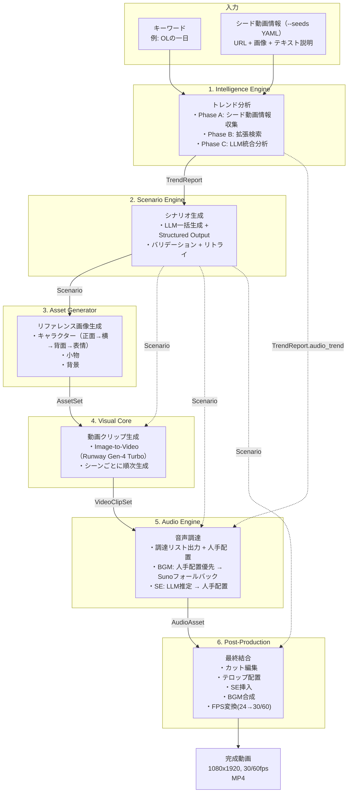
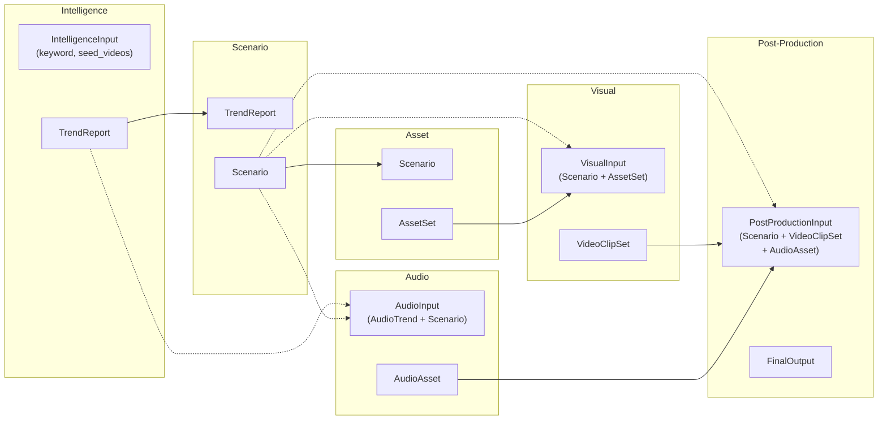

# 全体フロー設計書

本ドキュメントは、各設計書を横断してパイプライン全体のデータフローを俯瞰するための文書である。各レイヤーの詳細は個別の設計書を参照すること。

## 1. パイプライン概要

6つのレイヤーが順次実行され、各ステップ完了後にチェックポイント（`AWAITING_REVIEW`）で停止する。ユーザーが確認・承認した後、次のステップへ進む。

```
キーワード + シード動画情報（--seeds seeds.yaml で提供）
    ↓
[1. Intelligence Engine]  → TrendReport
    ↓ チェックポイント
[2. Scenario Engine]      → Scenario
    ↓ チェックポイント
[3. Asset Generator]      → AssetSet
    ↓ チェックポイント
[4. Visual Core]          → VideoClipSet
    ↓ チェックポイント
[5. Audio Engine]         → AudioAsset
    ↓ チェックポイント
[6. Post-Production]      → FinalOutput (完成動画)
    ↓ チェックポイント
完了
```

## 2. データフロー全体図



**実線矢印:** パイプラインの直列フロー（前ステップ → 次ステップ）
**破線矢印:** 過去ステップの出力を参照（ランナーが `load_output()` で取得）

## 3. レイヤー間データフロー詳細

### 3.1 Intelligence Engine → Scenario Engine

| 出力データ    | スキーマ                  | 用途               |
| ------------- | ------------------------- | ------------------ |
| `TrendReport` | `schemas/intelligence.py` | シナリオ生成の入力 |

`TrendReport` の各フィールドが Scenario Engine のシステムプロンプトに埋め込まれる:

| TrendReport フィールド | Scenario Engine での用途                       |
| ---------------------- | ---------------------------------------------- |
| `scene_structure`      | シーン数・尺配分の参考                         |
| `caption_trend`        | テロップ文言スタイルの参考                     |
| `visual_trend`         | シチュエーション・カメラワーク・色調の参考     |
| `audio_trend`          | BGM方向性指示の参考                            |
| `asset_requirements`   | キャラクター名・小物リスト・背景リストの導出元 |

### 3.2 Scenario Engine → Asset Generator

| 出力データ | スキーマ              | 用途                               |
| ---------- | --------------------- | ---------------------------------- |
| `Scenario` | `schemas/scenario.py` | キャラクター・小物・背景の画像生成 |

Asset Generator は `Scenario` の以下を消費する:

| Scenario フィールド              | Asset Generator での用途                 |
| -------------------------------- | ---------------------------------------- |
| `characters[].reference_prompt`  | 正面リファレンス画像の生成プロンプト     |
| `characters[].appearance/outfit` | 横・背面・表情の一貫性維持用コンテキスト |
| `props[].image_prompt`           | 小物画像の生成プロンプト                 |
| `scenes[].image_prompt`          | 背景画像の生成プロンプト                 |

### 3.3 Asset Generator → Visual Core

| 出力データ | スキーマ           | 用途                                   |
| ---------- | ------------------ | -------------------------------------- |
| `AssetSet` | `schemas/asset.py` | リファレンス画像（Visual Core の入力） |

Visual Core は `Scenario`（2ステップ前）+ `AssetSet`（直前）の両方を使用する:

| データ                      | Visual Core での用途                                 |
| --------------------------- | ---------------------------------------------------- |
| `CharacterAsset.front_view` | リファレンス画像（全シーン共通）                     |
| `SceneSpec.video_prompt`    | 動画生成プロンプト（動作・カメラワーク・雰囲気のみ） |

**重要:** リファレンス画像は全シーンで `characters[0].front_view`（メインキャラクターの正面画像）を使用する。`video_prompt` にキャラクターの外見描写は含めない（外見はリファレンス画像に委任）。

### 3.4 Visual Core → Audio Engine

| 出力データ     | スキーマ            | 用途                                                                |
| -------------- | ------------------- | ------------------------------------------------------------------- |
| `VideoClipSet` | `schemas/visual.py` | 直接参照はなし（パイプライン順序として Audio は Visual の後に実行） |

Audio Engine は `TrendReport.audio_trend`（3ステップ前）+ `Scenario`（2ステップ前）を使用する:

| データ                        | Audio Engine での用途   |
| ----------------------------- | ----------------------- |
| `AudioTrend.bpm_range`        | BGM 検索・生成のBPM条件 |
| `AudioTrend.genres`           | BGM 検索キーワード      |
| `AudioTrend.se_usage_points`  | SE 推定の参考情報       |
| `Scenario.bgm_direction`      | BGM 生成のプロンプト    |
| `Scenario.scenes[].situation` | SE 推定の入力           |
| `Scenario.total_duration_sec` | BGM の最小duration条件  |

### 3.5 Audio Engine → Post-Production

| 出力データ   | スキーマ           | 用途              |
| ------------ | ------------------ | ----------------- |
| `AudioAsset` | `schemas/audio.py` | BGM + SE ファイル |

Post-Production は全過去レイヤーの出力を使用する:

| データ                                       | Post-Production での用途 |
| -------------------------------------------- | ------------------------ |
| `Scenario.scenes[].caption_text`             | テロップ文言             |
| `Scenario.scenes[].duration_sec`             | シーンごとの尺           |
| `VideoClipSet.clips[].clip_path`             | 動画クリップファイル     |
| `AudioAsset.bgm.file_path`                   | BGM ファイル             |
| `AudioAsset.sound_effects[].file_path`       | SE ファイル              |
| `AudioAsset.sound_effects[].trigger_time_ms` | SE 挿入タイミング        |

## 4. パイプライン統合方式

### 4.1 StepEngine と各レイヤー ABC の関係

各レイヤーは独自の ABC（`IntelligenceEngineBase`, `ScenarioEngineBase` 等）を持つ。パイプラインランナーは統一インターフェース `StepEngine` でステップを実行する。

```
IntelligenceEngineBase  ─→  IntelligenceStepAdapter(StepEngine)
ScenarioEngineBase      ─→  ScenarioStepAdapter(StepEngine)
AssetGenerator          ─→  AssetStepAdapter(StepEngine)
VisualEngine            ─→  VisualStepAdapter(StepEngine)
AudioEngineBase         ─→  AudioStepAdapter(StepEngine)
(PostProductionEngine)  ─→  PostProductionStepAdapter(StepEngine)
```

アダプターが以下を担う:

1. **入力変換:** `StepEngine.execute(input_data, project_dir)` の `input_data` からレイヤー固有の引数への変換
2. **出力永続化:** レイヤー出力を `project_dir` 配下に保存（`save_output`）
3. **出力復元:** `load_output(project_dir)` で保存済みデータを復元

### 4.2 入力の組み立てフロー

ランナーの `_build_input()` が、実行対象ステップに応じて過去ステップの出力を `load_output()` で取得し、複合入力型を構築する。



### 4.3 パイプライン複合入力型

過去の複数ステップの出力を参照するステップは、`schemas/pipeline_io.py` で定義される複合入力型を使用する:

| 入力型                | 使用ステップ    | 含むデータ                           |
| --------------------- | --------------- | ------------------------------------ |
| `IntelligenceInput`   | Intelligence    | keyword, seed_videos（CLI の --seeds YAML から変換） |
| `VisualInput`         | Visual          | Scenario + AssetSet                  |
| `AudioInput`          | Audio           | AudioTrend + Scenario                |
| `PostProductionInput` | Post-Production | Scenario + VideoClipSet + AudioAsset |

Scenario と Asset は直前ステップの出力をそのまま使用するため、複合入力型は不要。

## 5. スキーマ一覧

各レイヤーの入出力スキーマの全体像:

| ファイル                  | 主要モデル                                                              | 定義レイヤー    | 消費レイヤー                          |
| ------------------------- | ----------------------------------------------------------------------- | --------------- | ------------------------------------- |
| `schemas/intelligence.py` | `TrendReport`                                                           | Intelligence    | Scenario, Audio                       |
| `schemas/scenario.py`     | `Scenario`, `CharacterSpec`, `PropSpec`, `SceneSpec`                    | Scenario        | Asset, Visual, Audio, Post-Production |
| `schemas/asset.py`        | `AssetSet`, `CharacterAsset`, `PropAsset`, `BackgroundAsset`            | Asset           | Visual                                |
| `schemas/visual.py`       | `VideoClipSet`, `VideoClip`                                             | Visual          | Post-Production                       |
| `schemas/audio.py`        | `AudioAsset`, `BGM`, `SoundEffect`                                      | Audio           | Post-Production                       |
| `schemas/post.py`         | `FinalOutput`, `CaptionEntry`, `CaptionStyle`                           | Post-Production | （最終出力）                          |
| `schemas/project.py`      | `PipelineState`, `StepState`, `ProjectConfig`                           | CLI基盤         | 全レイヤー（状態管理）                |
| `schemas/pipeline_io.py`  | `IntelligenceInput`, `VisualInput`, `AudioInput`, `PostProductionInput` | CLI基盤         | ランナー（入力組み立て）              |

## 6. プロジェクトディレクトリとデータ配置

各ステップの出力は `{data_root}/projects/{project_id}/` 配下にステップ名のディレクトリとして保存される:

```
projects/{project_id}/
├── config.yaml                     # プロジェクト設定（ProjectConfig）
├── state.yaml                      # パイプライン状態（PipelineState）
├── intelligence/
│   ├── report.json                 # TrendReport（最終出力）
│   ├── seed_input.json             # ユーザー提供のシード動画情報
│   ├── scene_captures/             # ユーザー提供のスクリーンショット画像
│   │   └── {video_id}/
│   │       └── scene_001.png
│   └── tmp/                        # 中間データ（メタデータ・字幕等）
│       ├── seed/{video_id}/
│       └── expanded/{video_id}/
├── scenario/
│   └── scenario.json               # Scenario（最終出力）
├── assets/
│   ├── reference/                  # ユーザー指定の参照画像（モードB用）
│   ├── character/{name}/           # キャラクター画像
│   │   ├── front.png
│   │   ├── side.png
│   │   ├── back.png
│   │   └── expressions/
│   ├── props/                      # 小物画像
│   ├── backgrounds/                # 背景画像
│   └── metadata.json               # AssetSet メタデータ
├── clips/
│   ├── scene_01.mp4                # 動画クリップ（24 FPS）
│   ├── scene_02.mp4
│   └── metadata.json               # VideoClipSet メタデータ
├── audio/
│   ├── audio_asset.json            # AudioAsset（最終出力）
│   ├── bgm/
│   │   ├── selected.mp3            # 選定された BGM
│   │   └── candidates/             # BGM 候補プール
│   ├── se/                         # SE ファイル
│   │   └── scene_01_footsteps.mp3
│   └── tmp/                        # 中間データ（候補メタデータ・SE推定結果）
└── output/
    └── final.mp4                   # 完成動画（1080x1920, 30/60 FPS）
```

## 7. 技術スタック横断ビュー

| 用途                       | 採用技術                               | 使用レイヤー        | ADR              |
| -------------------------- | -------------------------------------- | ------------------- | ---------------- |
| 画像生成                   | Gemini（`gemini-3-pro-image-preview`） | Asset Generator     | ADR-002          |
| 動画生成                   | Runway Gen-4 Turbo                     | Visual Core         | ADR-001          |
| 動画生成（高品質代替）     | Google Veo 3（Vertex AI）              | Visual Core         | ADR-001          |
| シナリオ生成 LLM           | OpenAI GPT-5 系                        | Scenario Engine     | （設計書で決定） |
| トレンド分析 LLM           | Gemini 2.5 Flash                       | Intelligence Engine | （設計書で決定） |
| SE 推定 LLM                | Gemini 2.5 Flash                       | Audio Engine        | （設計書で決定） |
| BGM・SE 素材               | 人手配置（フリー素材サイトから手動DL） | Audio Engine        | （設計書で決定） |
| BGM AI 生成                | Suno API v4                            | Audio Engine        | （ADR 作成予定） |
| メタデータ取得             | YouTube Data API v3                    | Intelligence Engine | —                |
| 字幕取得                   | youtube-transcript-api                 | Intelligence Engine | —                |
| 字幕取得（フォールバック） | OpenAI Whisper API                     | Intelligence Engine | —                |
| CLI フレームワーク         | Typer                                  | CLI 基盤            | —                |
| HTTP 通信                  | httpx（async）/ 各SDK内部              | 全レイヤー          | —                |

## 8. コスト見積もり（1動画あたり）

| レイヤー                            | 主要コスト                 | 見積もり                       |
| ----------------------------------- | -------------------------- | ------------------------------ |
| Intelligence Engine                 | Gemini Flash + YouTube API | 約 $0.05                       |
| Scenario Engine                     | OpenAI GPT-5               | 実装時確認（推定 $0.05〜0.15） |
| Asset Generator                     | Gemini 画像生成            | API料金による（回数依存）      |
| Visual Core（Runway）               | $0.05/秒 × 10秒 × シーン数 | 10シーンで **$5.00**           |
| Visual Core（Veo 3、高品質代替）    | $0.50/秒 × 8秒 × シーン数  | 10シーンで **$40.00**          |
| Audio Engine（フリー素材のみ）      | Gemini Flash（SE推定）     | 約 $0.01                       |
| Audio Engine（Suno フォールバック） | Suno クレジット            | 約 $0.11                       |
| **合計（Runway、フリー素材）**      |                            | **約 $5〜10**                  |
| **合計（Veo 3、フリー素材）**       |                            | **約 $40〜45**                 |

初期フェーズではコスト効率を重視し Runway をデフォルトとして使用する。品質重視の本番運用時には Veo 3 に切り替え可能。

## 9. 設計書一覧と対応関係

| 設計書                          | サブタスクID | 対応するパイプラインステップ         |
| ------------------------------- | ------------ | ------------------------------------ |
| `cli_pipeline_design.md`        | T1-1         | パイプラインオーケストレーション全体 |
| `intelligence_engine_design.md` | T1-2         | 1. Intelligence Engine               |
| `scenario_engine_design.md`     | T1-5         | 2. Scenario Engine                   |
| `asset_generator_design.md`     | T1-3         | 3. Asset Generator                   |
| `visual_core_design.md`         | T1-4         | 4. Visual Core                       |
| `audio_engine_design.md`        | T1-6         | 5. Audio Engine                      |
| （未作成）                      | T3-1         | 6. Post-Production                   |
