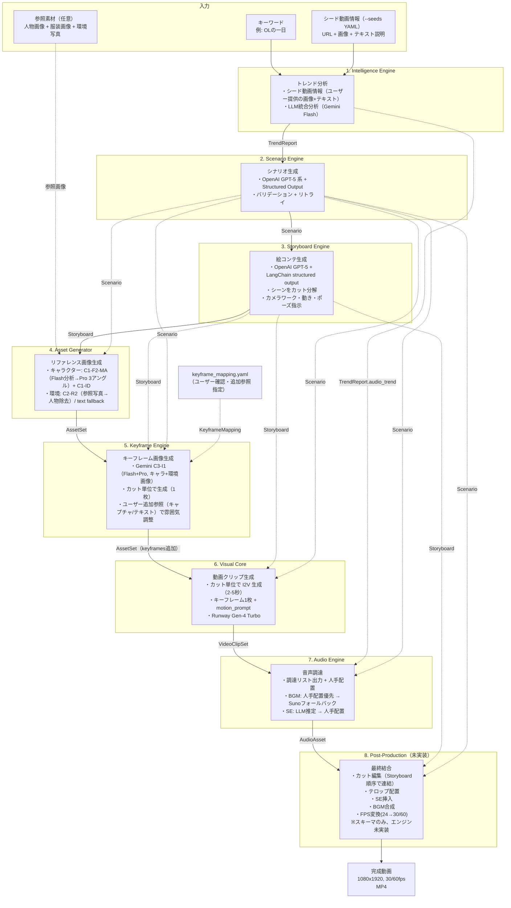

# 全体フロー設計書

本ドキュメントは、各設計書を横断してパイプライン全体のデータフローを俯瞰するための文書である。各レイヤーの詳細は個別の設計書を参照すること。

## 1. パイプライン概要

8つのレイヤーが順次実行され、各ステップ完了後にチェックポイント（`AWAITING_REVIEW`）で停止する。ユーザーが確認・承認した後、次のステップへ進む。

```
キーワード + シード動画情報（--seeds seeds.yaml で提供）
+ 参照素材（人物画像 + 服装画像 + 環境写真、任意）
    ↓
[1. Intelligence Engine]  → TrendReport
    ↓ チェックポイント
[2. Scenario Engine]      → Scenario
    ↓ チェックポイント
[3. Storyboard Engine]    → Storyboard
    ↓ チェックポイント（カット割りのユーザー確認）
[4. Asset Generator]      → AssetSet（キャラ画像 + Identity Block + 環境画像）
    ↓ チェックポイント
[5. Keyframe Engine]      → AssetSet（keyframes 追加）
    ↓ チェックポイント（キーフレーム画像のユーザー確認）
[6. Visual Core]          → VideoClipSet
    ↓ チェックポイント
[7. Audio Engine]         → AudioAsset
    ↓ チェックポイント
[8. Post-Production]      → FinalOutput (完成動画)
    ↓ チェックポイント
完了
```

## 2. データフロー全体図



**実線矢印:** パイプラインの直列フロー（前ステップ → 次ステップ）
**破線矢印:** 過去ステップの出力を参照（ランナーが `load_output()` で取得）

## 3. レイヤー間データフロー詳細

### 3.1 Intelligence Engine → Scenario Engine

| 出力データ    | スキーマ                  | 用途               |
| ------------- | ------------------------- | ------------------ |
| `TrendReport` | `schemas/intelligence.py` | シナリオ生成の入力 |

`TrendReport` の各フィールドが Scenario Engine のシステムプロンプトに埋め込まれる:

| TrendReport フィールド | Scenario Engine での用途                       |
| ---------------------- | ---------------------------------------------- |
| `scene_structure`      | シーン数・尺配分の参考                         |
| `caption_trend`        | テロップ文言スタイルの参考                     |
| `visual_trend`         | シチュエーション・カメラワーク・色調の参考     |
| `audio_trend`          | BGM方向性指示の参考                            |
| `asset_requirements`   | キャラクター名・背景リストの導出元 |

### 3.2 Scenario Engine → Storyboard Engine

| 出力データ | スキーマ              | 用途                                     |
| ---------- | --------------------- | ---------------------------------------- |
| `Scenario` | `schemas/scenario.py` | カット分解の入力（シーン構成・状況説明） |

Storyboard Engine は `Scenario` の以下を消費する:

| Scenario フィールド              | Storyboard Engine での用途            |
| -------------------------------- | ------------------------------------- |
| `title`                          | 動画タイトル（Storyboard に引き継ぎ） |
| `total_duration_sec`             | 全体尺の制約                          |
| `characters[].appearance/outfit` | カメラワーク・構図決定の参考          |
| `scenes[].situation`             | カット分解の入力                      |
| `scenes[].duration_sec`          | シーン尺の制約（カット合計と一致）    |
| `scenes[].camera_work`           | カメラワーク方針の参考                |
| `scenes[].image_prompt`          | キーフレームプロンプトへの背景情報    |
| `scenes[].caption_text`          | テンポ感の参考                        |

### 3.3 Storyboard Engine → Asset Generator

| 出力データ   | スキーマ                | 用途                           |
| ------------ | ----------------------- | ------------------------------ |
| `Storyboard` | `schemas/storyboard.py` | パイプライン順序上の直列フロー |

Asset Generator は `Scenario` + 参照素材を入力とし、Storyboard には直接依存しない。Storyboard が先に実行される理由は、将来的にカット数に応じたアセット最適化を行う可能性があるため。

#### 入力

| 入力 | ソース | 用途 |
|------|--------|------|
| `characters[].reference_prompt` | Scenario | テキストベースキャラ生成（参照画像なし時の fallback） |
| `characters[].appearance/outfit` | Scenario | 一貫性維持用コンテキスト |
| `scenes[].image_prompt` | Scenario | 背景画像の生成プロンプト（環境写真なし時の fallback） |
| 人物参照画像 | `assets/reference/person/` | **C1-F2-MA**: Flash 分析の入力 |
| 服装参照画像 | `assets/reference/clothing/` | **C1-F2-MA**: Flash 分析の入力（衣装バリアントごとに別画像を指定可能） |
| 環境参照写真 | `assets/reference/environments/` | **C2-R2**: 人物除去の入力 |

#### 処理ロジック

```
【キャラクター生成】
FOR EACH キャラクター:
  FOR EACH 衣装バリアント（clothing_variants、未指定時は "default" 1つ）:
    IF 参照画像（人物+服装）あり:
        C1-F2-MA: Flash(person+clothing) → テキスト記述 → Pro(front/side/back)
        C1-ID:   Flash(生成済みfront) → Identity Block テキスト
    ELSE:
        既存方式: reference_prompt → Pro(front) → front参照で side/back 生成

    出力先: assets/character/{キャラ名}/{variant_id}/

【環境生成】
IF 環境参照写真あり:
    C2-R2: Pro(参照写真 + 人物除去指示) → 環境画像
    C2-R2-MOD（任意）: C2-R2プロンプト末尾にテキスト修正指示を追加
        → 別アングル / 雰囲気変更 / オブジェクト追加 / スケール変更
ELSE:
    既存方式: image_prompt → Pro → 背景画像

```

#### 出力

| 出力 | 内容 | 新規/既存 |
|------|------|-----------|
| `CharacterAsset.variant_id` | 衣装バリアントID（デフォルト: `"default"`） | **新規** |
| `CharacterAsset.front_view/side_view/back_view` | キャラクター3アングル画像（バリアントごとに独立） | 既存 |
| `CharacterAsset.identity_block` | C1-ID テキスト記述 | 既存 |
| `EnvironmentAsset.image_path` | 人物不在の環境画像 | 既存 |
| `BackgroundAsset` | 背景画像（fallback） | 既存 |

**衣装バリアント:** 1キャラクターに複数の `CharacterAsset` が生成される（例: pajama, suit, casual）。`AssetSet.characters` は `[{Aoi, pajama}, {Aoi, suit}, {Aoi, casual}]` のようにフラットなリストとなる。

### 3.4 Asset Generator → Keyframe Engine → Visual Core

| 出力データ | スキーマ           | 用途                                                     |
| ---------- | ------------------ | -------------------------------------------------------- |
| `AssetSet` | `schemas/asset.py` | リファレンス画像（Keyframe Engine → Visual Core の入力） |

処理は2つの独立したパイプラインステップで実行される。まず KEYFRAME ステップで Gemini C3-I1（Flash + Pro 2パス）によりカット単位でキーフレーム画像を生成し、チェックポイントでユーザー承認を得た後、VISUAL ステップでキーフレーム画像 + `CutSpec.motion_prompt` から動画を生成する。

#### 処理方式: Gemini C3-I1（Flash + Pro 2パス）

```
Step 1: Flash 最小指示分析
  入力: キャラ画像 + 環境画像 + Identity Block + pose_instruction
        + ユーザー追加参照（キャプチャ画像/テキスト、任意）
  出力: シーンプロンプト（~53 words）

Step 2: Pro シーン生成
  入力: キャラ画像 + 環境画像 + Flashプロンプト
        + ユーザー追加キャプチャ（任意）
  出力: キーフレーム画像（9:16）
```

#### データフロー

| データ | 使用レイヤー | 用途 |
|--------|------------|------|
| `CharacterAsset.front_view` | Keyframe Engine | Flash+Pro のキャラクター参照画像 |
| `CharacterAsset.variant_id` | Keyframe Engine | キャラクター＋衣装バリアントの特定 |
| `EnvironmentAsset.image_path` | Keyframe Engine | Flash+Pro の環境参照画像 |
| `CharacterAsset.identity_block` | Keyframe Engine | Flash 最小指示分析のテキスト入力 |
| `CutSpec.pose_instruction` | Keyframe Engine | Flash 分析のポーズ指示 |
| `KeyframeMapping.variant_id` | Keyframe Engine | シーンで使用する衣装バリアントの指定 |
| `KeyframeMapping.reference_image` | Keyframe Engine | ユーザー追加のキャプチャ画像（任意） |
| `KeyframeMapping.reference_text` | Keyframe Engine | ユーザー追加のテキスト指示（任意） |
| `KeyframeAsset.image_path` | Visual Core | 動画生成の入力画像 |
| `CutSpec.motion_prompt` | Visual Core | 動画生成プロンプト（変更なし） |
| `CutSpec.transition` | Post-Production | カット間トランジション種別 |
| `CutSpec.duration_sec` | Visual Core | カットの動画尺 |

#### keyframe_mapping.yaml — ユーザー確認・追加参照

ASSET ステップ完了後のチェックポイントで、Storyboard + AssetSet の内容から `keyframe_mapping.yaml` を自動生成する。ユーザーはこのファイルで以下を確認・編集する:

1. **確認**: 各シーンの キャラ × 衣装バリアント × 環境 × ポーズ の対応関係（Storyboard から自動導出）
2. **編集**: `components` リストでキャラクター・参照コンポーネントを追加・変更
3. **追加**: 参照キャプチャ画像やテキスト指示で雰囲気を調整

```yaml
# keyframe_mapping.yaml（自動生成 → ユーザー編集）
scenes:
  - scene_number: 1
    environment: "env_1"
    pose: "standing_confident"
    components:
      - type: character
        character: "haruka"
        variant_id: "pajama"       # 衣装バリアント（朝のシーン）
      # --- ユーザーが任意で追加 ---
      - type: reference
        image: "reference/sunset_beach.jpg"   # 雰囲気参照キャプチャ
        text: "夕日を背景に、逆光シルエット気味に"
        purpose: atmosphere                   # 雰囲気参照

  - scene_number: 2
    environment: "env_2"
    pose: "walking"
    components:
      - type: character
        character: "haruka"
        variant_id: "suit"         # 衣装バリアント（通勤シーン）

  # アイテム装着シーン例
  - scene_number: 3
    environment: "ダイビング船デッキ"
    pose: "フルフェイスマスクを装着している最中"
    components:
      - type: character
        character: "haruka"
        variant_id: "drysuit"
      - type: reference
        image: "assets/items/full_face_mask.png"
        text: "フルフェイスマスク"
        purpose: wearing                      # キャラクターが装着中

  # ツーショットシーン例
  - scene_number: 4
    environment: "カフェ"
    pose: "向かい合ってコーヒーを飲む"
    components:
      - type: character
        character: "haruka"
        variant_id: "casual"
      - type: character
        character: "saki"
        variant_id: "casual"
      - type: reference
        image: "reference/latte.png"
        text: "特大のラテカップ"
        purpose: holding                      # 手に持っているアイテム
```

**コンポーネントの種類:**
- `type: character` — `character` + `variant_id` で `AssetSet.characters` から `front_view` + `identity_block` を自動解決。先頭の character コンポーネントが「主キャラクター」（Flash の Identity Block の主体）
- `type: reference` — 画像パス（`image`）/ テキスト（`text`）を直接指定（オブジェクト、雰囲気参照等）。`purpose` で参照の用途を明示する

**`purpose`（参照の用途）:**

| 値 | 意味 | Flash への伝搬 |
|-----|------|----------------|
| `wearing` | キャラクターが装着/着用しているアイテム | `"The character MUST be actively wearing/putting on '{text}'"` |
| `holding` | 手に持っているアイテム | `"The character MUST be holding '{text}'"` |
| `atmosphere` | 雰囲気・スタイルの参照 | `"Use '{text}' as a style/mood reference"` |
| `background` | 背景に配置するオブジェクト | `"Place '{text}' in the background/environment"` |
| `interaction` | キャラクターが操作/使用しているもの | `"The character MUST be actively using/interacting with '{text}'"` |
| `general` | 汎用（デフォルト） | `"Image N shows additional reference: {text}."` のみ（明示的指示なし） |

`purpose` 未指定時は `general`（後方互換）。`general` 以外の purpose を指定すると、Flash メタプロンプトに `"IMPORTANT reference instructions:"` セクションが追加され、参照画像の意図が明示的に伝搬される。

**`variant_id` の解決ルール:**
- `character` + `variant_id` の組み合わせで `AssetSet.characters` から一致する `CharacterAsset` を検索
- `variant_id` が空（未指定）の場合、`character` 名で最初に見つかったバリアントを使用
- 自動生成時は先頭バリアントが全シーンに割り当てられる（ユーザーが手動編集で各シーンの衣装を指定）

**後方互換:** 旧フォーマット（`character`/`variant_id`/`reference_image`/`reference_text` をフラットに記述）は自動的に `components` リストに変換される。`components` が指定されている場合は旧フィールドの自動変換は行わない。

**マッピング粒度:** keyframe_mapping はシーン単位で定義する。カット単位のキーフレーム生成時は、同一シーン内の全カットに同じマッピング（components, environment）を適用する。カットごとに異なるのは `CutSpec.pose_instruction` と `CutSpec.motion_prompt`（Storyboard 由来）のみ。

**Flash への追加情報の渡し方:**
- `type: reference` の `image`: Flash に追加画像として渡す。画像番号の説明は `purpose` に応じて変化する（例: wearing → `"Image N shows an item the character is wearing/putting on: {text}."`)。`image` なし（テキストのみ）の参照は Image 番号に含めない
- `type: reference` の `text`: Flash の contents にテキストとして追加する。`purpose` に応じて接頭辞が変化する（例: wearing → `"Item reference (character wears this): {text}"`、general → `"Additional reference: {text}"`）
- `type: reference` の `purpose`: `general` 以外の purpose が指定されている参照がある場合、Flash メタプロンプトの末尾に `"IMPORTANT reference instructions:"` セクションを追加し、参照の意図を明示的に指示する。これにより Flash が参照画像の用途を推測する余地をなくす
- 複数キャラクター時は全員の Identity Block を Flash に渡し、"Single person only, solo" 制約を除外する
- C3-I1 の最小指示知見に基づき、追加情報は簡潔に保つことを推奨する

**重要:** `motion_prompt` にはキャラクターの外見描写や場所の説明は含めない（入力画像であるキーフレーム画像に既に反映されているため）。Subject Motion + Scene Motion + Camera Motion の3要素で構成する。

### 3.5 Visual Core → Audio Engine

| 出力データ     | スキーマ            | 用途                                                                |
| -------------- | ------------------- | ------------------------------------------------------------------- |
| `VideoClipSet` | `schemas/visual.py` | 直接参照はなし（パイプライン順序として Audio は Visual の後に実行） |

Audio Engine は `TrendReport.audio_trend`（5ステップ前）+ `Scenario`（4ステップ前）を使用する:

| データ                        | Audio Engine での用途   |
| ----------------------------- | ----------------------- |
| `AudioTrend.bpm_range`        | BGM 検索・生成のBPM条件 |
| `AudioTrend.genres`           | BGM 検索キーワード      |
| `AudioTrend.se_usage_points`  | SE 推定の参考情報       |
| `Scenario.bgm_direction`      | BGM 生成のプロンプト    |
| `Scenario.scenes[].situation` | SE 推定の入力           |
| `Scenario.total_duration_sec` | BGM の最小duration条件  |

### 3.6 Audio Engine → Post-Production

| 出力データ   | スキーマ           | 用途              |
| ------------ | ------------------ | ----------------- |
| `AudioAsset` | `schemas/audio.py` | BGM + SE ファイル |

Post-Production は全過去レイヤーの出力を使用する:

| データ                                       | Post-Production での用途   |
| -------------------------------------------- | -------------------------- |
| `Storyboard.scenes[].cuts`                   | カット順序に従った動画連結 |
| `CutSpec.transition`                         | カット間トランジション種別 |
| `Scenario.scenes[].caption_text`             | テロップ文言               |
| `CutSpec.duration_sec`                       | カットごとの尺             |
| `VideoClipSet.clips[].clip_path`             | 動画クリップファイル       |
| `AudioAsset.bgm.file_path`                   | BGM ファイル               |
| `AudioAsset.sound_effects[].file_path`       | SE ファイル                |
| `AudioAsset.sound_effects[].trigger_time_ms` | SE 挿入タイミング          |

## 3.7 パイプラインモード

パイプラインは3つのモードで実行できる。コア（Production）をコンテンツ非依存にし、プランニングは外部から挿入可能とする。

### Full モード（従来通り）

```
run → resume を繰り返し
[Intelligence → Scenario → Storyboard → Asset → Keyframe → Visual → Audio → Post-Production]
```

全8ステップを順次実行する。`run` コマンドで開始。

### Planning モード

```
plan → resume を繰り返し
[Intelligence → Scenario → Storyboard]
```

プランニングステップのみ実行する。`plan` コマンドで開始。生成された scenario.json / storyboard.json をユーザーが手動編集してから `produce` でプロダクションに移行できる。

### Production モード

```
produce → resume を繰り返し
[Asset → Keyframe → Visual → Audio]
```

コンテンツ非依存のプロダクションステップのみ実行する。`produce` コマンドで開始。事前に scenario.json / storyboard.json がプロジェクトディレクトリに配置されている必要がある。Intelligence 未実行時は AudioTrend にデフォルト値を使用する。

### コア境界

```
┌─────────────────────────────────────┐    ┌────────────────────────────────────────┐
│  Planning（コンテンツ依存）          │    │  Production Core（コンテンツ非依存）    │
│                                     │    │                                        │
│  Intelligence → Scenario →          │    │  Asset → Keyframe → Visual → Audio     │
│  Storyboard                         │    │                                        │
│                                     │    │  入力契約: Scenario + Storyboard       │
│  出力: scenario.json,               │    │  （手動配置 or Planning の出力）        │
│        storyboard.json              │    │                                        │
└─────────────────────────────────────┘    └────────────────────────────────────────┘
```

### CLI コマンド一覧

| コマンド | 用途 | 開始ステップ |
|----------|------|-------------|
| `run <keyword>` | フル8ステップ（後方互換） | Intelligence |
| `plan <keyword>` | プランニングのみ | Intelligence |
| `produce <project-id>` | プロダクションのみ | Asset |
| `resume <project-id>` | 次ステップへ進行（全モード共通） | — |
| `retry <project-id>` | エラー再試行 | — |
| `status <project-id>` | 状態表示 | — |
| `init <keyword>` | プロジェクト初期化のみ | — |

## 4. パイプライン統合方式

### 4.1 StepEngine と各レイヤー ABC の関係

各レイヤーは独自の ABC（`IntelligenceEngineBase`, `ScenarioEngineBase` 等）を持つ。パイプラインランナーは統一インターフェース `StepEngine` でステップを実行する。

```
IntelligenceEngineBase  ─→  IntelligenceStepAdapter(StepEngine)
ScenarioEngineBase      ─→  ScenarioStepAdapter(StepEngine)
StoryboardEngineBase    ─→  StoryboardStepAdapter(StepEngine)
AssetGenerator          ─→  AssetStepAdapter(StepEngine)
KeyframeEngineBase      ─→  KeyframeStepAdapter(StepEngine)
VisualEngine            ─→  VisualStepAdapter(StepEngine)
AudioEngineBase         ─→  AudioStepAdapter(StepEngine)
(PostProductionEngine)  ─→  PostProductionStepAdapter(StepEngine)
```

アダプターが以下を担う:

1. **入力変換:** `StepEngine.execute(input_data, project_dir)` の `input_data` からレイヤー固有の引数への変換
2. **出力永続化:** レイヤー出力を `project_dir` 配下に保存（`save_output`）
3. **出力復元:** `load_output(project_dir)` で保存済みデータを復元

### 4.2 入力の組み立てフロー

ランナーの `_build_input()` が、実行対象ステップに応じて過去ステップの出力を `load_output()` で取得し、複合入力型を構築する。


### 4.3 パイプライン複合入力型

過去の複数ステップの出力を参照するステップは、`schemas/pipeline_io.py` で定義される複合入力型を使用する:

| 入力型                | 使用ステップ    | 含むデータ                                           |
| --------------------- | --------------- | ---------------------------------------------------- |
| `IntelligenceInput`   | Intelligence    | keyword, seed_videos（CLI の --seeds YAML から変換） |
| `StoryboardInput`     | Storyboard      | Scenario                                             |
| `KeyframeInput`       | Keyframe        | Scenario + Storyboard + AssetSet + KeyframeMapping?     |
| `VisualInput`         | Visual          | Scenario + Storyboard + AssetSet（keyframes含む）    |
| `AudioInput`          | Audio           | AudioTrend + Scenario                                |
| `PostProductionInput` | Post-Production | Scenario + Storyboard + VideoClipSet + AudioAsset    |

Scenario と Asset は直前ステップの出力をそのまま使用するため、複合入力型は不要。

## 5. スキーマ一覧

各レイヤーの入出力スキーマの全体像:

| ファイル                  | 主要モデル                                                                                                  | 定義レイヤー    | 消費レイヤー                              |
| ------------------------- | ----------------------------------------------------------------------------------------------------------- | --------------- | ----------------------------------------- |
| `schemas/intelligence.py` | `TrendReport`                                                                                               | Intelligence    | Scenario, Audio                           |
| `schemas/scenario.py`     | `Scenario`, `CharacterSpec`, `SceneSpec`                                                                    | Scenario        | Storyboard, Asset, Audio, Post-Production |
| `schemas/storyboard.py`   | `Storyboard`, `SceneStoryboard`, `CutSpec`, `MotionIntensity`, `Transition`                                 | Storyboard      | Keyframe, Visual, Post-Production         |
| `schemas/asset.py`        | `AssetSet`, `CharacterAsset`, `BackgroundAsset`, `EnvironmentAsset`, `KeyframeAsset`                        | Asset, Keyframe | Keyframe, Visual                          |
| `schemas/visual.py`       | `VideoClipSet`, `VideoClip`                                                                                 | Visual          | Post-Production                           |
| `schemas/audio.py`        | `AudioAsset`, `BGM`, `SoundEffect`                                                                          | Audio           | Post-Production                           |
| `schemas/post.py`         | `FinalOutput`, `CaptionEntry`, `CaptionStyle`                                                               | Post-Production | （最終出力）                              |
| `schemas/project.py`      | `PipelineState`, `StepState`, `ProjectConfig`                                                               | CLI基盤         | 全レイヤー（状態管理）                    |
| `schemas/keyframe_mapping.py` | `KeyframeMapping`, `SceneKeyframeSpec`, `CharacterComponent`, `ReferenceComponent`, `ReferencePurpose`  | ユーザー入力    | Keyframe                                  |
| `schemas/pipeline_io.py`  | `IntelligenceInput`, `StoryboardInput`, `KeyframeInput`, `VisualInput`, `AudioInput`, `PostProductionInput` | CLI基盤         | ランナー（入力組み立て）                  |

**SceneSpec のフィールド変更:** Storyboard 分離に伴い、`SceneSpec` から `keyframe_prompt` と `motion_prompt` を **削除**。これらはカット単位で `CutSpec` に移動した。

### C1-C3 に伴うスキーマ変更

| 変更種別 | モデル | フィールド | 型 | デフォルト |
|----------|--------|-----------|-----|-----------|
| **フィールド追加** | `CharacterAsset` | `identity_block` | `str` | `""` |
| **モデル新規** | `EnvironmentAsset` | `scene_number`, `image_path`, `source_type` | — | — |
| **フィールド追加** | `AssetSet` | `environments` | `list[EnvironmentAsset]` | `[]` |
| **フィールド追加** | `CutSpec` | `pose_instruction` | `str` | `""` |
| **フィールド追加** | `KeyframeAsset` | `cut_id`, `generation_method` | `str`, `str` | `""`, `"gemini"` |
| **モデル新規** | `SceneKeyframeSpec` | `scene_number`, `character`, `environment`, `pose`, `reference_image`, `reference_text` | — | — |
| **モデル新規** | `KeyframeMapping` | `scenes: list[SceneKeyframeSpec]` | — | — |

### 衣装バリアント対応に伴うスキーマ変更

| 変更種別 | モデル | フィールド | 型 | デフォルト |
|----------|--------|-----------|-----|-----------|
| **フィールド追加** | `CharacterAsset` | `variant_id` | `str` | `"default"` |
| **モデル新規** | `ClothingReferenceSpec` | `label`, `clothing` | `str`, `str \| None` | — |
| **フィールド追加** | `CharacterReferenceSpec` | `clothing_variants` | `list[ClothingReferenceSpec]` | `[]` |
| **フィールド追加** | `SceneKeyframeSpec` | `variant_id` | `str` | `""` |

### コンポーネント化に伴うスキーマ変更

| 変更種別 | モデル | フィールド | 型 | デフォルト |
|----------|--------|-----------|-----|-----------|
| **モデル新規** | `CharacterComponent` | `type`, `character`, `variant_id` | `Literal["character"]`, `str`, `str` | — |
| **モデル新規** | `ReferenceComponent` | `type`, `image`, `text`, `purpose` | `Literal["reference"]`, `Path \| None`, `str`, `ReferencePurpose` | — |
| **Enum 新規** | `ReferencePurpose` | — | `StrEnum` | `"general"` |
| **フィールド追加** | `SceneKeyframeSpec` | `components` | `list[CharacterComponent \| ReferenceComponent]` | `[]` |
| **deprecated** | `SceneKeyframeSpec` | `character`, `variant_id`, `reference_image`, `reference_text` | — | — (後方互換で残存、`components` 未指定時に自動変換) |

`ReferencePurpose` の値: `wearing`, `holding`, `atmosphere`, `background`, `interaction`, `general`

全て後方互換（デフォルト値あり）。既存の `BackgroundAsset`, `keyframe_prompt` は維持。`StyleMapping` は `KeyframeMapping` に置き換え。

## 6. プロジェクトディレクトリとデータ配置

各ステップの出力は `{data_root}/projects/{project_id}/` 配下にステップ名のディレクトリとして保存される:

```
projects/{project_id}/
├── config.yaml                     # プロジェクト設定（ProjectConfig）
├── state.yaml                      # パイプライン状態（PipelineState）
├── intelligence/
│   ├── report.json                 # TrendReport（最終出力）
│   ├── seed_input.json             # ユーザー提供のシード動画情報
│   ├── scene_captures/             # ユーザー提供のスクリーンショット画像
│   │   └── {video_id}/
│   │       └── scene_001.png
│   └── tmp/                        # 中間データ（メタデータ・字幕等）
│       ├── seed/{video_id}/
│       └── expanded/{video_id}/
├── scenario/
│   └── scenario.json               # Scenario（最終出力）
├── storyboard/
│   ├── storyboard.json             # Storyboard（最終出力）
│   └── keyframe_mapping.yaml       # キーフレームマッピング（自動生成 → ユーザー編集）
├── assets/
│   ├── reference/                  # ユーザー提供の参照素材
│   │   ├── person/                 # 人物参照画像（C1-F2-MA 入力）
│   │   ├── clothing/               # 服装参照画像（C1-F2-MA 入力）
│   │   └── environments/           # 環境参照写真（C2-R2 入力）
│   ├── character/{name}/           # キャラクター画像（衣装バリアント別）
│   │   ├── {variant_id}/          # 衣装バリアントディレクトリ（例: default/, pajama/, suit/）
│   │   │   ├── front.png
│   │   │   ├── side.png
│   │   │   └── back.png
│   ├── environments/               # 環境画像（C2-R2 出力）
│   │   ├── env_1.png
│   │   └── env_2.png
│   ├── backgrounds/                # 背景画像（環境写真なし時の fallback）
│   ├── keyframes/                  # キーフレーム画像（カット単位で生成、1枚/カット）
│   │   ├── scene_01_cut_01.png
│   │   ├── scene_01_cut_02.png
│   │   └── ...
│   └── metadata.json               # AssetSet メタデータ
├── clips/
│   ├── scene_01_cut_01.mp4         # カット単位の動画クリップ（24 FPS, 2-5秒）
│   ├── scene_01_cut_02.mp4
│   └── metadata.json               # VideoClipSet メタデータ
├── audio/
│   ├── audio_asset.json            # AudioAsset（最終出力）
│   ├── bgm/
│   │   ├── selected.mp3            # 選定された BGM
│   │   └── candidates/             # BGM 候補プール
│   ├── se/                         # SE ファイル
│   │   └── scene_01_footsteps.mp3
│   └── tmp/                        # 中間データ（候補メタデータ・SE推定結果）
└── output/
    └── final.mp4                   # 完成動画（1080x1920, 30/60 FPS）
```

## 7. 技術スタック横断ビュー

| 用途                       | 採用技術                               | 使用レイヤー        | ADR              |
| -------------------------- | -------------------------------------- | ------------------- | ---------------- |
| 画像生成（基盤）           | Gemini Pro（`gemini-3-pro-image-preview`） | Asset Generator     | ADR-002          |
| キャラ Flash 分析（C1-F2-MA） | Gemini Flash（`gemini-3-flash-preview`） | Asset Generator     | —                |
| Identity Block 抽出（C1-ID） | Gemini Flash                          | Asset Generator     | —                |
| 環境生成（C2-R2）          | Gemini Pro                             | Asset Generator     | —                |
| キーフレーム生成（C3-I1）  | Gemini Flash + Pro                     | Keyframe Engine     | —                |
| 動画生成                   | Runway Gen-4 Turbo                     | Visual Core         | ADR-001, ADR-003 |
| 動画生成（高品質代替）     | Runway Gen-4.5 / Google Veo 3          | Visual Core         | ADR-001, ADR-003 |
| シナリオ生成 LLM           | OpenAI GPT-5 系                         | Scenario Engine     | （設計書で決定） |
| 絵コンテ生成 LLM           | OpenAI GPT-5 系                        | Storyboard Engine   | （設計書で決定） |
| トレンド分析 LLM           | Gemini Flash                           | Intelligence Engine | （設計書で決定） |
| SE 推定 LLM                | Gemini Flash                           | Audio Engine        | （設計書で決定） |
| BGM・SE 素材               | 人手配置（フリー素材サイトから手動DL） | Audio Engine        | （設計書で決定） |
| BGM AI 生成                | Suno API v4                            | Audio Engine        | （ADR 作成予定） |
| メタデータ取得             | YouTube Data API v3                    | Intelligence Engine | —                |
| 字幕取得                   | youtube-transcript-api                 | Intelligence Engine | —                |
| 字幕取得（フォールバック） | OpenAI Whisper API                     | Intelligence Engine | —                |
| CLI フレームワーク         | Typer                                  | CLI 基盤            | —                |
| HTTP 通信                  | httpx（async）/ 各SDK内部              | 全レイヤー          | —                |

## 8. コスト見積もり（1動画あたり）

| レイヤー | 単価 | 数量 | コスト |
|----------|------|------|--------|
| Intelligence Engine | Gemini Flash | 1 | 約 $0.05 |
| Scenario Engine | OpenAI GPT-5 系 | 1 | 約 $0.05〜0.15 |
| Storyboard Engine | OpenAI GPT-5 | 1 | 約 $0.03〜0.10 |
| Asset Generator（キャラ C1-F2-MA + C1-ID） | $0.14/キャラ | 1 | **$0.14** |
| Asset Generator（環境 C2-R2） | $0.04/環境 | 5 | **$0.20** |
| Keyframe Engine（C3-I1） | $0.05/シーン | 25 | **$1.25** |
| Visual Core（Runway Gen-4 Turbo） | $0.05/秒 | 75秒 | **$3.75** |
| Visual Core（Veo 3、高品質代替） | $0.50/秒 | 75秒 | **$37.50** |
| Audio Engine（フリー素材のみ） | Gemini Flash | 1 | 約 $0.01 |
| Audio Engine（Suno フォールバック） | Suno クレジット | — | 約 $0.11 |
| **合計（Runway、フリー素材）** | | | **約 $5.5〜5.7** |
| **合計（Veo 3、フリー素材）** | | | **約 $39〜42** |

C1-C3 導入によりキーフレーム生成コストが Gen-4 Image Turbo（$0.02/枚 × 25 = $0.50）から Gemini C3-I1（$0.05/シーン × 25 = $1.25）に増加するが、キャラ・環境アセットの品質向上と一貫性の改善を考慮すると妥当。

## 9. C1-C3 PoC 検証結果のまとめ

本セクションは、C1（キャラクター生成）、C2（環境生成）、C3（シーン融合）の PoC 検証で確立された画像生成パイプラインの知見を要約する。詳細は各 PoC レポートを参照。

### 9.1 C1 キャラクター生成（C1-F2-MA + C1-ID）

**採用パターン:** C1-F2-MA（Flash 分析 → マルチアングル Pro 生成）

```
入力:
  [人物参照画像] — assets/reference/person/
  [服装参照画像] — assets/reference/clothing/

Step 1: Flash が [人物画像] + [服装画像] を分析 → キャラ記述テキスト（1回）
Step 2: Pro が各アングルで画像生成（Flash 記述をアンカーとして共有）
  - 正面: front_view
  - 側面: side_view
  - 背面: back_view

Step 3（C1-ID）: Flash が生成済み正面画像を分析 → Identity Block テキスト

出力:
  キャラクター3アングル画像（CharacterAsset.front_view / side_view / back_view）
  Identity Block テキスト（CharacterAsset.identity_block）
```

- **コスト:** Flash 1回 + Pro 3回 + Flash 1回（ID） = **$0.14/キャラ/バリアント**
- **要点:** Flash 記述が3アングル間の一貫性アンカーとして機能。Identity Block は生成**後**の画像を分析した記述を使用（生成前の Flash 記述ではない）

**衣装バリアント:** `mapping.yaml` で `clothing_variants` を指定すると、同一キャラクターに対して衣装ごとに C1-F2-MA が実行される（例: 2衣装 × (Flash 1 + Pro 3 + Flash 1) = $0.28/キャラ）。各バリアントは `CharacterAsset.variant_id` で識別される。

**参照画像なし時の fallback:** 既存方式（`reference_prompt` → Pro で正面生成 → 正面参照で side/back 生成）

### 9.2 C2 環境生成（C2-R2 + C2-R2-MOD）

**採用パターン:** C2-R2（参照写真 → Pro 直接生成）

```
入力:
  [環境参照写真] — assets/reference/environments/（人物入り可）

Step 1: Pro が参照写真 + 人物除去指示で環境画像を生成（1パス）

出力:
  環境画像（EnvironmentAsset.image_path）— 人物不在、元写真の雰囲気を再現
```

- **コスト:** **$0.04/環境**
- **要点:** 参照画像を直接 Pro に渡す1パスが最も忠実。Flash を挟むとテキスト化で細部が失われる
- **テキスト修正（C2-R2-MOD）:** C2-R2 のプロンプト末尾にテキスト指示を追加し、別アングル・雰囲気変更・オブジェクト追加が可能（+$0.04/バリエーション）

**環境参照写真なし時の fallback:** 既存方式（`scenes[].image_prompt` → Pro で背景画像を生成）

### 9.3 C3 シーン融合（C3-I1）

**採用パターン:** C3-I1（最小指示 Flash 分析 → Pro 生成）

```
入力:
  [キャラクター正面画像] — C1-F2-MA 出力
  [環境画像] — C2-R2 出力
  [Identity Block テキスト] — C1-ID 出力
  [ポーズ指示] — Storyboard の CutSpec.pose_instruction
  [ユーザー追加参照（任意）] — keyframe_mapping.yaml（キャプチャ画像 / テキスト指示）

Step 1: Flash がキャラ画像 + 環境画像 + Identity Block + ポーズ指示
        （+ ユーザー追加参照）を分析 → シーンプロンプト（~53 words）
Step 2: Pro がキャラ画像 + 環境画像 + Flash プロンプト
        （+ ユーザー追加キャプチャ）でシーン画像生成

出力:
  キーフレーム画像（KeyframeAsset.image_path）— 9:16、キャラクターが環境に自然に存在する1枚
```

- **コスト:** Flash $0.01 + Pro $0.04 = **$0.05/シーン**
- **要点:** 最小指示により Pro が画像参照を主体に自然な合成を行う。テキスト過多は逆効果

### 9.4 C1 → C2 → C3 完全フロー

```
[人物参照画像] + [服装参照画像]
    ↓
C1-F2-MA: Flash分析 → Pro 3アングル生成 → キャラ画像セット
    ↓
C1-ID: Flash が正面画像を分析 → Identity Block テキスト
    ↓                                    [環境参照写真]
    ↓                                         ↓
    ↓                               C2-R2: Pro 人物除去 → 環境画像
    ↓                                         ↓
    ├──── キャラ正面画像 ────────────────────→ ↓
    ├──── Identity Block ────────────────────→ ↓
    ↓                                         ↓
C3-I1: Flash 最小指示分析 → Pro シーン生成 → キーフレーム画像
    ↓
Visual Core: I2V 動画生成
```

### 9.5 横断的知見

#### 1パス vs 2パス（Flash 分析 → Pro 生成）の判断基準

| タスク | 入力 | 最適方式 | 理由 |
|--------|------|----------|------|
| 単一参照キャラ（C1-R1） | 人物画像1枚 | **1パス** | Flash の自由提案が発散するリスク |
| 融合キャラ（C1-F2） | 人物+服装 2枚以上 | **2パス** | Flash がどう組み合わせるかを言語化し精度向上 |
| 環境再現（C2-R2） | 環境写真1枚 | **1パス** | 参照画像を直接見せる方が忠実 |
| シーン融合（C3-I1） | キャラ+環境+ID+ポーズ | **2パス（最小指示）** | Flash の最小指示でポーズ・構図を組み立て |

**一般化:** 参照画像が1枚で「同じものを再現」するタスクは1パス直接指示が最適。複数入力を融合・組み合わせるタスクは Flash の言語化を挟む2パスが有効。ただし Flash への情報量は最小限に抑える。

#### Flash 最小指示原則

Flash に渡す情報が多いほどプロンプトが長くなり、Pro の自由度を奪って不自然さにつながる。C3-I1（~53 words）が C3-I2（~136 words）より優れた品質を示した。

- Identity Block: **有効**（キャラ特定に寄与）
- 環境記述テキスト: **逆効果**（環境画像と重複、プロンプト肥大化）
- シナリオコンテキスト: **逆効果**（同上）

#### selfie のベストプラクティス

- `"takes a selfie"` → 内カメラ視点（自然な自撮り）
- `"holding up a smartphone to take a selfie"` → 第三者視点（意図しない）
- **原則:** ポーズ指示では「動作の結果」を簡潔に書き、「手段（道具）」を書かない

### 9.6 検証エビデンス

| 検証 | レポート | コスト |
|------|----------|--------|
| C1 キャラクター生成 | `poc/seamless/C1_result.md` | $0.81 |
| C2 環境生成 | `poc/seamless/C2_result.md` | $0.52 |
| C3 シーン融合 | `poc/seamless/C3_result.md` | $0.84 |
| **合計** | | **$2.17** |

ベストプラクティスは `docs/image_gen_best_practices/` に個別タスク単位で蓄積:

- `character_generation.md` — キャラクター生成
- `environment_generation.md` — 環境生成
- `scene_generation.md` — シーン生成（C3 相当）
- `pose_change.md` — ポーズ変更
- `text_removal.md` — テキスト除去

## 10. 設計書一覧と対応関係

| 設計書                            | サブタスクID | 対応するパイプラインステップ                         |
| --------------------------------- | ------------ | ---------------------------------------------------- |
| `cli_pipeline_design.md`          | T1-1         | パイプラインオーケストレーション全体                 |
| `intelligence_engine_design.md`   | T1-2         | 1. Intelligence Engine                               |
| `scenario_engine_design.md`       | T1-5         | 2. Scenario Engine                                   |
| `storyboard_engine_design.md`     | —            | 3. Storyboard Engine                                 |
| `asset_generator_design.md`       | T1-3         | 4. Asset Generator                                   |
| `adr003_trajectory_correction.md` | —            | 5. Keyframe Engine（ADR-003 軌道修正設計書内で定義） |
| `visual_core_design.md`           | T1-4         | 6. Visual Core                                       |
| `audio_engine_design.md`          | T1-6         | 7. Audio Engine                                      |
| （未作成）                        | T3-1         | 8. Post-Production（スキーマのみ、エンジン未実装）   |

### PoC 検証レポート

| レポート | 対応するパイプラインステップ | 内容 |
| -------- | ---------------------------- | ---- |
| `poc/seamless/C1_result.md` | 4. Asset Generator（キャラクター生成） | C1-F2-MA + C1-ID の検証結果 |
| `poc/seamless/C2_result.md` | 4. Asset Generator（環境生成） | C2-R2 + C2-R2-MOD の検証結果 |
| `poc/seamless/C3_result.md` | 5. Keyframe Engine（シーン融合） | C3-I1 の検証結果 |

### 画像生成ベストプラクティス

| ドキュメント | 対応タスク |
| ------------ | ---------- |
| `docs/image_gen_best_practices/character_generation.md` | キャラクター生成（C1 相当） |
| `docs/image_gen_best_practices/environment_generation.md` | 環境生成（C2 相当） |
| `docs/image_gen_best_practices/scene_generation.md` | シーン生成（C3 相当） |
| `docs/image_gen_best_practices/pose_change.md` | ポーズ変更 |
| `docs/image_gen_best_practices/text_removal.md` | テキスト除去 |
| `docs/image_gen_best_practices/background_change.md` | 背景変更 |
| `docs/image_gen_best_practices/character_swap.md` | キャラクター入れ替え |
