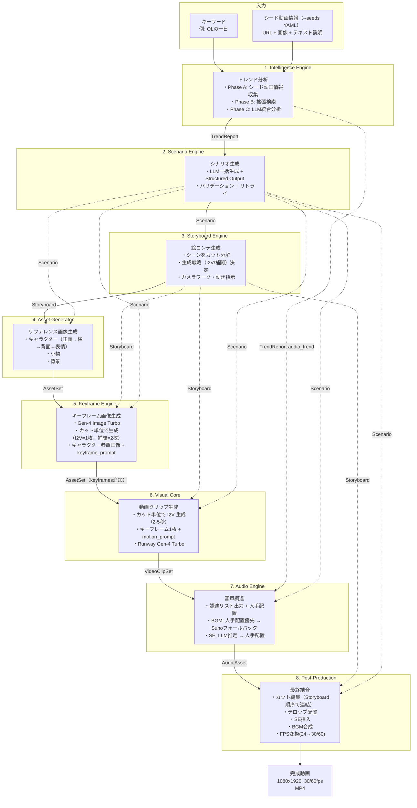
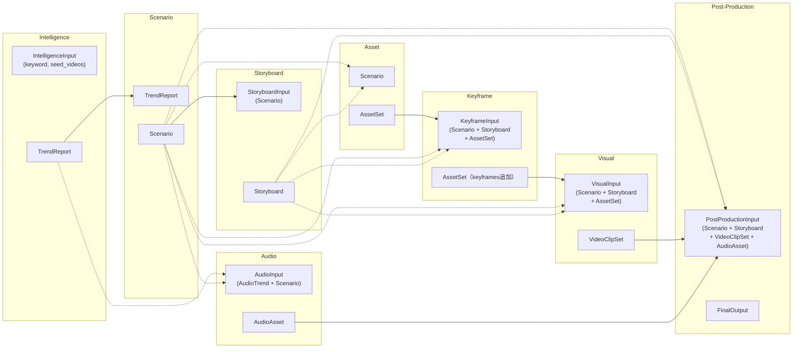

# 全体フロー設計書

本ドキュメントは、各設計書を横断してパイプライン全体のデータフローを俯瞰するための文書である。各レイヤーの詳細は個別の設計書を参照すること。

## 1. パイプライン概要

8つのレイヤーが順次実行され、各ステップ完了後にチェックポイント（`AWAITING_REVIEW`）で停止する。ユーザーが確認・承認した後、次のステップへ進む。

```
キーワード + シード動画情報（--seeds seeds.yaml で提供）
    ↓
[1. Intelligence Engine]  → TrendReport
    ↓ チェックポイント
[2. Scenario Engine]      → Scenario
    ↓ チェックポイント
[3. Storyboard Engine]    → Storyboard
    ↓ チェックポイント（カット割りのユーザー確認）
[4. Asset Generator]      → AssetSet
    ↓ チェックポイント
[5. Keyframe Engine]      → AssetSet（keyframes 追加）
    ↓ チェックポイント（キーフレーム画像のユーザー確認）
[6. Visual Core]          → VideoClipSet
    ↓ チェックポイント
[7. Audio Engine]         → AudioAsset
    ↓ チェックポイント
[8. Post-Production]      → FinalOutput (完成動画)
    ↓ チェックポイント
完了
```

## 2. データフロー全体図



**実線矢印:** パイプラインの直列フロー（前ステップ → 次ステップ）
**破線矢印:** 過去ステップの出力を参照（ランナーが `load_output()` で取得）

## 3. レイヤー間データフロー詳細

### 3.1 Intelligence Engine → Scenario Engine

| 出力データ    | スキーマ                  | 用途               |
| ------------- | ------------------------- | ------------------ |
| `TrendReport` | `schemas/intelligence.py` | シナリオ生成の入力 |

`TrendReport` の各フィールドが Scenario Engine のシステムプロンプトに埋め込まれる:

| TrendReport フィールド | Scenario Engine での用途                       |
| ---------------------- | ---------------------------------------------- |
| `scene_structure`      | シーン数・尺配分の参考                         |
| `caption_trend`        | テロップ文言スタイルの参考                     |
| `visual_trend`         | シチュエーション・カメラワーク・色調の参考     |
| `audio_trend`          | BGM方向性指示の参考                            |
| `asset_requirements`   | キャラクター名・小物リスト・背景リストの導出元 |

### 3.2 Scenario Engine → Storyboard Engine

| 出力データ | スキーマ              | 用途                                     |
| ---------- | --------------------- | ---------------------------------------- |
| `Scenario` | `schemas/scenario.py` | カット分解の入力（シーン構成・状況説明） |

Storyboard Engine は `Scenario` の以下を消費する:

| Scenario フィールド          | Storyboard Engine での用途           |
| ---------------------------- | ------------------------------------ |
| `title`                      | 動画タイトル（Storyboard に引き継ぎ） |
| `total_duration_sec`         | 全体尺の制約                         |
| `characters[].appearance/outfit` | カメラワーク・構図決定の参考     |
| `scenes[].situation`         | カット分解の入力                     |
| `scenes[].duration_sec`      | シーン尺の制約（カット合計と一致）   |
| `scenes[].camera_work`       | カメラワーク方針の参考               |
| `scenes[].image_prompt`      | キーフレームプロンプトへの背景情報   |
| `scenes[].caption_text`      | テンポ感の参考                       |

### 3.3 Storyboard Engine → Asset Generator

| 出力データ    | スキーマ                  | 用途               |
| ------------- | ------------------------- | ------------------ |
| `Storyboard`  | `schemas/storyboard.py`   | パイプライン順序上の直列フロー |

Asset Generator は `Scenario` のみを入力とし、Storyboard には直接依存しない。Storyboard が先に実行される理由は、将来的にカット数に応じたアセット最適化を行う可能性があるため。

Asset Generator は `Scenario` の以下を消費する:

| Scenario フィールド              | Asset Generator での用途                 |
| -------------------------------- | ---------------------------------------- |
| `characters[].reference_prompt`  | 正面リファレンス画像の生成プロンプト     |
| `characters[].appearance/outfit` | 横・背面・表情の一貫性維持用コンテキスト |
| `props[].image_prompt`           | 小物画像の生成プロンプト                 |
| `scenes[].image_prompt`          | 背景画像の生成プロンプト                 |

### 3.4 Asset Generator → Keyframe Engine → Visual Core

| 出力データ | スキーマ           | 用途                                                   |
| ---------- | ------------------ | ------------------------------------------------------ |
| `AssetSet` | `schemas/asset.py` | リファレンス画像（Keyframe Engine → Visual Core の入力） |

処理は2つの独立したパイプラインステップで実行される。まず KEYFRAME ステップで `front_view` + `CutSpec.keyframe_prompts` からカット単位でキーフレーム画像を生成し、チェックポイントでユーザー承認を得た後、VISUAL ステップでキーフレーム画像 + `CutSpec.motion_prompt` から動画を生成する。

| データ | 使用レイヤー | 用途 |
| --- | --- | --- |
| `CharacterAsset.front_view` | Keyframe Engine | キーフレーム画像生成の参照画像（`@char` タグで参照） |
| `CutSpec.keyframe_prompt` | Keyframe Engine | カット単位のキーフレーム画像生成プロンプト（1枚） |
| `KeyframeAsset.image_path` | Visual Core | 動画生成の入力画像 |
| `CutSpec.motion_prompt` | Visual Core | カット単位の動画生成プロンプト |
| `CutSpec.transition` | Post-Production | カット間トランジション種別 |
| `CutSpec.duration_sec` | Visual Core | カットの動画尺 |

**重要:** `motion_prompt` にはキャラクターの外見描写や場所の説明は含めない（入力画像であるキーフレーム画像に既に反映されているため）。Subject Motion + Scene Motion + Camera Motion の3要素で構成する。

### 3.5 Visual Core → Audio Engine

| 出力データ     | スキーマ            | 用途                                                                |
| -------------- | ------------------- | ------------------------------------------------------------------- |
| `VideoClipSet` | `schemas/visual.py` | 直接参照はなし（パイプライン順序として Audio は Visual の後に実行） |

Audio Engine は `TrendReport.audio_trend`（5ステップ前）+ `Scenario`（4ステップ前）を使用する:

| データ                        | Audio Engine での用途   |
| ----------------------------- | ----------------------- |
| `AudioTrend.bpm_range`        | BGM 検索・生成のBPM条件 |
| `AudioTrend.genres`           | BGM 検索キーワード      |
| `AudioTrend.se_usage_points`  | SE 推定の参考情報       |
| `Scenario.bgm_direction`      | BGM 生成のプロンプト    |
| `Scenario.scenes[].situation` | SE 推定の入力           |
| `Scenario.total_duration_sec` | BGM の最小duration条件  |

### 3.6 Audio Engine → Post-Production

| 出力データ   | スキーマ           | 用途              |
| ------------ | ------------------ | ----------------- |
| `AudioAsset` | `schemas/audio.py` | BGM + SE ファイル |

Post-Production は全過去レイヤーの出力を使用する:

| データ                                       | Post-Production での用途       |
| -------------------------------------------- | ------------------------------ |
| `Storyboard.scenes[].cuts`                   | カット順序に従った動画連結     |
| `CutSpec.transition`                         | カット間トランジション種別     |
| `Scenario.scenes[].caption_text`             | テロップ文言                   |
| `CutSpec.duration_sec`                       | カットごとの尺                 |
| `VideoClipSet.clips[].clip_path`             | 動画クリップファイル           |
| `AudioAsset.bgm.file_path`                   | BGM ファイル                   |
| `AudioAsset.sound_effects[].file_path`       | SE ファイル                    |
| `AudioAsset.sound_effects[].trigger_time_ms` | SE 挿入タイミング              |

## 4. パイプライン統合方式

### 4.1 StepEngine と各レイヤー ABC の関係

各レイヤーは独自の ABC（`IntelligenceEngineBase`, `ScenarioEngineBase` 等）を持つ。パイプラインランナーは統一インターフェース `StepEngine` でステップを実行する。

```
IntelligenceEngineBase  ─→  IntelligenceStepAdapter(StepEngine)
ScenarioEngineBase      ─→  ScenarioStepAdapter(StepEngine)
StoryboardEngineBase    ─→  StoryboardStepAdapter(StepEngine)
AssetGenerator          ─→  AssetStepAdapter(StepEngine)
KeyframeEngineBase      ─→  KeyframeStepAdapter(StepEngine)
VisualEngine            ─→  VisualStepAdapter(StepEngine)
AudioEngineBase         ─→  AudioStepAdapter(StepEngine)
(PostProductionEngine)  ─→  PostProductionStepAdapter(StepEngine)
```

アダプターが以下を担う:

1. **入力変換:** `StepEngine.execute(input_data, project_dir)` の `input_data` からレイヤー固有の引数への変換
2. **出力永続化:** レイヤー出力を `project_dir` 配下に保存（`save_output`）
3. **出力復元:** `load_output(project_dir)` で保存済みデータを復元

### 4.2 入力の組み立てフロー

ランナーの `_build_input()` が、実行対象ステップに応じて過去ステップの出力を `load_output()` で取得し、複合入力型を構築する。



### 4.3 パイプライン複合入力型

過去の複数ステップの出力を参照するステップは、`schemas/pipeline_io.py` で定義される複合入力型を使用する:

| 入力型                | 使用ステップ    | 含むデータ                                       |
| --------------------- | --------------- | ------------------------------------------------ |
| `IntelligenceInput`   | Intelligence    | keyword, seed_videos（CLI の --seeds YAML から変換） |
| `StoryboardInput`     | Storyboard      | Scenario                                         |
| `KeyframeInput`       | Keyframe        | Scenario + Storyboard + AssetSet                 |
| `VisualInput`         | Visual          | Scenario + Storyboard + AssetSet（keyframes含む） |
| `AudioInput`          | Audio           | AudioTrend + Scenario                            |
| `PostProductionInput` | Post-Production | Scenario + Storyboard + VideoClipSet + AudioAsset |

Scenario と Asset は直前ステップの出力をそのまま使用するため、複合入力型は不要。

## 5. スキーマ一覧

各レイヤーの入出力スキーマの全体像:

| ファイル                  | 主要モデル                                                              | 定義レイヤー         | 消費レイヤー                                  |
| ------------------------- | ----------------------------------------------------------------------- | -------------------- | --------------------------------------------- |
| `schemas/intelligence.py` | `TrendReport`                                                           | Intelligence         | Scenario, Audio                               |
| `schemas/scenario.py`     | `Scenario`, `CharacterSpec`, `PropSpec`, `SceneSpec`                    | Scenario             | Storyboard, Asset, Audio, Post-Production     |
| `schemas/storyboard.py`   | `Storyboard`, `SceneStoryboard`, `CutSpec`, `MotionIntensity`, `Transition` | Storyboard           | Keyframe, Visual, Post-Production             |
| `schemas/asset.py`        | `AssetSet`, `CharacterAsset`, `PropAsset`, `BackgroundAsset`, `KeyframeAsset` | Asset, Keyframe      | Keyframe, Visual                              |
| `schemas/visual.py`       | `VideoClipSet`, `VideoClip`                                             | Visual               | Post-Production                               |
| `schemas/audio.py`        | `AudioAsset`, `BGM`, `SoundEffect`                                      | Audio                | Post-Production                               |
| `schemas/post.py`         | `FinalOutput`, `CaptionEntry`, `CaptionStyle`                           | Post-Production      | （最終出力）                                  |
| `schemas/project.py`      | `PipelineState`, `StepState`, `ProjectConfig`                           | CLI基盤              | 全レイヤー（状態管理）                        |
| `schemas/pipeline_io.py`  | `IntelligenceInput`, `StoryboardInput`, `KeyframeInput`, `VisualInput`, `AudioInput`, `PostProductionInput` | CLI基盤              | ランナー（入力組み立て）                      |

**SceneSpec のフィールド変更:** Storyboard 分離に伴い、`SceneSpec` から `keyframe_prompt` と `motion_prompt` を **削除**。これらはカット単位で `CutSpec` に移動した。

## 6. プロジェクトディレクトリとデータ配置

各ステップの出力は `{data_root}/projects/{project_id}/` 配下にステップ名のディレクトリとして保存される:

```
projects/{project_id}/
├── config.yaml                     # プロジェクト設定（ProjectConfig）
├── state.yaml                      # パイプライン状態（PipelineState）
├── intelligence/
│   ├── report.json                 # TrendReport（最終出力）
│   ├── seed_input.json             # ユーザー提供のシード動画情報
│   ├── scene_captures/             # ユーザー提供のスクリーンショット画像
│   │   └── {video_id}/
│   │       └── scene_001.png
│   └── tmp/                        # 中間データ（メタデータ・字幕等）
│       ├── seed/{video_id}/
│       └── expanded/{video_id}/
├── scenario/
│   └── scenario.json               # Scenario（最終出力）
├── storyboard/
│   └── storyboard.json             # Storyboard（最終出力）
├── assets/
│   ├── reference/                  # ユーザー指定の参照画像（モードB用）
│   ├── character/{name}/           # キャラクター画像
│   │   ├── front.png
│   │   ├── side.png
│   │   ├── back.png
│   │   └── expressions/
│   ├── props/                      # 小物画像
│   ├── backgrounds/                # 背景画像
│   ├── keyframes/                  # キーフレーム画像（カット単位で生成）
│   │   ├── scene_01_cut_01.png     # I2V カット: 1枚
│   │   ├── scene_01_cut_02_start.png  # 補間カット: 始点
│   │   ├── scene_01_cut_02_end.png    # 補間カット: 終点
│   │   └── ...
│   └── metadata.json               # AssetSet メタデータ
├── clips/
│   ├── scene_01_cut_01.mp4         # カット単位の動画クリップ（24 FPS, 2-5秒）
│   ├── scene_01_cut_02.mp4
│   └── metadata.json               # VideoClipSet メタデータ
├── audio/
│   ├── audio_asset.json            # AudioAsset（最終出力）
│   ├── bgm/
│   │   ├── selected.mp3            # 選定された BGM
│   │   └── candidates/             # BGM 候補プール
│   ├── se/                         # SE ファイル
│   │   └── scene_01_footsteps.mp3
│   └── tmp/                        # 中間データ（候補メタデータ・SE推定結果）
└── output/
    └── final.mp4                   # 完成動画（1080x1920, 30/60 FPS）
```

## 7. 技術スタック横断ビュー

| 用途                       | 採用技術                               | 使用レイヤー         | ADR              |
| -------------------------- | -------------------------------------- | -------------------- | ---------------- |
| 画像生成                   | Gemini（`gemini-3-pro-image-preview`） | Asset Generator      | ADR-002          |
| キーフレーム画像生成       | Runway Gen-4 Image Turbo               | Keyframe Engine      | ADR-003          |
| 動画生成                   | Runway Gen-4 Turbo                     | Visual Core          | ADR-001, ADR-003 |
| 動画生成（高品質代替）     | Runway Gen-4.5 / Google Veo 3          | Visual Core          | ADR-001, ADR-003 |
| シナリオ生成 LLM           | OpenAI GPT-5 系                        | Scenario Engine      | （設計書で決定） |
| 絵コンテ生成 LLM           | OpenAI GPT-5 系                        | Storyboard Engine    | （設計書で決定） |
| トレンド分析 LLM           | Gemini 2.5 Flash                       | Intelligence Engine  | （設計書で決定） |
| SE 推定 LLM                | Gemini 2.5 Flash                       | Audio Engine         | （設計書で決定） |
| BGM・SE 素材               | 人手配置（フリー素材サイトから手動DL） | Audio Engine         | （設計書で決定） |
| BGM AI 生成                | Suno API v4                            | Audio Engine         | （ADR 作成予定） |
| メタデータ取得             | YouTube Data API v3                    | Intelligence Engine  | —                |
| 字幕取得                   | youtube-transcript-api                 | Intelligence Engine  | —                |
| 字幕取得（フォールバック） | OpenAI Whisper API                     | Intelligence Engine  | —                |
| CLI フレームワーク         | Typer                                  | CLI 基盤             | —                |
| HTTP 通信                  | httpx（async）/ 各SDK内部              | 全レイヤー           | —                |

## 8. コスト見積もり（1動画あたり）

| レイヤー                            | 主要コスト                     | 見積もり                             |
| ----------------------------------- | ------------------------------ | ------------------------------------ |
| Intelligence Engine                 | Gemini Flash + YouTube API     | 約 $0.05                             |
| Scenario Engine                     | OpenAI GPT-5                   | 実装時確認（推定 $0.05〜0.15）       |
| Storyboard Engine                   | OpenAI GPT-5                   | 実装時確認（推定 $0.03〜0.10）       |
| Asset Generator                     | Gemini 画像生成                | API料金による（回数依存）            |
| Keyframe Engine                     | Gen-4 Image Turbo $0.02/枚    | 25〜35枚で **$0.50〜0.70**           |
| Visual Core（動画）                 | Gen-4 Turbo $0.05/秒          | 25本 × 3秒平均 = 75秒で **$3.75**    |
| Visual Core（Veo 3、高品質代替）    | $0.50/秒 × カット尺 × カット数 | 25本 × 3秒 × $0.50 = **$37.50**     |
| Audio Engine（フリー素材のみ）      | Gemini Flash（SE推定）         | 約 $0.01                             |
| Audio Engine（Suno フォールバック） | Suno クレジット                | 約 $0.11                             |
| **合計（Runway、フリー素材）**      |                                | **約 $4〜5**                         |
| **合計（Veo 3、フリー素材）**       |                                | **約 $38〜43**                       |

Storyboard 導入によりカット数は増加するが、1カットの尺が短くなるため動画コストはほぼ同等。キーフレームコストは増加するがトータルでは大きな変動なし。

## 9. 設計書一覧と対応関係

| 設計書                              | サブタスクID | 対応するパイプラインステップ                         |
| ----------------------------------- | ------------ | ---------------------------------------------------- |
| `cli_pipeline_design.md`            | T1-1         | パイプラインオーケストレーション全体                 |
| `intelligence_engine_design.md`     | T1-2         | 1. Intelligence Engine                               |
| `scenario_engine_design.md`         | T1-5         | 2. Scenario Engine                                   |
| `storyboard_engine_design.md`       | —            | 3. Storyboard Engine                                 |
| `asset_generator_design.md`         | T1-3         | 4. Asset Generator                                   |
| `adr003_trajectory_correction.md`   | —            | 5. Keyframe Engine（ADR-003 軌道修正設計書内で定義） |
| `visual_core_design.md`             | T1-4         | 6. Visual Core                                       |
| `audio_engine_design.md`            | T1-6         | 7. Audio Engine                                      |
| （未作成）                          | T3-1         | 8. Post-Production                                   |
