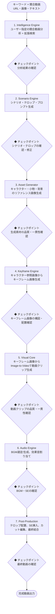

# プロジェクト仕様書：「〇〇の一日」AI動画生成自動化パイプライン

## 1. プロジェクト概要

### 1.1 目的

YouTube ショート（9:16）形式の「〇〇の一日」動画を、キャラクターの同一性を厳密に保ちながら自動生成するパイプラインを構築する。

### 1.2 ターゲット

SNSマーケティング、ブランド広告、個人VlogのAI代替。

### 1.3 提供価値

YouTube上の競合動画分析から素材生成・編集までを自動化し、トレンドに即した高クオリティな動画を量産する。

### 1.4 出力仕様

| 項目           | 仕様                               |
| -------------- | ---------------------------------- |
| フォーマット   | 1080x1920 (9:16)                   |
| フレームレート | 30fps / 60fps                      |
| 動画尺         | 30秒〜60秒                         |
| 音声           | BGM + テロップ（ナレーションなし） |
| 配信先         | YouTube ショート                   |

### 1.5 仕様書の運用方針

- 本仕様書は現時点の完成形ビジョンを記述する。
- サブタスクへの分解後、各タスクの実装詳細は個別の設計書（`/docs/designs/xx_design.md`）に記載する。
- 実装結果のフィードバックに基づき、本仕様書は継続的に更新される。

---

## 2. システムアーキテクチャ

ローカルマシン上で動作するPythonベースのパイプライン。各レイヤーは独立したモジュールとして実装し、CLI経由で実行する。チェックポイントでの確認にはWeb UIを使用する。

| レイヤー                   | 役割                                                       | 採用候補技術                                 |
| -------------------------- | ---------------------------------------------------------- | -------------------------------------------- |
| **1. Intelligence Engine** | ユーザー指定の競合動画分析 + 拡張検索によるトレンド構造化  | YouTube Data API / youtube-transcript-api / Gemini 2.5 Flash |
| **2. Scenario Engine**     | 分析データに基づくシナリオ・プロンプト・テロップ文言の生成 | **OpenAI GPT-5 系（採用済み: 設計書）**      |
| **3. Asset Generator**     | キャラクター・背景・小物のリファレンス画像生成             | **Gemini（採用済み: ADR-002）**              |
| **4. Keyframe Engine**     | キャラクター正面画像を参照画像として、シーン構図のキーフレーム画像を生成 | **Runway Gen-4 Image Turbo（採用済み: ADR-003）** |
| **5. Visual Core**         | キーフレーム画像を入力としたImage-to-Video動画生成（2段階パイプライン） | **Runway Gen-4 Turbo（採用済み: ADR-001, ADR-003）** / Runway Gen-4.5（高品質代替） |
| **6. Audio Engine**        | BGM調達（AI生成 + フリー素材）・効果音(SE)生成             | Suno / Udio / フリー素材ライブラリ           |
| **7. Post-Production**     | テロップ配置・SE挿入・カット編集・最終結合                 | MoviePy / FFmpeg                             |

---

## 3. パイプライン詳細

### 3.1 全体フロー



### 3.2 Intelligence Engine（トレンド分析）

**設計思想:** ユーザーの目視分析（高精度・低コスト）と自動メタデータ取得（効率・網羅性）を組み合わせたハイブリッドアプローチ。動画の映像内容は AI で自動分析するよりも、ユーザーが実際に動画を視聴して重要シーンをキャプチャする方が精度・コスト両面で優れている。

**データソース:** YouTube Data API v3 + youtube-transcript-api + ユーザー入力（画像・テキスト）+ Gemini 2.5 Flash（Vision + 統合分析）

**入力:**
- **検索キーワード:** 例：「OLの一日」「モーニングルーティン」
- **シード動画:** ユーザーが指定する競合動画情報（1本以上）:
  - YouTube URL
  - 重要シーンのスクリーンショット画像（1枚以上推奨）
  - テキスト説明（なぜ重要か、どう活用してほしいか）

**処理フロー（3段階）:**
1. **Phase A: シード動画情報収集:** ユーザー指定の競合動画URLからメタデータ（タイトル・説明文・タグ・統計）と字幕を自動取得し、ユーザーが提供したシーン画像・テキスト説明と統合
2. **Phase B: 拡張検索:** シード動画の情報をもとに YouTube Data API で類似動画を検索し、メタデータ・字幕を自動収集（最大10本）
3. **Phase C: LLM統合分析:** シード動画データ（ユーザー画像 + テキスト説明 + 字幕 + メタデータ）と拡張検索動画データ（字幕 + メタデータ）を Gemini 2.5 Flash に入力し、`TrendReport` を Structured Output で生成

**分析・抽出項目:**

| カテゴリ         | 抽出内容                                                                              |
| ---------------- | ------------------------------------------------------------------------------------- |
| シーン構成       | シーン数、各シーンの秒数、冒頭のフック（引き）の手法、シーン遷移パターン              |
| テロップトレンド | フォント傾向、配色、アニメーション、表示位置、強調手法                                |
| 映像内容         | シチュエーション一覧、登場小物、カメラワーク（POV、クローズアップ等）、色調・フィルタ |
| 音響トレンド     | BGMテンポ（BPM）、ジャンル、音量変化パターン、SE使用箇所                              |
| 素材要件         | 上記分析から導出される、AI素材生成で必要なキャラクター・小物・背景のリスト            |

**出力:** 構造化されたトレンド分析レポート（JSON形式）

### 3.3 Scenario Engine（シナリオ生成）

**入力:**
- Intelligence Engineのトレンド分析レポート
- ユーザーのクリエイティブディレクション（任意。自由テキストで創作意図を指定。例：「コメディ寄りにしたい」「朝のシーンを長めに」等）

**出力:**

- **シナリオ:** シーンごとの状況説明、時間配分、カメラワーク指定
- **キャラクター仕様:** 外見・服装の詳細説明、Asset Generator用のリファレンス画像生成プロンプト
- **小物仕様:** 小物の詳細説明、Asset Generator用の画像生成プロンプト
- **テロップ文言:** シーンごとのテロップテキスト（大枠。後工程で映像と照合しタイミング調整）
- **画像生成プロンプト:** Asset Generator用の背景の生成プロンプト
- **キーフレーム画像生成プロンプト:** Keyframe Engine用の各シーンのキーフレーム画像生成プロンプト（シーンの場所・状況にキャラクターを配置した構図を記述）
- **動画生成プロンプト:** Visual Core用の各シーンの動画生成プロンプト（動作・カメラワークのみ。外見・場所はキーフレーム画像に委任）
- **BGM方向性:** Audio Engine用のBGMテンポ・ジャンルの指示

### 3.4 Asset Generator（素材生成）

**目的:** キャラクターの同一性を全シーンで厳密に維持するためのリファレンス画像を生成する。

**生成対象:**

| 種別         | 内容                                                     |
| ------------ | -------------------------------------------------------- |
| キャラクター | 正面・横・背面の基本ポーズ、表情バリエーション、服装一式 |
| 小物         | シナリオで使用する小物（コーヒーカップ、PC、バッグ等）   |
| 背景         | 各シーンの背景（自宅、オフィス、カフェ等）               |

**一貫性維持手法:** リファレンス画像制御（2モード対応）

- **モードA（プロンプトのみ）:** Gemini が正面画像を生成し、それを参照画像として横・背面・表情を段階的に生成する。参照画像を持っていない場合のデフォルトモード。
- **モードB（ユーザー参照画像）:** ユーザーが指定した既存のキャラクター画像をアンカーとして、全ビュー・表情を生成する。一貫性がモードAより高くなることが期待される。
- 生成されたリファレンス画像を全シーンで同一の参照画像として動画生成AI（Visual Core）に入力する。
- 服装・髪型・顔の特徴が全シーンを通じて維持されることを保証する。

### 3.5 Keyframe Engine（キーフレーム画像生成）

**目的:** キャラクター正面画像を参照画像として、Gen-4 Image Turbo でシーン構図のキーフレーム画像を生成する。Asset Generator と Visual Core の間に位置し、チェックポイントでユーザー承認を得てから次のステップに進む。

**手法:** キャラクターの正面画像を `@char` タグで参照し、`keyframe_prompt` に基づいてシーンの場所・状況にキャラクターを配置した構図画像を生成する。

**入力:**
- キャラクター正面画像（`CharacterAsset.front_view`）
- シーンごとのキーフレーム画像生成プロンプト（`SceneSpec.keyframe_prompt`）

**出力:** シーンごとのキーフレーム画像（`assets/keyframes/scene_01.png` 等）

**コスト:** Gen-4 Image Turbo = $0.02/枚。8シーンで $0.16。動画生成（$0.50/本）の25分の1のコストでキーフレーム画像を事前確認できるため、コスト効率が高い。

### 3.6 Visual Core（動画生成）

**手法:** Image-to-Video（キーフレーム画像 + テキストプロンプト → 動画クリップ）。Keyframe Engine が生成したキーフレーム画像を入力として、Gen-4 Turbo I2V で動画クリップを生成する2段階パイプライン。

**採用技術（ADR-001 で決定済み）:**

| AI                 | ステータス       | 特徴                                                                  |
| ------------------ | --------------- | --------------------------------------------------------------------- |
| Runway Gen-4 Turbo | **採用（デフォルト）** | 同一性スコア 8.5/10、コスト $0.05/秒、初期フェーズのコスト効率重視  |
| Google Veo 3       | 高品質代替（切替可能） | 同一性スコア 9.5/10（最高）、生成速度 36秒（最速）、$0.50/秒       |
| Luma Dream Machine | 不採用          | 安定性が低い（stdev=3.49）ため除外                                    |
| Kling AI           | 未評価          | クレジット追加後に再評価の余地あり                                    |

**出力:** シーンごとの動画クリップ（24 FPS、Post-Production で最終 FPS に変換）。キーフレーム画像に既にシーン構図が反映されているため、`motion_prompt` は動きとカメラワークのみを指示する。複数候補の品質ベース選択は T4-1 で実装。

### 3.7 Audio Engine（音声生成）

**ナレーション:** なし（BGM + テロップで構成）

**BGM:**

| 調達方法   | 詳細                                                          |
| ---------- | ------------------------------------------------------------- |
| 人手配置   | 調達リスト（ジャンル・BPM等の条件）を自動出力し、著作権フリーのBGMライブラリから人手でダウンロード・配置後、ローカルスキャンで選定 |
| AI生成（フォールバック） | BGM未配置時のみ、Suno等でトレンド分析のBPM・ジャンルに合致するBGMを生成 |

シナリオに最適なBGMを人手配置ファイルまたはAI生成フォールバックから選択する。

**効果音(SE):**

- シーン情報からLLM（Gemini）が必要なSE（足音、キーボード打鍵音、ドアの開閉音等）を推定し、調達リストとして出力。人手でダウンロード・配置したファイルをローカルスキャンで割り当てる。
- 映像とSEの精密な同期（ミリ秒単位）はPost-Production（T2-3 Sound-Image Sync）で実施する。

### 3.8 Post-Production（編集・結合）

**処理内容:**

1. **カット編集:** トレンド分析のテンポに合わせ、シーンごとの動画クリップをカット・結合
2. **テロップ配置:**
   - Scenario Engineで生成したテロップ文言を配置
   - 実際の映像と照合し、表示タイミング・表示位置を調整
   - トレンド分析で抽出したテロップスタイル（フォント・配色・アニメーション）を適用
3. **SE挿入:** Audio Engineで割り当てたSEを映像に同期配置
4. **BGM合成:** 選定したBGMを全体に配置し、音量バランスを調整
5. **最終出力:** 1080x1920, 30/60fps の完成動画を書き出し

---

## 4. 品質管理

### 4.1 自動品質チェック

各レイヤーの出力に対してAIによる品質評価を自動実行する。基準未達の場合は自動で再生成を試行する。

| レイヤー        | 品質チェック項目                                         |
| --------------- | -------------------------------------------------------- |
| Asset Generator | キャラクター一貫性スコア、画像品質スコア                 |
| Keyframe Engine | キーフレーム画像の構図適合度、キャラクター再現性         |
| Visual Core     | キャラクター同一性維持度、動きの自然さ、プロンプト追従性 |
| Audio Engine    | BGMとシナリオの適合度、SE同期精度                        |
| Post-Production | 全体の流れの自然さ、テロップ可読性                       |

### 4.2 人間によるチェックポイント

全ステップの出力で人間が確認・承認するチェックポイントを設ける。Web UIでプレビュー・修正指示を行い、承認後に次のステップへ進む。

---

## 5. ユーザーインターフェース

### 5.1 CLI（メイン実行）

- パイプライン全体の実行・個別ステップの実行
- キーワード入力、設定ファイル指定
- ステータス確認、ログ出力

### 5.2 Web UI（チェックポイント確認）

- 各ステップの出力プレビュー（テキスト、画像、動画、音声）
- 承認 / 差し戻し / 修正指示のインターフェース
- パイプライン全体の進行状況ダッシュボード

---

## 6. データ管理

### 6.1 ディレクトリ構造

ローカルファイルシステムで管理する。プロジェクトごとにディレクトリを分離。

```
projects/
└── {project_id}/
    ├── config.yaml           # プロジェクト設定
    ├── intelligence/         # トレンド分析結果
    │   ├── seed_videos/      # シード動画情報（メタデータ・字幕・ユーザー提供画像）
    │   ├── expanded_videos/  # 拡張検索で収集した動画情報
    │   └── report.json       # 統合トレンド分析レポート
    ├── scenario/             # シナリオ・プロンプト
    │   └── scenario.json    # シナリオ全体（テロップ文言を含む）
    ├── assets/               # リファレンス画像
    │   ├── reference/        # ユーザー指定の参照画像（任意）
    │   ├── character/        # キャラクター画像（{name}/front.png等）
    │   ├── props/
    │   ├── backgrounds/
    │   └── keyframes/        # キーフレーム画像（scene_01.png等）
    ├── clips/                # 動画クリップ（scene_01.mp4, scene_02.mp4, ...）
    ├── audio/                # BGM・SE
    │   ├── bgm/
    │   └── se/
    └── output/               # 最終出力
        └── final.mp4
```

---

## 7. 重点技術課題

| 課題                         | 概要                                                                                                       |
| ---------------------------- | ---------------------------------------------------------------------------------------------------------- |
| **Trend Decomposition**      | ユーザーの目視分析（シーン画像・テキスト説明）と自動メタデータ・字幕取得を組み合わせ、競合動画群を再構成可能な構造化トレンドデータに変換するハイブリッドアルゴリズム |
| **Asset Driven Consistency** | リファレンス画像を「正解データ」として動画生成AIに強く反映させ、キャラクター同一性を厳密に維持する制御技術 |
| **Dynamic Captions**         | 視聴維持率を最大化する、YouTubeショート特有の強調アニメーションテロップの自動配置・タイミング制御          |
| **Sound-Image Sync**         | 映像内の動作と効果音（SE）をミリ秒単位で同期させる音響設計                                                 |
| **Video AI Selection**       | 複数の動画生成AIを比較評価し、キャラクター同一性維持に最適なモデルを選定する検証フレームワーク             |
