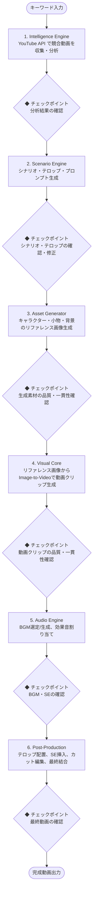

# プロジェクト仕様書：「〇〇の一日」AI動画生成自動化パイプライン

## 1. プロジェクト概要

### 1.1 目的

YouTube ショート（9:16）形式の「〇〇の一日」動画を、キャラクターの同一性を厳密に保ちながら自動生成するパイプラインを構築する。

### 1.2 ターゲット

SNSマーケティング、ブランド広告、個人VlogのAI代替。

### 1.3 提供価値

YouTube上の競合動画分析から素材生成・編集までを自動化し、トレンドに即した高クオリティな動画を量産する。

### 1.4 出力仕様

| 項目           | 仕様                               |
| -------------- | ---------------------------------- |
| フォーマット   | 1080x1920 (9:16)                   |
| フレームレート | 30fps / 60fps                      |
| 動画尺         | 30秒〜60秒                         |
| 音声           | BGM + テロップ（ナレーションなし） |
| 配信先         | YouTube ショート                   |

### 1.5 仕様書の運用方針

- 本仕様書は現時点の完成形ビジョンを記述する。
- サブタスクへの分解後、各タスクの実装詳細は個別の設計書（`/docs/designs/xx_design.md`）に記載する。
- 実装結果のフィードバックに基づき、本仕様書は継続的に更新される。

---

## 2. システムアーキテクチャ

ローカルマシン上で動作するPythonベースのパイプライン。各レイヤーは独立したモジュールとして実装し、CLI経由で実行する。チェックポイントでの確認にはWeb UIを使用する。

| レイヤー                   | 役割                                                       | 採用候補技術                                 |
| -------------------------- | ---------------------------------------------------------- | -------------------------------------------- |
| **1. Intelligence Engine** | YouTube競合動画のトレンド分析・構造化                      | YouTube Data API / Whisper / GPT-4o (Vision) |
| **2. Scenario Engine**     | 分析データに基づくシナリオ・プロンプト・テロップ文言の生成 | Gemini 1.5 Pro / GPT-4o                      |
| **3. Asset Generator**     | キャラクター・背景・小物のリファレンス画像生成             | Stability AI API / DALL-E 3 / Gemini         |
| **4. Visual Core**         | リファレンス画像を入力としたImage-to-Video動画生成         | Google Veo / Kling / Luma / Runway Gen-3     |
| **5. Audio Engine**        | BGM調達（AI生成 + フリー素材）・効果音(SE)生成             | Suno / Udio / フリー素材ライブラリ           |
| **6. Post-Production**     | テロップ配置・SE挿入・カット編集・最終結合                 | MoviePy / FFmpeg                             |

---

## 3. パイプライン詳細

### 3.1 全体フロー



### 3.2 Intelligence Engine（トレンド分析）

**データソース:** YouTube Data API（YouTubeのみ）

**入力:** 検索キーワード（例：「OLの一日」「モーニングルーティン」）

**分析・抽出項目:**

| カテゴリ         | 抽出内容                                                                              |
| ---------------- | ------------------------------------------------------------------------------------- |
| シーン構成       | シーン数、各シーンの秒数、冒頭のフック（引き）の手法、シーン遷移パターン              |
| テロップトレンド | フォント傾向、配色、アニメーション、表示位置、強調手法                                |
| 映像内容         | シチュエーション一覧、登場小物、カメラワーク（POV、クローズアップ等）、色調・フィルタ |
| 音響トレンド     | BGMテンポ（BPM）、ジャンル、音量変化パターン、SE使用箇所                              |
| 素材要件         | 上記分析から導出される、AI素材生成で必要なキャラクター・小物・背景のリスト            |

**出力:** 構造化されたトレンド分析レポート（JSON形式）

### 3.3 Scenario Engine（シナリオ生成）

**入力:** Intelligence Engineのトレンド分析レポート

**出力:**

- **シナリオ:** シーンごとの状況説明、時間配分、カメラワーク指定
- **テロップ文言:** シーンごとのテロップテキスト（大枠。後工程で映像と照合しタイミング調整）
- **画像生成プロンプト:** Asset Generator用のキャラクター・小物・背景の生成プロンプト
- **動画生成プロンプト:** Visual Core用の各シーンの動画生成プロンプト

### 3.4 Asset Generator（素材生成）

**目的:** キャラクターの同一性を全シーンで厳密に維持するためのリファレンス画像を生成する。

**生成対象:**

| 種別         | 内容                                                     |
| ------------ | -------------------------------------------------------- |
| キャラクター | 正面・横・背面の基本ポーズ、表情バリエーション、服装一式 |
| 小物         | シナリオで使用する小物（コーヒーカップ、PC、バッグ等）   |
| 背景         | 各シーンの背景（自宅、オフィス、カフェ等）               |

**一貫性維持手法:** リファレンス画像制御（Image-to-Video）

- キャラクターの参照画像を事前に高品質生成し、全シーンで同一の参照画像を動画生成AIに入力する。
- 服装・髪型・顔の特徴が全シーンを通じて維持されることを保証する。

### 3.5 Visual Core（動画生成）

**手法:** Image-to-Video（リファレンス画像 + テキストプロンプト → 動画クリップ）

**採用候補技術（検証対象）:**

| AI                 | 特徴                 | 評価観点                         |
| ------------------ | -------------------- | -------------------------------- |
| Google Veo         | 高品質な動画生成     | 画質、API安定性、コスト          |
| Kling              | Image-to-Videoに強み | キャラクター一貫性、動きの自然さ |
| Luma Dream Machine | 高速生成             | 速度、品質バランス               |
| Runway Gen-4 Turbo | 映像クオリティ       | プロンプト追従性、一貫性         |

**選定基準:** キャラクター同一性の維持精度を最重視。検証フェーズで各AIを比較評価し決定する。

**出力:** シーンごとの動画クリップ（複数候補を生成し、品質チェック後に最良を選定）

### 3.6 Audio Engine（音声生成）

**ナレーション:** なし（BGM + テロップで構成）

**BGM:**

| 調達方法   | 詳細                                                          |
| ---------- | ------------------------------------------------------------- |
| AI生成     | Suno / Udio等でトレンド分析のBPM・ジャンルに合致するBGMを生成 |
| フリー素材 | 著作権フリーのBGMライブラリからトレンドに合う楽曲を自動選定   |

シナリオに最適なBGMを両プールから自動選択する。

**効果音(SE):**

- 映像内の「物体」や「動作」をAIが認識し、最適なSE（足音、キーボード打鍵音、ドアの開閉音等）を自動ライブラリから割り当て。
- 映像と効果音をミリ秒単位で同期させる。

### 3.7 Post-Production（編集・結合）

**処理内容:**

1. **カット編集:** トレンド分析のテンポに合わせ、シーンごとの動画クリップをカット・結合
2. **テロップ配置:**
   - Scenario Engineで生成したテロップ文言を配置
   - 実際の映像と照合し、表示タイミング・表示位置を調整
   - トレンド分析で抽出したテロップスタイル（フォント・配色・アニメーション）を適用
3. **SE挿入:** Audio Engineで割り当てたSEを映像に同期配置
4. **BGM合成:** 選定したBGMを全体に配置し、音量バランスを調整
5. **最終出力:** 1080x1920, 30/60fps の完成動画を書き出し

---

## 4. 品質管理

### 4.1 自動品質チェック

各レイヤーの出力に対してAIによる品質評価を自動実行する。基準未達の場合は自動で再生成を試行する。

| レイヤー        | 品質チェック項目                                         |
| --------------- | -------------------------------------------------------- |
| Asset Generator | キャラクター一貫性スコア、画像品質スコア                 |
| Visual Core     | キャラクター同一性維持度、動きの自然さ、プロンプト追従性 |
| Audio Engine    | BGMとシナリオの適合度、SE同期精度                        |
| Post-Production | 全体の流れの自然さ、テロップ可読性                       |

### 4.2 人間によるチェックポイント

全ステップの出力で人間が確認・承認するチェックポイントを設ける。Web UIでプレビュー・修正指示を行い、承認後に次のステップへ進む。

---

## 5. ユーザーインターフェース

### 5.1 CLI（メイン実行）

- パイプライン全体の実行・個別ステップの実行
- キーワード入力、設定ファイル指定
- ステータス確認、ログ出力

### 5.2 Web UI（チェックポイント確認）

- 各ステップの出力プレビュー（テキスト、画像、動画、音声）
- 承認 / 差し戻し / 修正指示のインターフェース
- パイプライン全体の進行状況ダッシュボード

---

## 6. データ管理

### 6.1 ディレクトリ構造

ローカルファイルシステムで管理する。プロジェクトごとにディレクトリを分離。

```
projects/
└── {project_id}/
    ├── config.yaml           # プロジェクト設定
    ├── intelligence/         # トレンド分析結果
    │   └── report.json
    ├── scenario/             # シナリオ・プロンプト
    │   ├── scenario.json
    │   └── captions.json
    ├── assets/               # リファレンス画像
    │   ├── character/
    │   ├── props/
    │   └── backgrounds/
    ├── clips/                # 動画クリップ
    │   └── scene_{n}/
    ├── audio/                # BGM・SE
    │   ├── bgm/
    │   └── se/
    └── output/               # 最終出力
        └── final.mp4
```

---

## 7. 重点技術課題

| 課題                         | 概要                                                                                                       |
| ---------------------------- | ---------------------------------------------------------------------------------------------------------- |
| **Trend Decomposition**      | 既存YouTube動画を「映像・音声・メタデータ」に分解し、再構成可能な構造化データに変換するアルゴリズム        |
| **Asset Driven Consistency** | リファレンス画像を「正解データ」として動画生成AIに強く反映させ、キャラクター同一性を厳密に維持する制御技術 |
| **Dynamic Captions**         | 視聴維持率を最大化する、YouTubeショート特有の強調アニメーションテロップの自動配置・タイミング制御          |
| **Sound-Image Sync**         | 映像内の動作と効果音（SE）をミリ秒単位で同期させる音響設計                                                 |
| **Video AI Selection**       | 複数の動画生成AIを比較評価し、キャラクター同一性維持に最適なモデルを選定する検証フレームワーク             |
