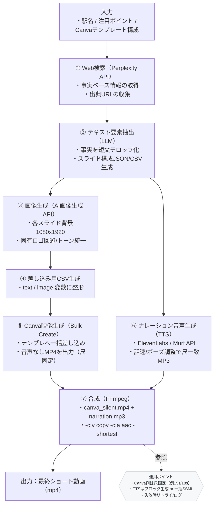

# SNSの自動化PoC 要件定義書

**システム名称：** エリア紹介ショート動画自動生成システム（PoC版）

---

## 1. 背景・目的

近年、YouTube Shorts・Instagram Reels・TikTok などの縦型動画コンテンツの需要が増加している。

特に不動産領域では「エリア紹介動画」のニーズが高く、

**短時間で事実ベースの情報をまとめた動画を自動生成する仕組み** を構築することで、

個人でもクライアントに価値を提供できるサービスの実現を目指す。

本PoCでは次を検証する：

- Perplexity などの外部AI検索サービスを活用し、
    
    **駅名・注目ポイントから事実ベースの情報が確実に抽出できるか**
    
- 抽出した情報が
    
    **ショート動画のテロップとして成立するか**
    
- Canva Bulk Createなどのツールを使い、
    
    **テンプレートに差し込むだけで動画が完成するワークフローが成立するか**
    

---

## 2. スコープ（PoCで実施する範囲）

### ✅ 対象とする主タスク

1. 駅名・注目ポイント・動画秒数・Canvaテンプレートの入力
2. Perplexity等による事実ベースの情報検索
3. 検索結果の要素抽出・テロップ文への変換
4. Canvaテンプレートへの差し込みによる映像生成（Bulk Create）
5. TTS（ElevenLabs / Murf）によるナレーション音声生成
6. FFmpegによる映像＋音声の合成（最終書き出し動画作成）

### ✅ 非対象（本PoCでは扱わない）

- SNS自動投稿
- フィードバック学習によるテロップ品質改善
- マップ画像自動生成（必要に応じて拡張）

---

## 3. 想定入力データ

| 項目 | 型 | 説明 |
| --- | --- | --- |
| 駅名（area） | string | 例：吉祥寺、三軒茶屋、武蔵小杉 |
| 題名（title） | string | 例：渋谷から15分の吉祥寺の魅力、おしゃれに綺麗に暮らしたいならここ |
| 注目ポイント（keywords） | list | 例：公園、商店街、カフェ、生活導線 |
| Canvaテンプレート構成 | struct | Bulk Create に使用するテンプレートの構成

例：スライド枚数・変数名など |

---

## 4. システム概要フロー



---

## 5. 機能要件（Functional Requirements）

### 5.1 入力処理

- 駅名・注目ポイント・秒数・テンプレートIDを受け取る
- 秒数に応じてスライド数を決定（例：3秒/スライド）

### 5.2 情報検索（Perplexity API）

- 駅名＋注目ポイントを元にクエリを生成
- 事実ベースの情報を取得（施設、公園、商店街、路線など）
- 出典リンクを取得（説明責任のため）
- Web文章の引用はせず、要素化して取得する

### 5.3 情報抽象化・テロップ化

- 長文から事実を抽出し、
    
    「12〜16字」の短文テロップに変換
    
- 不動産系動画の標準構成に沿って
    
    6スライド程度にまとめる
    
- 例：
    - 「公園まで徒歩5分」
    - 「生活導線が短い」
    - 「商店街が広く便利」

### 5.4 画像生成

### ✅ 事実版（こちらを採用）

- perplexityで取得した事実から画像を取得しテロップの背景画像に使用
- 実景を使用
- サイズ：1080×1920（縦動画）

### ✅ 抽象化版（今回は見送り）

- 背景画像をスライド数に応じて生成
- DALL·E / Gemini / Flux などを使用
- 実景の模倣ではなく
    
    “雰囲気”だけを抽象化して生成
    
- サイズ：1080×1920（縦動画）

### 5.5 Canva映像生成（Bulk Create）

- Canvaテンプレートを事前に用意
- テロップ・画像枠に `{{var}}` を設定
- CSV/Google Sheetを読み込み、**動画を一括生成**
- 出力：
    - **音声なし動画（mp4）**
    - 尺は固定（例：15秒・18秒）
    - スライドごとのアニメーションはテンプレ内で定義

### **5.5（新規） ナレーション音声生成（TTS）**

- ElevenLabs or Murf API を使用
- 入力：
    - テロップ文 or 台本
    - 話速、声質、安定度、感情
- 出力：
    - **動画尺と一致する音声ファイル（mp3/wav）**
- 台本はスライド構成と同期させて短文化する
- スライドごとに音声を生成し連結する方式にも対応

---

### **5.6（新規） 映像＋音声の自動合成（FFmpeg）**

- 合成方法：
    
    ```
    ffmpeg -i canva_silent.mp4 -i narration.mp3 -c:v copy -c:a aac -shortest final.mp4
    ```
    
- 要件：
    - 映像の尺と音声の尺が一致
    - 映像コーデックはH.264／音声はAAC
    - Cloud Runでも動作可能な軽量FFmpegビルドを使用
- 出力：
    - **音声つき最終ショート動画（mp4）**

---

## 6. 非機能要件（NFR）

### 6.1 品質

- テロップは12〜16字で視認性を確保
- 固有名詞は必要な範囲でのみ使用
- 画像は明度・コントラストを調整し認識性を確保

### 6.2 パフォーマンス

- 1動画生成にかかる時間：
    - 情報検索〜素材生成：1〜2分
    - Canva書き出し：30〜60秒

### 6.3 拡張性

将来的には以下を追加可能：

- Canva APIによる完全自動動画生成
- SNS自動投稿
- 地図生成（Static Maps API）
- 自動ナレーション（音声生成）

### 6.4 追加：自動合成の安定性

- 音ズレ防止のため
    - 映像尺はCanvaで固定
    - 音声生成はAPIで秒数一致
    - 合成時は `shortest` で同期
- エンコード環境はCloud Run／ローカルの双方で安定稼働

---

## 7. 出力イメージ（例）

### ✅ テロップ

- 「都心へ30分圏内」
- 「駅前の商業集積が強い」
- 「公園が徒歩5分でアクセス良」
- 「カフェ密度が高い街」

### ✅ スライド構成（18秒）

- 6スライド × 3秒
- エリア写真 → 注目ポイント → まとめ

---

## 8. リスク・懸念点

| リスク | 対応策 |
| --- | --- |
| Web情報の偏り | 出典を明示＋複数ソース統合 |
| 画像の類似性 | AI生成で独自の構造を作る |
| テロップのバラつき | テンプレを固定しルールで整形 |
| Canvaテンプレ依存 | テンプレを複数持って切り替え可能に |
| Canvaのテンプレ変更で尺が変わる | 尺固定テンプレートを使用 |
| TTS音声が速い/遅い | ElevenLabs/Murfで話速制御 |
| スライドと音声の同期ズレ | スライドごとに台本を生成し、音声ブロック方式にする |
| FFmpeg操作の複雑さ | Cloud Runでシェル化し自動化 |

---

9. 今後の拡張（PoC後の想定）

- Notion接続（入力→自動生成）
- 動画テンプレートの複数展開
- 地図画像の自動作成
- 一地域に対して複数バリエーション生成
- 事実情報の自動検証（WKP/自治体/Places API クロスチェック）

---