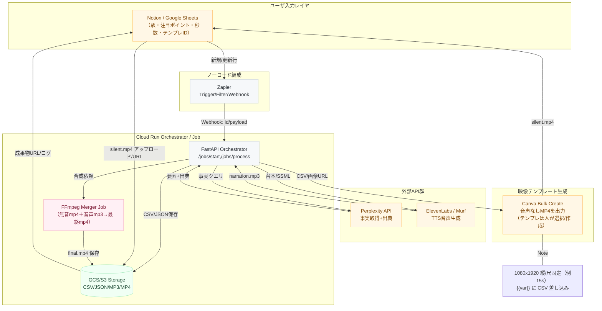
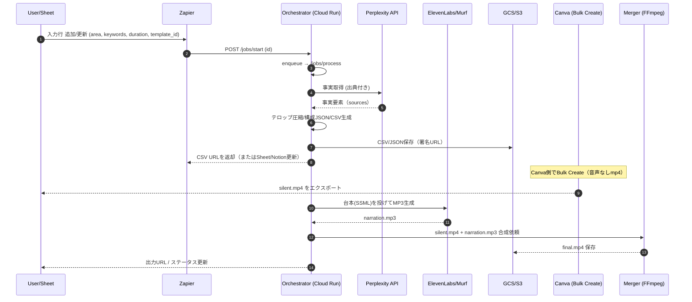

# SNSの自動化PoC 設計書

# 📐 構成要素設計書（PoC版）

**対象**：

- ノーコード中心（Zapier）
- 併用：Cloud Run（Docker / Python / FFmpeg）, Perplexity API, Canva Bulk Create, ElevenLabs/Murf（TTS）

**目的**：

「駅・注目ポイント・秒数・Canvaテンプレ」を入力すると、**事実ベースのテロップ付き縦動画**を**半自動〜自動**で生成・書き出す。

---

## 0. 全体アーキテクチャ（論理構成）



---

## 1. データモデル設計

### 1.1 入力（Notion/Sheet）

| フィールド | 型 | 必須 | 例 |
| --- | --- | --- | --- |
| id | string | ✓ | `KICHIJ-2025-001` |
| area | string | ✓ | `吉祥寺` |
| title | string | ✓ | `渋谷から15分の吉祥寺` |
| keywords | list<string> | ✓ | `["公園","商店街","カフェ"]` |
| duration_sec | int | ✓ | `18` |
| canva_template_id | string | ✓ | `tmpl_abc123` |
| tone | string |  | `ロジカル` |
| target | string |  | `DINKS` |
| status | enum | ✓ | `pending / processing / ready_csv / voiced / merged / error` |
| outputs | json |  | 後述（URL/ログ） |

> 補足：Zapierがこの1レコードをトリガーに、Cloud RunのオーケストレータAPIへPOST。
> 

---

### 1.2 構成JSON（スライド・タイムライン）

```json
{
  "meta": {"id":"KICHIJ-2025-001", "area":"吉祥寺", "duration":18, "tone":"ロジカル"},
  "slides": [
    {"idx":1, "t":0.0, "dur":2.0, "text":"吉祥寺をロジカルに分析", "img_key":"title"},
    {"idx":2, "t":2.0, "dur":3.0, "text":"公園まで徒歩5分", "img_key":"park"},
    {"idx":3, "t":5.0, "dur":3.0, "text":"商店街の生活導線が短い", "img_key":"street"},
    {"idx":4, "t":8.0, "dur":3.0, "text":"カフェ密度が高い街", "img_key":"cafe"},
    {"idx":5, "t":11.0, "dur":3.0, "text":"昼夜の人通りがあって安心", "img_key":"square"},
    {"idx":6, "t":14.0, "dur":4.0, "text":"効率と快適の街", "img_key":"summary"}
  ],
  "assets": {
    "images": {
      "title":"https://.../title.jpg",
      "park":"https://.../park.jpg",
      "street":"https://.../street.jpg",
      "cafe":"https://.../cafe.jpg",
      "square":"https://.../square.jpg",
      "summary":"https://.../summary.jpg"
    }
  }
}

```

---

### 1.3 Canva Bulk Create 用 CSV（例）

| title_text | image_title | point1_text | image_point1 | point2_text | image_point2 | point3_text | image_point3 | summary_text | image_summary |
| --- | --- | --- | --- | --- | --- | --- | --- | --- | --- |
| 吉祥寺をロジカルに分析 | [https://.../title.jpg](https://.../title.jpg) | 公園まで徒歩5分 | [https://.../park.jpg](https://.../park.jpg) | 商店街の生活導線が短い | [https://.../street.jpg](https://.../street.jpg) | カフェ密度が高い街 | [https://.../cafe.jpg](https://.../cafe.jpg) | 効率と快適の街 | [https://.../summary.jpg](https://.../summary.jpg) |

> テンプレ変数：Canva側のテキスト/画像枠に {{title_text}} 等を設定しておく。
> 

---

### 1.4 TTS 台本（スライド分割）

```json
{
  "voice":"elevenlabs:VOICE_ID",
  "blocks":[
    {"idx":1, "target_dur":2.0, "ssml":"<speak>吉祥寺をロジカルに分析。</speak>"},
    {"idx":2, "target_dur":3.0, "ssml":"<speak>公園まで徒歩五分。<break time='200ms'/>駅からの導線が短い。</speak>"},
    {"idx":3, "target_dur":3.0, "ssml":"<speak>商店街の生活導線が短い。</speak>"},
    {"idx":4, "target_dur":3.0, "ssml":"<speak>カフェ密度が高い街。</speak>"},
    {"idx":5, "target_dur":3.0, "ssml":"<speak>昼夜の人通りがあり安心。</speak>"},
    {"idx":6, "target_dur":4.0, "ssml":"<speak>効率と快適の街。</speak>"}
  ]
}

```

---

## 2. コンポーネント＆責務

### 2.1 Zapier（ノーコード・編成）

- **Trigger**：Notion/Google Sheets「新規/更新行」
- **Action**：`Webhooks by Zapier` → Cloud Run API `POST /jobs/start`
- **Option**：Schedule（毎時N分）で**キュー消化**パターンも可
- **Error Handling**：Zapierリトライ、Slack/メール通知

**Zap 例（擬似）**

1. New/Updated Row in Sheet → 2) Code by Zapier（入力検証＆正規化） → 3) Webhook POST (Cloud Run) → 4) Update Row（status, links）

---

### 2.2 Orchestrator API（Cloud Run / FastAPI）

**主要エンドポイント**

| Method | Path | 説明 |
| --- | --- | --- |
| POST | `/jobs/start` | 入力IDを受け、非同期処理キック（Pub/Sub or 内部キューへ） |
| POST | `/jobs/process` | 実処理：Perplexity→構成→CSV→TTS→ストレージ保存 |
| GET | `/jobs/{id}` | 進捗・成果物URL・ログ |
| GET | `/healthz` | 健康チェック |

**責務**

- 入力検証（area/keywords/duration/template）
- Perplexityクエリ作成・実行
- テロップ生成（LLM）
- 画像URL確定（実景URL or 生成URL）
- CSV生成（署名付きURL or 一時保存）
- 台本生成（SSML＋ブロック）
- TTS実行（ElevenLabs/Murf）→ narration.mp3
- 成果物URLを返却 & status更新

**設計ポイント**

- **冪等性**：`idempotency_key = {id}` で二重実行防止
- **リトライ**：外部API 429/5xx に指数バックオフ
- **監査**：出典（URL/タイムスタンプ）を `outputs.sources[]` で保持

---

### 2.3 ストレージ（GCS/S3）

- `/{env}/{job_id}/` 以下に**CSV/JSON/MP3**を格納
- Canva/人手に渡すのは**署名付きURL**
- 保存メタ：`metadata.json`（処理時間、APIコスト、出典URLなど）

---

### 2.4 TTS（ElevenLabs/Murf）

- **入力**：スライド分割台本（SSML）
- **出力**：`narration.mp3`（もしくは `narration_parts/*.mp3` を連結）
- **話速合わせ**：
    - まず**target_dur**に近づけ、±0.2s 以内ならOK
    - 誤差が大きければ**無音パディング**で吸収
- **品質**：語尾伸ばし/句読点チューニング

---

### 2.5 Canva（人/半自動）

- **テンプレ**：1080×1920、尺固定（例：2s/3s/3s/3s/3s/4s）
- **Bulk Create**：CSVを流し込み → **音声なしmp4** 出力
- **命名規則**：`{id}_silent.mp4`
- **運用**：テンプレ変更時はバージョンを `outputs.canva_template_version` に保存

---

### 2.6 合成器（FFmpeg / Cloud Run Job）

- **入力**：`silent.mp4` + `narration.mp3`
- **コマンド**：
    
    ```bash
    ffmpeg -i silent.mp4 -i narration.mp3 -c:v copy -c:a aac -ar 48000 -shortest final.mp4
    
    ```
    
- **検証**：
    - `ffprobe` で duration 差 < 0.2s
    - 合成後の `final.mp4` をGCS/S3保存

---

## 3. シーケンス



---

## 4. 環境・デプロイ

### 4.1 Cloud Run（Docker）

**Dockerfile（例）**

```docker
FROM python:3.11-slim

# ffmpeg (軽量ビルド)
RUN apt-get update && apt-get install -y --no-install-recommends ffmpeg && rm -rf /var/lib/apt/lists/*

WORKDIR /app
COPY pyproject.toml poetry.lock* /app/
RUN pip install --no-cache-dir uv && uv pip install -r <(uv pip compile pyproject.toml)
COPY . /app

ENV PORT=8080
CMD ["uvicorn", "app.main:app", "--host", "0.0.0.0", "--port", "8080"]

```

**主要パッケージ**

- `fastapi`, `httpx`, `pydantic`
- `google-cloud-storage` or `boto3`
- `python-dotenv`
- `ffmpeg-python`（任意 / 素のFFmpeg呼び出しでOK）

**環境変数**

- `PERPLEXITY_API_KEY`
- `ELEVENLABS_API_KEY` / `MURF_API_KEY`
- `GCS_BUCKET` / `AWS_*`
- `OPENAI_API_KEY`（LLM圧縮に使用する場合）
- `BASE_URL`（Webhook応答用）

---

## 5. アルゴリズム・制御ロジック

### 5.1 テロップ圧縮（12–16字）

- ルール：
    - 助詞最小、漢字率60–80%
    - 名詞止め優先（例：「公園徒歩5分」）
    - 音読時間：スライドdur – 0.3s以内
- 失敗時：別候補（Synonyms）で再試行

### 5.2 台本 → TTS → 尺合わせ

- スライド単位にSSML生成（`<break>`で微調整）
- `target_dur` と実音声の差分を測定
    - ±0.2s以内：採用
    - それ以上：
        - 話速調整（サービスが対応していれば）
        - 末尾に無音パディング付与

### 5.3 エラー・再処理

| 事象 | 対応 |
| --- | --- |
| Perplexity 429/5xx | バックオフ（1,2,4,8s）3回 |
| TTS失敗 | 別声ID or 文言短縮で再試行 |
| 画像URL 404 | 代替画像（カテゴリ汎用） |
| FFmpeg失敗 | `-y` 上書き/再実行、codec互換性チェック |

---

## 6. セキュリティ／運用

- **Secrets**：GCP Secret Manager / `.env` は禁止
- **認可**：Cloud Runは**認証付き**（ZapierのWebhookはSigned Secret）
- **ロギング**：リクエストID/ジョブIDでトレース
- **メトリクス**：1ジョブあたり
    - APIコール回数/遅延/費用見積
    - テロップ生成回数/失敗率
    - TTSの平均尺誤差
- **監査**：`outputs.sources[]` に出典URL/タイムスタンプ

---

## 7. コスト概算（PoC感度）

- Perplexity：数円〜十数円/クエリ（プラン依存）
- TTS：数十秒で数円〜十数円（声・品質依存）
- Cloud Run：常時課金なし（起動/秒課金）
- Canva：既存プラン内でBulk Create（プラン依存）

> PoCでは1本あたり 30〜150円程度で収まる想定（画像生成なし/短尺）。
> 

---

## 8. テスト計画

- **UT**：
    - 文字数制約（12–16字）
    - target_dur±0.2s判定
    - CSV生成の列一致
- **IT**：
    - 1案件通し（吉祥寺・18秒）
    - エラー系（Perplexity 429 / TTS失敗 / 画像404 / FFmpeg失敗）
- **UAT**：
    - 3案件（吉祥寺/三軒茶屋/北千住）
    - 2テンプレ（落ち着き系/ポップ系）

---

## 9. ロールアウト計画

1. **Week1**：Cloud Run Orchestrator（/jobs/process）実装、Perplexity統合
2. **Week2**：テロップ圧縮 → CSV生成 → TTS（ElevenLabs）
3. **Week3**：Canvaテンプレ確定・Bulk Create検証 → FFmpeg合成
4. **Week4**：自動合成まで通し / ログ整備 / 簡易ダッシュボード（Sheet/Notion）

---

## 10. 添付：最小実装スニペット（疑似）

**FFmpeg 合成（Python）**

```python
import subprocess

def mux(video_silent, narration_mp3, out_mp4):
    cmd = [
      "ffmpeg","-y",
      "-i", video_silent,
      "-i", narration_mp3,
      "-c:v","copy","-c:a","aac","-ar","48000","-shortest", out_mp4
    ]
    subprocess.run(cmd, check=True)

```

**タイムライン妥当性チェック**

```python
def validate_timeline(slides, duration):
    assert abs(sum(s["dur"] for s in slides) - duration) < 0.1
    for i, s in enumerate(slides, start=1):
        assert 1 <= len(s["text"]) <= 16
```

---